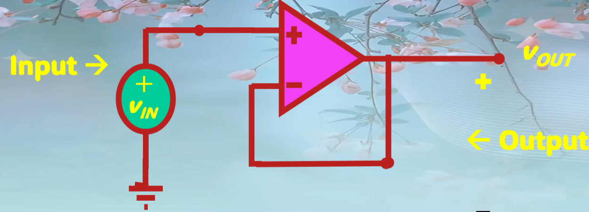
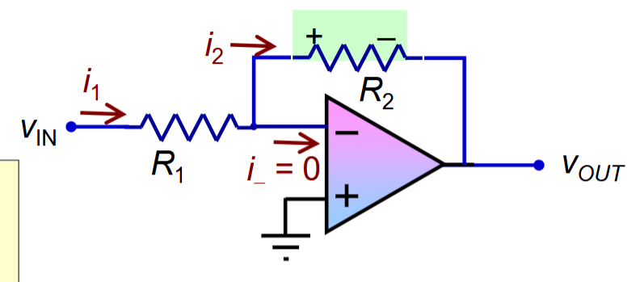
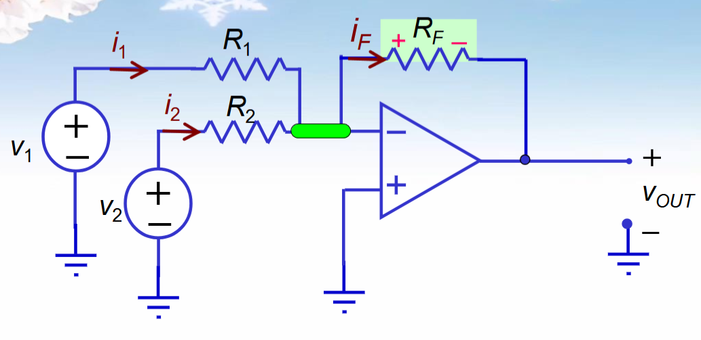
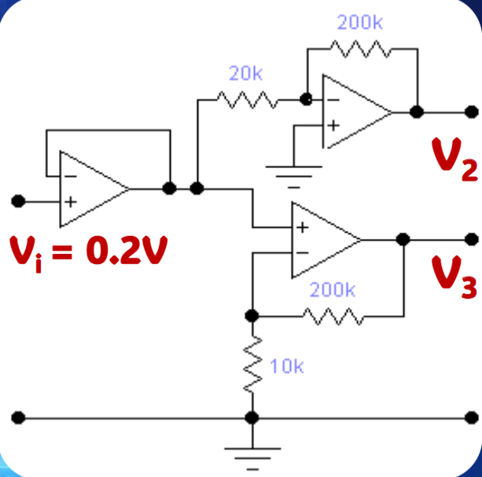
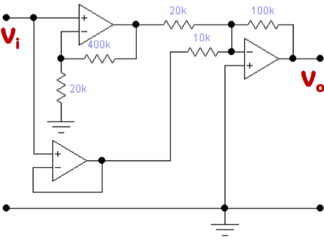

# Operational Amplifier

## Buffer

$$$
V_{out} = V_{in}
$$$

## Non-Inverting Amplifier

$$$
V_{out} = \cfrac{R_1 + R_2}{R_1} V_{in}
$$$

## Inverting Amplifier

$$$
V_{out} = -\cfrac{R_2}{R_1} V_{in}
$$$

## Summation Amplifier

$$$
V_{out} = - (V_1 \cfrac{R_F}{R_1} + V_2 \cfrac{R_F}{R_2})
$$$

- - -

>>>例题 1

对于 V,,2,,，有增益 $$A_{v1} = -\cfrac{200k}{20k} = -10$$
对于 V,,3,,，有增益 $$A_{v2} = \cfrac{200k + 10k}{10k} = 21$$
>>>

>>>例题 2

V,,in,, = +0.1V，求输出电压。

先计算左上角放大器的输出电压：$$V_2 = V_1 \cfrac{400k + 20k}{20k} = 2.1V$$
左下角放大器电路为 buffer，其输出电压：$$V_3 = V_1 = 0.1V$$
右侧放大器电路为 Summation amplifier，其输出电压：$$V_o = -(V_2 \cfrac{100k}{20k} + V_3 \cfrac{100k}{10k}) = -11.5V$$
>>>
