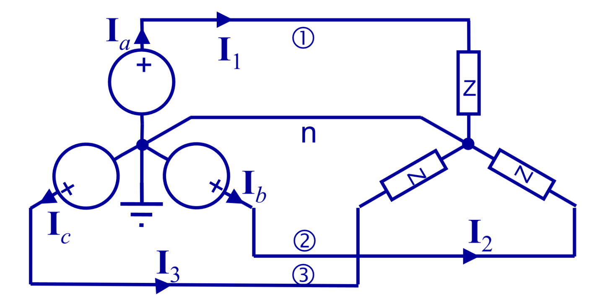
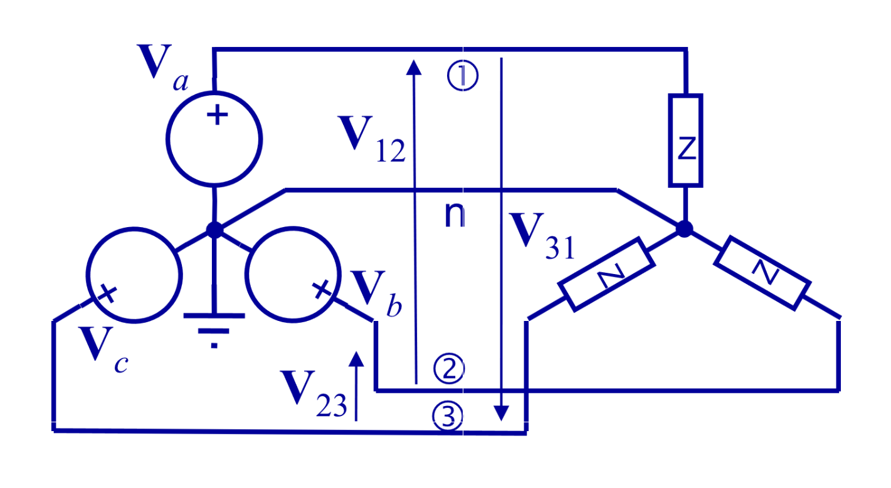
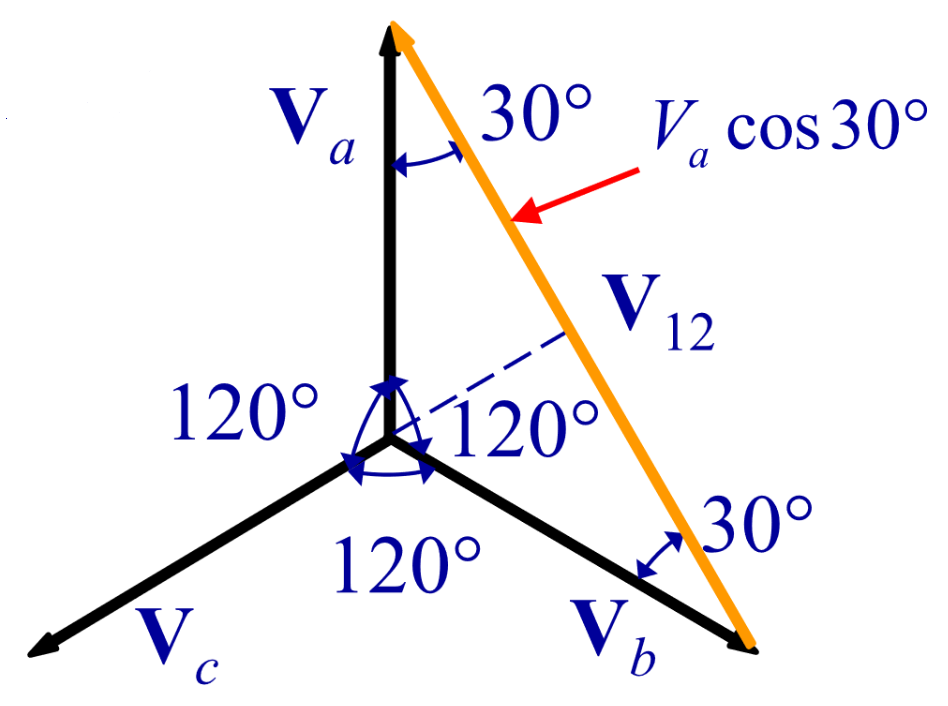
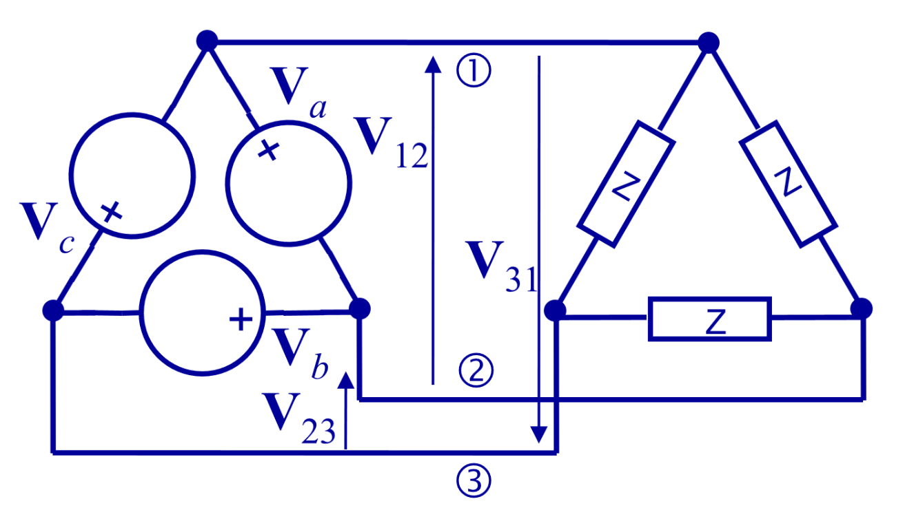
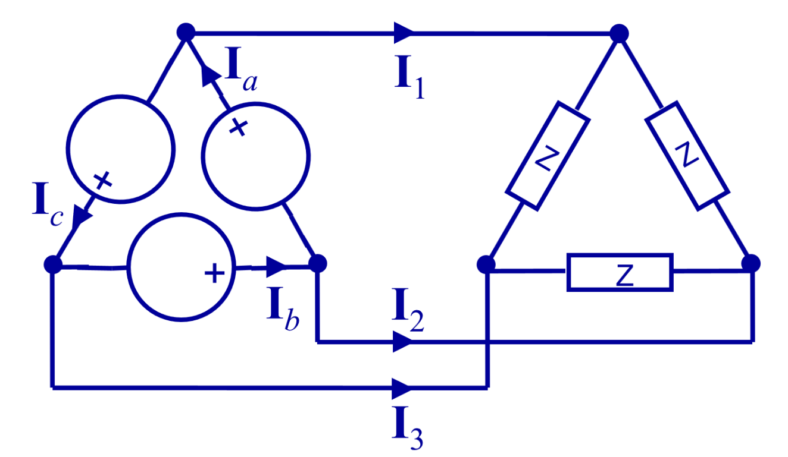
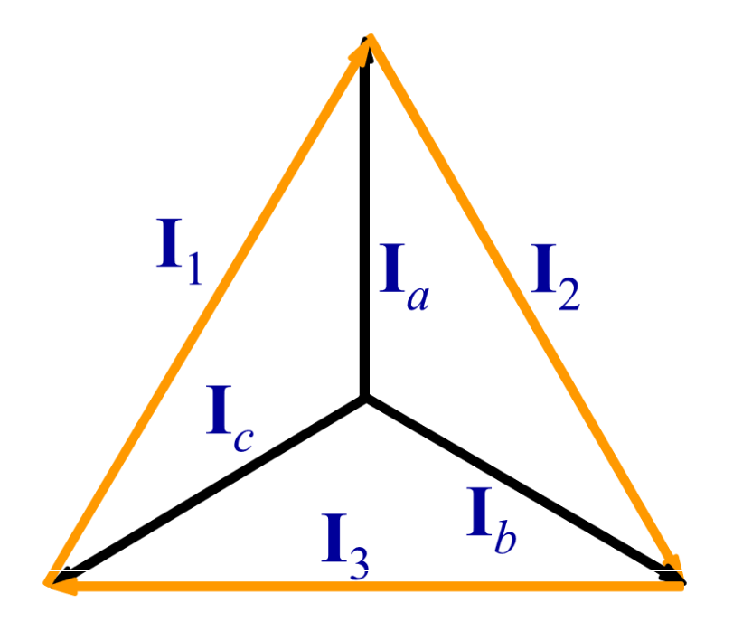

# 三相交流电路 | 3-phase AC systems

$$$
v_a = V_m \cos{\omega t + \phi}\\
v_b = V_m \cos{\omega t + \phi - 120 \degree}\\
v_c = V_m \cos{\omega t + \phi - 240 \degree}\\
\downarrow\\
i_a = I_m \cos{\omega t}\\
i_b = I_m \cos{\omega t - 120 \degree}\\
i_c = I_m \cos{\omega t - 240 \degree}\\
\downarrow\\
p_a(t) = v_a i_a\\
p_b(t) = v_b i_b\\
p_c(t) = v_c i_c\\
p(t) = p_a + p_b + p_c = \frac{3}{2} V_m I_m \cos{\phi} \rightarrow constant
$$$

## Star Connection

$$$
I_{line} = I_{phase}\\
I_1 = I_a\\
I_2 = I_b\\
I_3 = I_c\\
$$$

$$$
v_{12} = v_a - v_b = \sqrt{3}v_a = \sqrt{3}v_b
$$$

## Delta Connection

$$$
V_{line} = V_{phase}\\
V_{12} = V_a\\
V_{23} = V_b\\
V_{31} = V_c\\
$$$

$$$
I_1 = I_a - I_c\\
I_2 = I_b - I_a\\
I_3 = I_c - I_b\\
$$$

$$$
I_{line} = I_1 + I_2 + I_3\\
I_{phase} = I_a + I_b + I_c\\
I_{line} = \sqrt{3} I_{phase}
$$$
