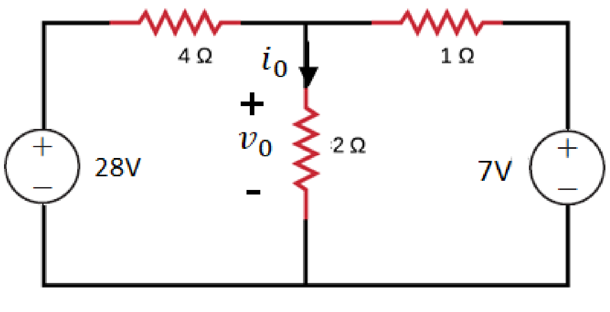
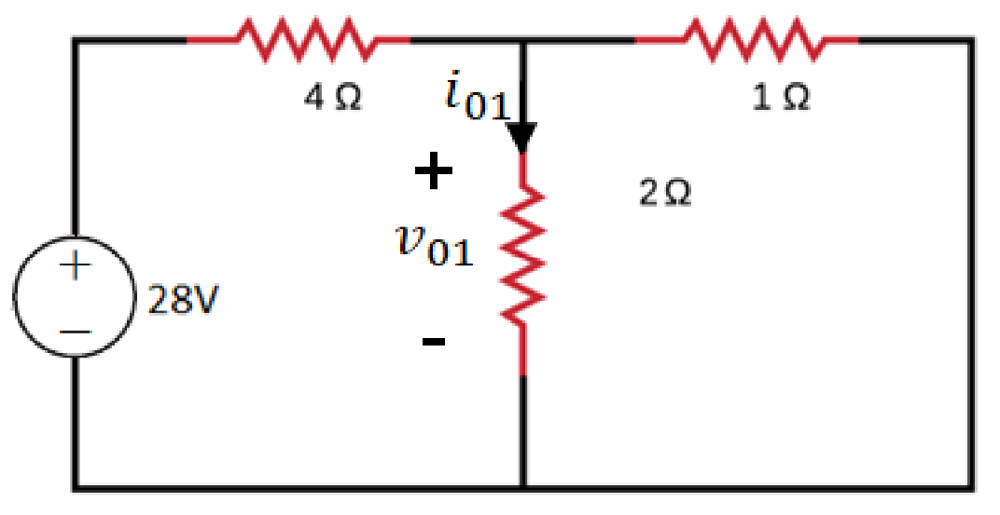
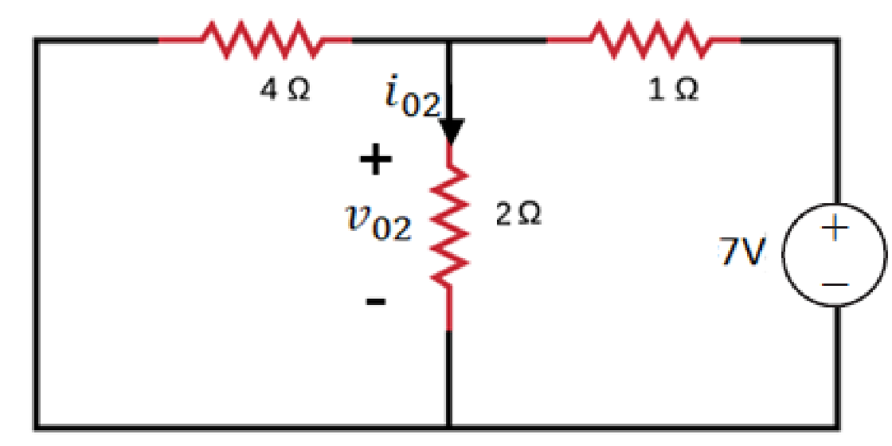

# 叠加原理 | The Superposition Theorem

## Disabled current sources and voltage sources

对于电压源，将其替换为短路；对于电流源，将其替换为开路。

- - -

## 例题

对于电路，要求电压 v,,0,, 和电路 i,,0,,

则要计算在单个电压源作用下的电压和电流，再进行叠加。

$$$
v_0 = v_{01} + v_{02}\\
i_0 = i_{01} + i_{02}\\
$$$