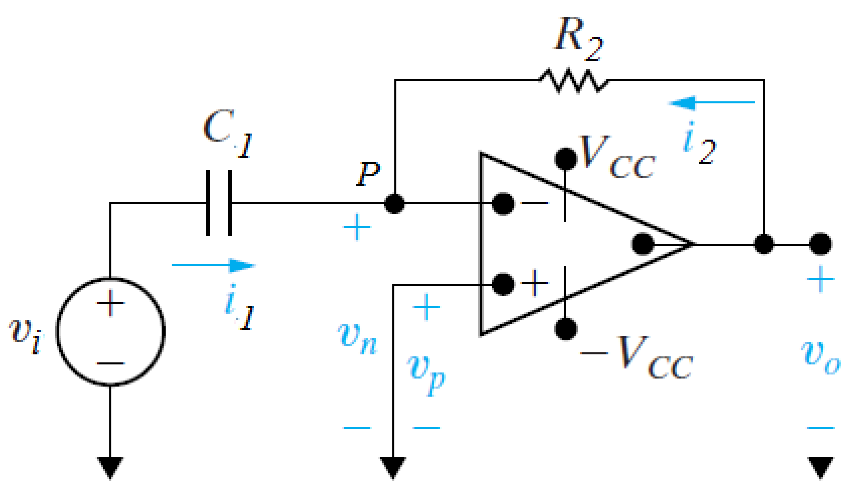
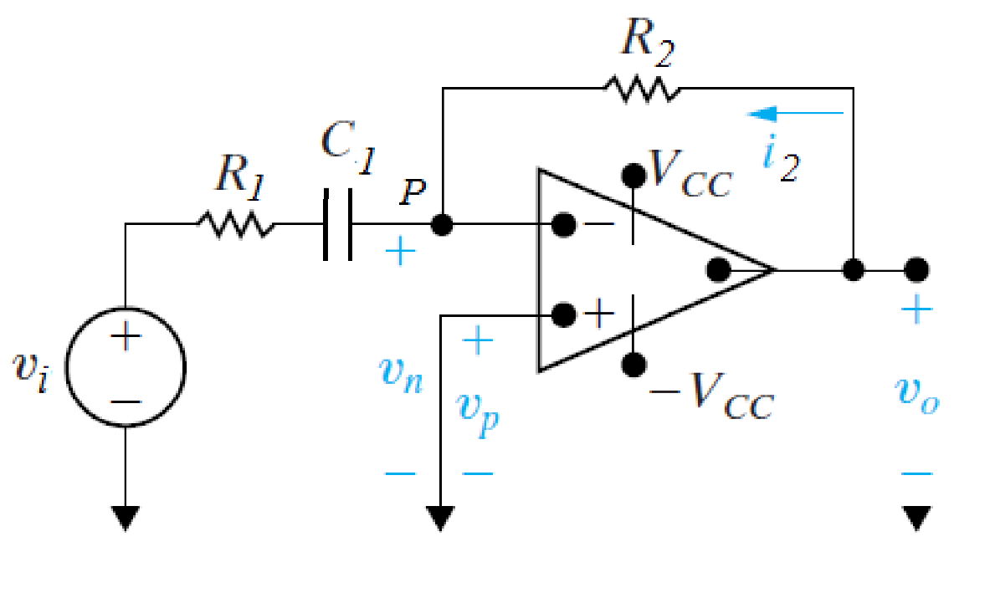
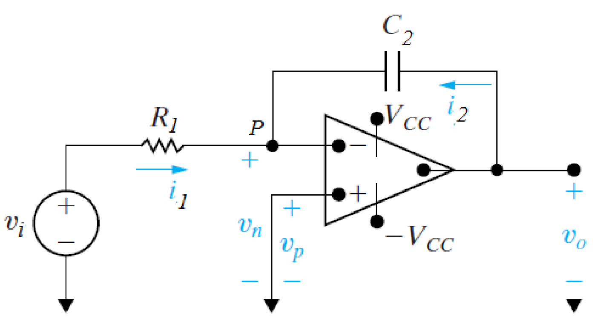
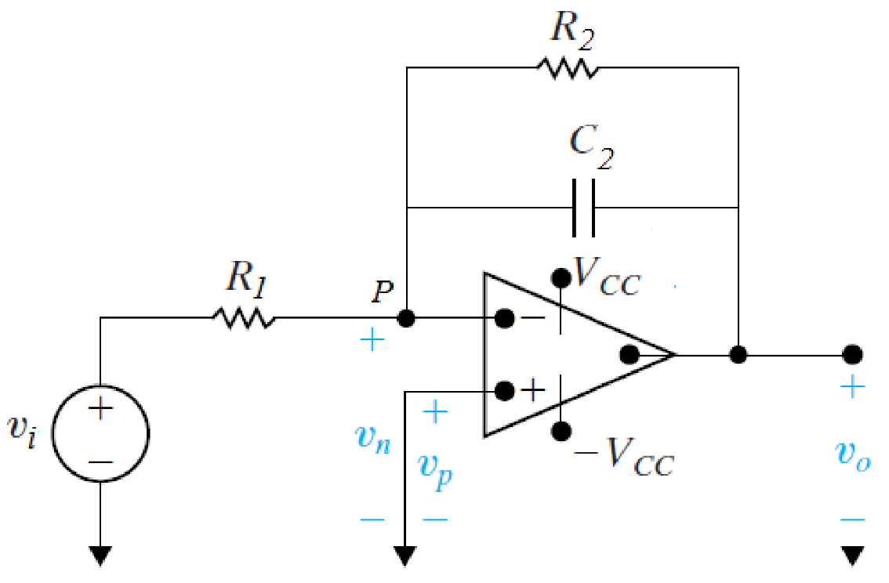

# 微分器和积分器 | The Differentiator and the Integrator

## 微分器 | The Differentiator

Exact Differentiator:

$$$输出电压与输入电压的关系
v_o = - R_2 C_1 \frac{dv_i}{dt}
$$$

Approximate Differentiator(also high-pass filter):

cut-off voltage: $$f_c = \frac{1}{2\pi C_1 R_1}$$

当输入频率小于 f,,c,, 时，$$v_o = -R_2 C_1 \frac{dv_i}{d_t}$$
当输入频率大于 f,,c,, 时，$$v_o = - \frac{R_2}{R_1} v_i$$

- - -

## 积分器 | The Integrator

Exact Integrator:

$$$
v_o = - \frac{1}{R_1 C_2} \int v_i\,dt
$$$

Approximate Integrator(also low-pass filter):

cut-off voltage: $$f_c = \frac{1}{2\pi C_2 R_2}$$

当输入频率小于 f,,c,, 时，$$v_o = - \frac{R_2}{R_1} v_i$$
当输入频率大于 f,,c,, 时，$$v_o = - \frac{1}{R_1 C_2} \int v_i\,dt$$
