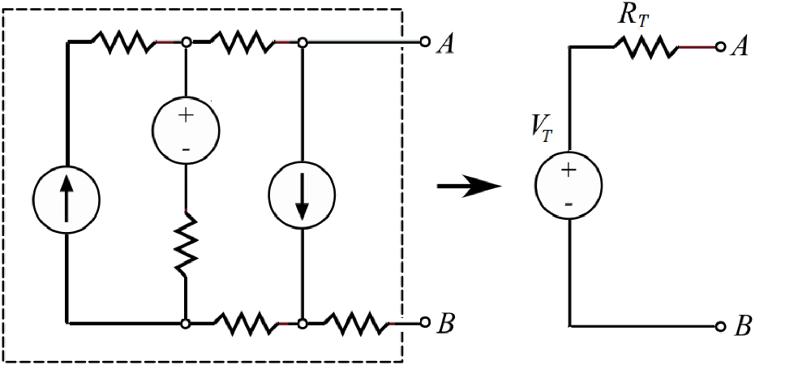
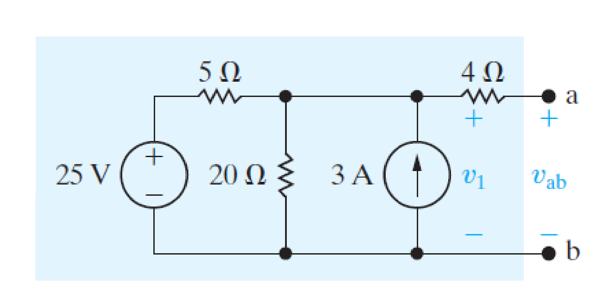
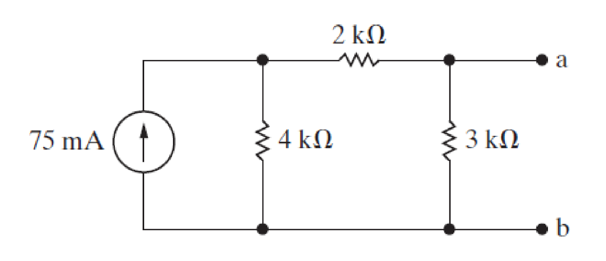
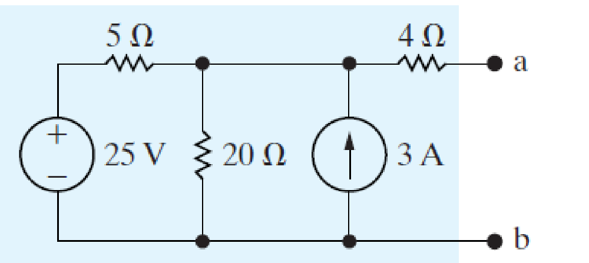
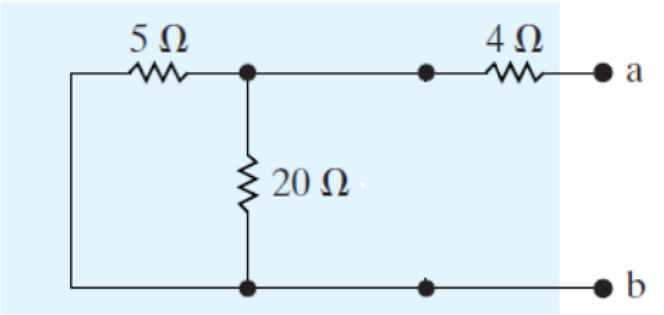
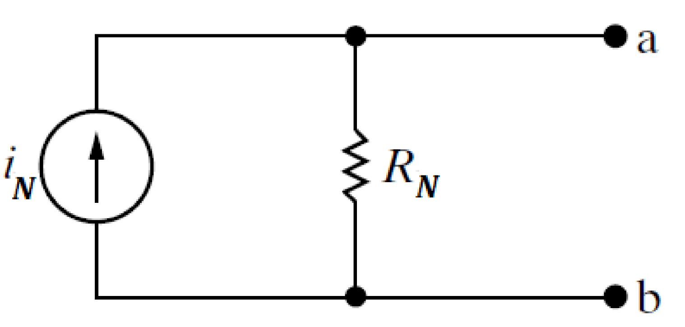
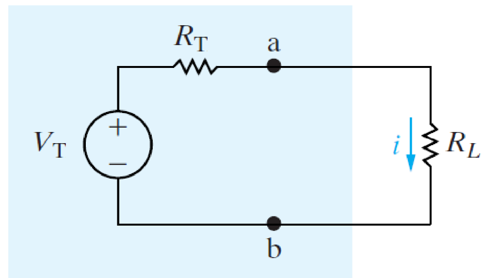

# 戴维宁和诺顿定理 | Thevenin / Norton Equivalent Circuits

## Thevenin’s theorem

以一个电压源和一个电阻来等效一个具有两个端口的电路。

## 计算等效电压

计算等效电压即计算电路中两端点间的电压

### 例题1

等效电压即 v,,ab,,。

通过使用节点分析法，
$$$
\frac{v_1 - 25}{5} + \frac{v_1}{20} - 3 = 0\\
Thus,\ v_{ab} = v_1 = 32V\\
$$$

### 例题2

对于此题，我们可以忽略两端点，然后计算电阻 $$R_{3k\Omega}$$ 两端的电压。

$$$
i_{3k} = 75 \frac{4}{4 + (2 + 3)} = \frac 100 3 mA\\
v_T = i_{3k} * 3k\Omega = 100V\\
$$$

- - -

## 计算等效电阻

去除电路中所有的电流源和电压源后，等效电阻 R,,T,, 就等于两端之间的电阻。

### 例题

则 $$R_T = 4 + (5 || 20) = 8\Omega$$

- - -

## 诺顿定理 | Norton Theorem

戴维宁定理把电路简化成了一个电压源串联着一个电阻，而诺顿定理将电路简化为一个电流源并联着一个电阻，如图所示：

- - -

## 最大传递功率

对于如上图所示的电路，当负载 R,,L,, 与端阻 R,,T,, 相等时，传递功率最大。
