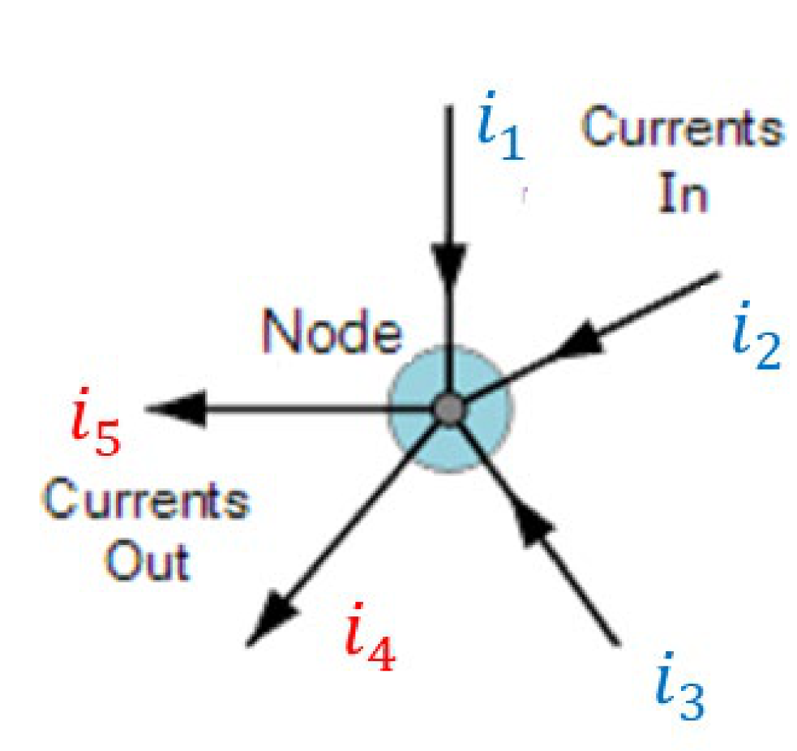

# 电路分析法 | Circuit Analysis Methods

## Kirchhoff’s Current Laws (KCL)

##Definition: ##

> 电路中的节点即为电路中两个或多个元件连接处。
> 在电路中的任意节点，流入节点的电流总和等于流出的电流总和。
> - - -
> A node is a point in a circuit where two or more components meet.
> At any node in an electrical circuit, the sum of currents flowing into a node is equal to the sum of currents flowing out of that node

## Kirchhoff’s Voltage Law (KVL)

##Definition: ##

> 回路即为电路中的闭合路线，从同一个节点开始和结束。
> 在任一时刻，电路回路中电压下降的和（或者等价地，电压上升的代数和）等于零。
> 或者说，在回路中每个组件上降的电压和每个组件上升的电压和相等。
> - - -
> A loop is a closed path in a circuit, starting and ending at the same point.
> At any instant the algebraic sum of the voltage drops (or , equivalently, the algebraic sum of voltage rises) around any loop in a circuit is equal to zero.

- - -

## 特勒根定理 | Tellegen's theorem

电路中产生的功率与吸收的功率之和为零。

In any circuit, the sum of the powers associated with each component is equal to zero. In other words: the total power delivered to the circuit is equal to the total power adsorbed from the circuit.

##例：##

$$$
Conditions:\\
v_0 = -30V\, v_1 = 150V\\
i_0 = -3V\, i_1 = 3A\\
~\\
P_{120V} = 360W > 0 \rightarrow absorbing\ power\\
P_{10\Omega} = 90W > 0 \rightarrow absorbing\ power\\
P_{50\Omega} = 450W > 0 \rightarrow absorbing\ power\\
P_{6A} = -900 < 0 \rightarrow delivering\ power\\
$$$
