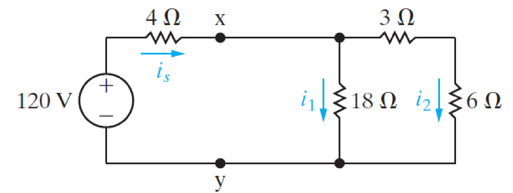
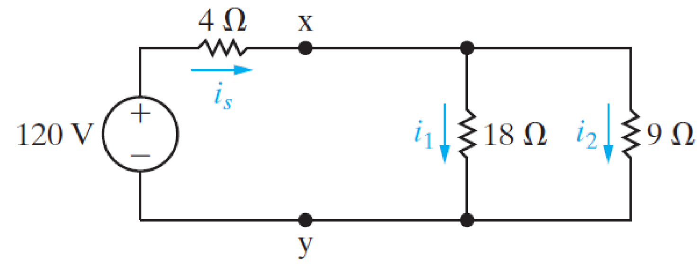
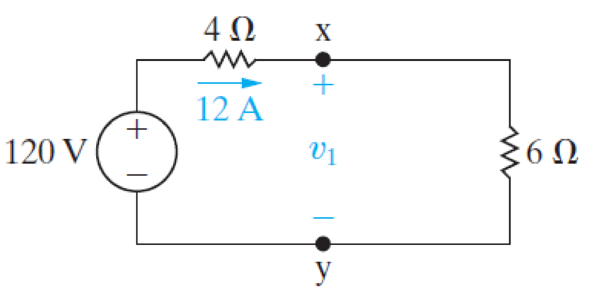
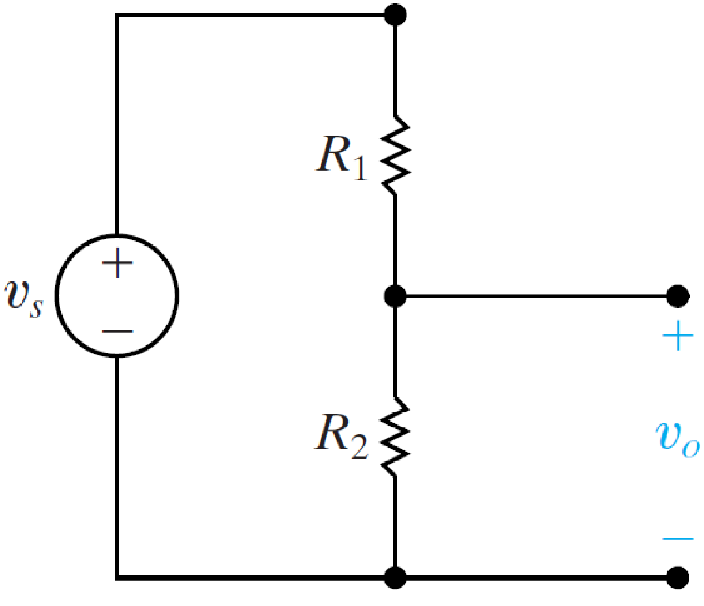
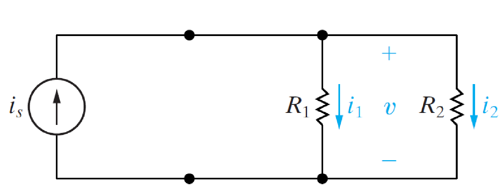

# 电阻的串联与并联

## 电阻串联 | Resistors in Series

$$$
R_{eq} = R_1 + R_2 + R_3 + \dots + R_n
$$$

## 电阻并联 | Resistors in Parallel

$$$
\frac{1}{R_{eq}} = \frac{1}{R_1} + \frac{1}{R_2} + \frac{1}{R_3} + \dots + \frac{1}{R_n}
$$$

## 串并联的简化 | Series-Parallel Simplification

- - -

## 分压 | Voltage Divider

$$$
v_0 = v_s \frac{R_2}{R_1 + R_2}
$$$

## 分流 | Current Division

$$$
v = i_s\frac{R_1 R_2}{R_1 + R_2}\\
i_1 = \frac{v}{R_1},\ i_2 = \frac{v}{R_2}
$$$

- - -

## 电压源串联 | Voltage Sources in Series

多个电压源串联可以等效为一个电压源

$$$
v_{eq} = v_1 + v_2 + \dots
$$$

## 电流源并联 | Current Sources in Parallel

多个电流源并联可以等效为一个电流源

$$$
i_{eq} = i_1 + i_2 + \dots
$$$
