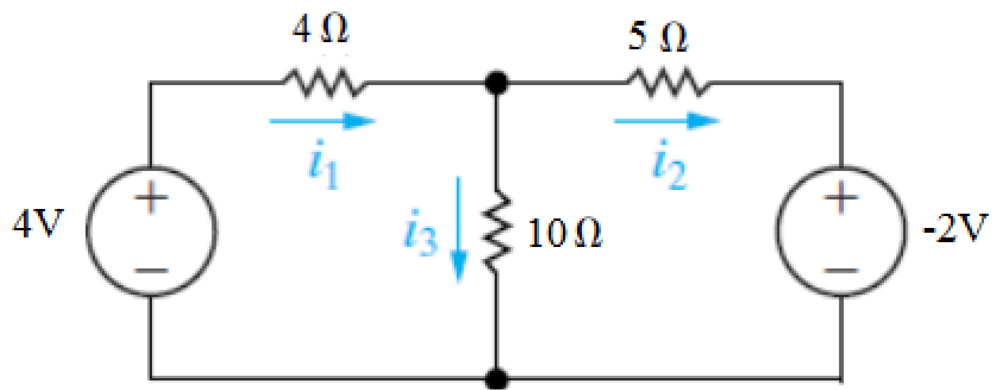
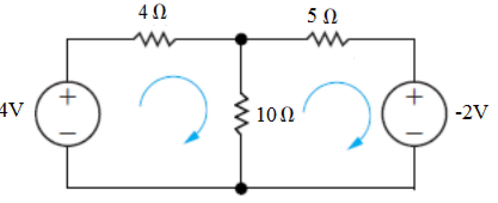
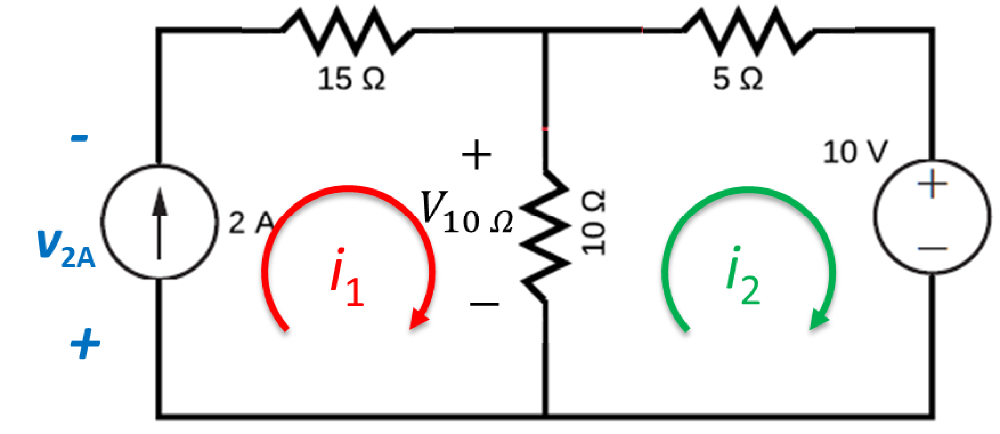

# 网格分析 | Mesh Analysis

## 例题1

对于网格 a，有等式：$$-4 + 4i_a + 10(i_a - i_b) = 0$$
对于网格 b，有等式：$$-2 + 10(i_b - i_a) + 5i_b = 0$$

- - -

## 例题2：含有电流源的电路

对于这一电路，我们无法写出回路 1 的等式。##但是##，我们实际已经知道了网格 1 的电流 i,,1,,。

而对于回路 2，有等式$$10 + 10(i_2 - i_1) + 5i_2 = 0, with\ i_1 = 2A$$
