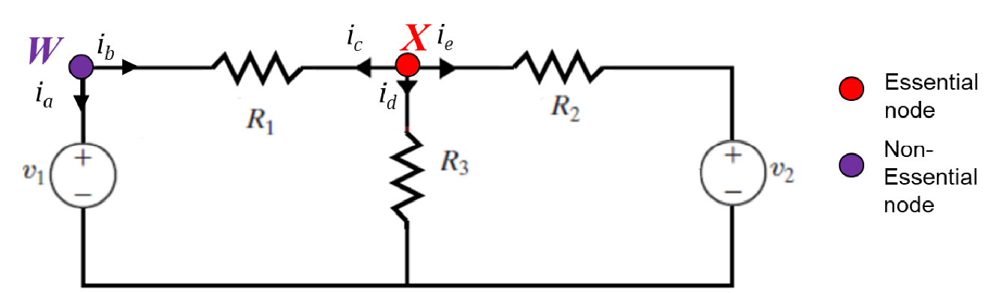

# 节点分析 | Nodal Analysis

## Essential node

连接三个或更多电路元件的节点被称为 essential node。
Nodes with three or more connections are called essential nodes.

- - -

## Nodal Analysis 使用

选择具有较多连接的节点为参考点（接地点）
Choose a node with many connections as reference node

列式技巧：##将当前计算的节点假设为较高电位##，##将流出的电流放在等式左侧，流入电流放在等式右侧##。

$$$
For\ node 1:\ \frac{v_1}{2} + \frac{v_1 - v_2}{5} = 3.1\\
For\ node 2:\ \frac{v_2}{1} + \frac{v_2 - v_1}{5} + (-1.4) = 0
$$$

- - -

## 对于存在电压源的电路

对于存在电压源的电路，由于经过电压源的电流无法计算，则##将电压源两侧的节点视为一个节点##，此节点为##超节点（supernode）##。

## 例题

$$$
For\ node1:\ \frac{v_1 - v_3}{4} + \frac{v_1 - v_2}{3} = -3 - 8\\
For\ node2\ and\ node3:\ \frac{v_2}{1} + \frac{v_2 - v_1}{3} + \frac{v_3}{5} + \frac{v_3 - v_1}{4} + (-25) + (-3)= 0\\
Additionally,\ v_3 - v_2 = 22\ for\ the\ supernode.
$$$

- - -

对于超节点作为参考点的情况：

因为 node4 为参考点，node2 与 node4 之间有 10V 的电压提升，故 node2 的电压为 10V。
接下来的步骤便如之前所示。
