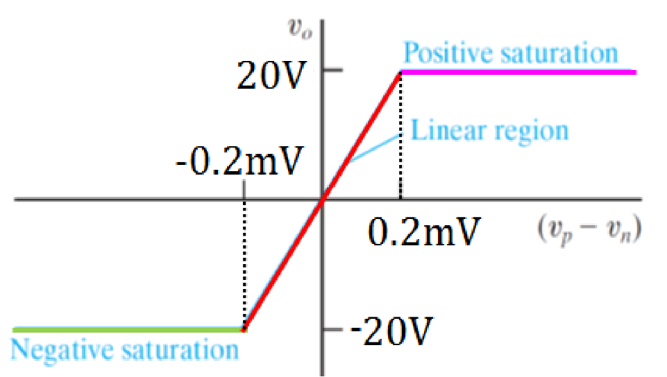
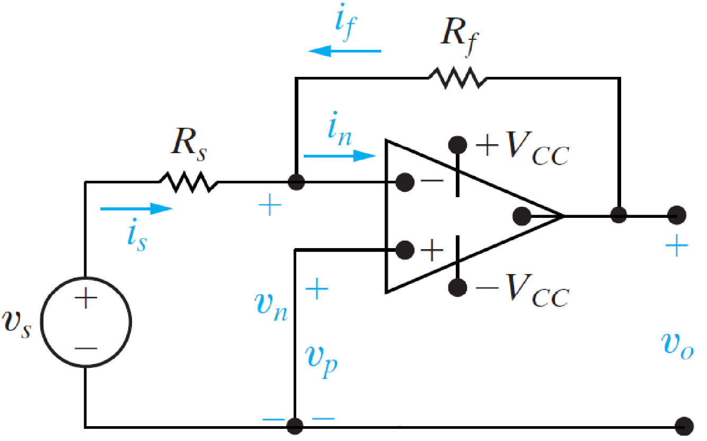
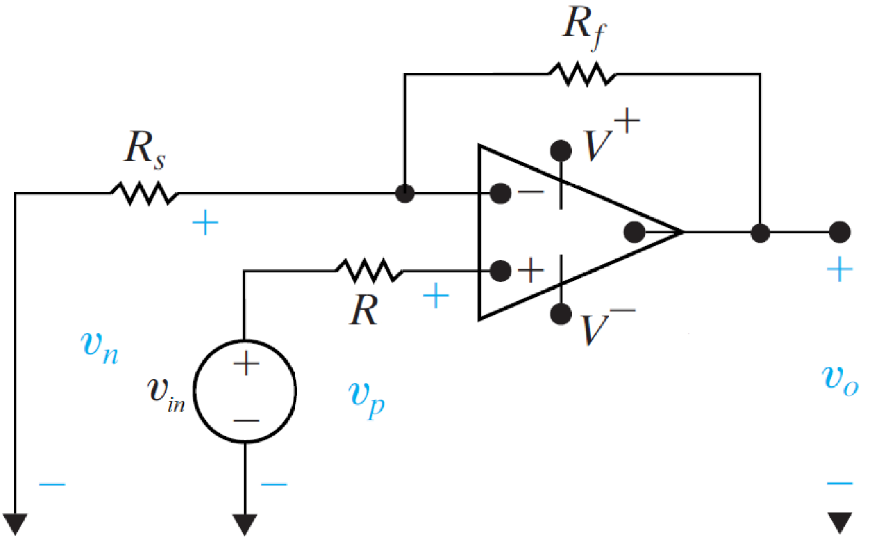
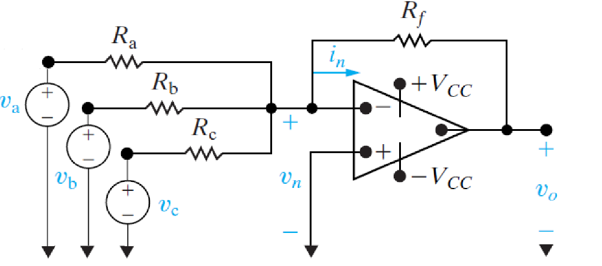
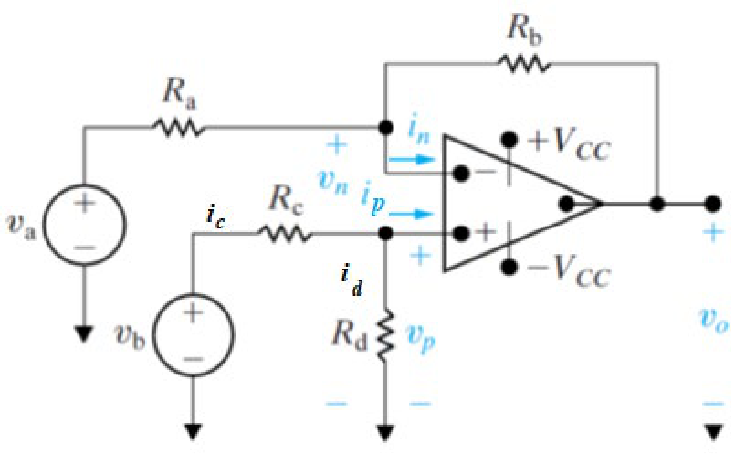

# 运算放大器 | Operational Amplifier

## 理想情况下的运算放大器 | Ideal OpAmp Rules

对于运算放大器，在线性区域内（输入电压未超过放大器电源电压），

$$$
v_p = v_n
i_p = i_n = 0
$$$

- - -

## 放大器的截断 | OpAmp in Saturation

假设放大器的电源电压：$$V^+ = 20V\ and\ V^- = -20V$$，则放大器的输出随输入变化如图所示：

- - -

## 反相放大器 | The Inverting Amplifier

$$$
v_o = v_i(- \frac{R_f}{R_s}),\ 
where\ the\ - \frac{R_f}{R_s}\ is\ the\ gain
$$$

## 正相放大器 | The non-inverting Amplifier

$$$
v_o = v_i(1 + \frac{R_f}{R_s}),\ 
where\ the\ (1 + \frac{R_f}{R_s})\ is\ the\ gain
$$$

- - -

### 波形性质 | Waveform Properties

- 周期 Period ``T``
- 频率 Frequency ``f``, $$f = \frac 1 T$$
- 峰到峰振幅 Peak-to-peak amplitude V,,pp,,: ranges from the minimum to the maximum value.

- - -

## 求和放大器 | Summing amplifier

$$$
v_o = -(\frac{R_f}{R_a} v_a + \frac{R_f}{R_b} v_b + \frac{R_f}{R_c} v_c)
$$$

## 求差放大器 | Summing amplifier

$$$
v_o = \frac{R_b}{R_a}(v_b - v_a)
$$$
