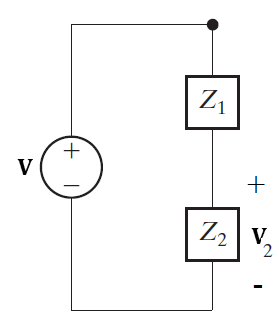
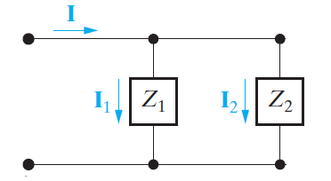

# 阻抗 | Impedance

对于电阻、电容和电感，其 $$\vec{V} - \vec{I}$$ 关系都可以看成这个形式：

$$$
\vec{V} = \vec{Z} \vec{I}
$$$

其中，对于不同的元件：

$$$
\vec{Z} = \frac{\vec{V}}{\vec{I}}\\
\vec{Z}_R = R,\ \vec{Z}_L = j\omega L,\ \vec{Z}_C = \frac{-j}{\omega C}\\
$$$

### 电抗 | Reactance

阻抗是相量，有实部和虚部。
$$$
\vec{Z} = R + jX,\\
Re\{\vec{Z}\} = R \rightarrow Resistance\\
Im\{\vec{Z}\} = X \rightarrow Reactance\\
$$$

其中，对于不同的元件：
$$$
X_R = 0,\ X_L = \omega L,\ X_C = \frac{-1}{\omega C}
$$$

由此可得：
- 电抗 = 0 时，电路为纯电阻电路；
- 电抗 < 0 时，电路为容性；
- 电抗 > 0 时，电路为感性。

## 阻抗的分压和分流

分压：

$$$
\vec{V_2} = \vec{V} \frac{\vec{Z_2}}{\vec{Z_1} + \vec{Z_2}}
$$$

分流：

$$$
\vec{I_2} = \vec{I} \frac{\vec{Z_1}}{\vec{Z_1} + \vec{Z_2}}
$$$
