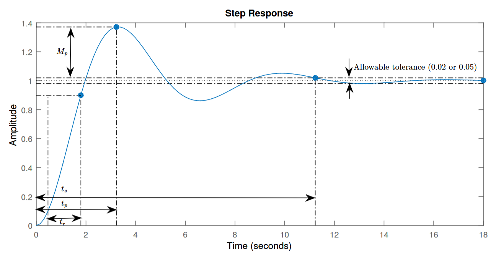

# {二阶系统}(Second Order System)

$$$
\cfrac{Y(s)}{R(s)} = \cfrac{ks\omega_n^2}{s^2 + 2\zeta\omega_n s + \omega_n^2}
$$$
- k,,s,,: the gain of the system
- ζ: {the damping coefficient}(阻尼比)
- ω,,n,,: the natural frequency

>>>{damped natural frequency}(实际振荡频率)
$$$
\omega_d = \omega_n \sqrt{1 - \zeta^2}
$$$
>>>

>>>阻尼比 ζ
| 阻尼比 ζ | 系统行为 | 优点 | 缺点 |
| ζ = 0     | 持续振荡，无衰减     | 振荡频率明确   | 永不稳定         |
| 0 < ζ < 1 | 衰减振荡             | 快速响应       | 存在超调         |
| ζ = 1     | 无振荡，快速稳定     | 无超调，响应速度快 | 调节时间相对略长 |
| ζ > 1     | 无振荡，缓慢稳定     | 极度稳定       | 响应速度慢，调整时间长 |

### ζ = 0（无阻尼，Undamped）
- 系统没有任何阻尼（如完全理想的弹簧-质量系统，没有摩擦）。
- 输出会以自然频率（ω,,n,,​）持续振荡，没有振幅衰减。
- 系统的响应是纯正弦波振荡。

### 0 < ζ < 1（欠阻尼，Underdamped）
- 系统有一定阻尼，但不足以完全抑制振荡。
- 输出会以实际振荡频率（$$\omega_d = \omega_n \sqrt{1 - \zeta^2}$$​）振荡，同时振幅逐渐衰减。
- 存在{超调}(Overshoot)：输出会超过目标值，然后逐渐趋于稳定。

### ζ = 1（临界阻尼，Critically Damped）
- 系统具有刚好足够的阻尼以避免振荡。
- 输出快速趋近目标值，无振荡，但仍可能有一个较小的超调。

### ζ > 1（过阻尼，Overdamped）
- 阻尼过大，系统的响应非常缓慢，输出不会振荡。
- 系统趋于目标值的速度比临界阻尼慢，但更稳定。
>>>

## Transient-Response Specifications

1. Delay time t,,d,,: 系统响应达到目标值的 50% 所需的时间。
2. Rise time t,,r,,: 系统响应从初始值（通常为 10% 的最终值）上升到最终值的 90% 所需的时间。
3. Peak time t,,p,,: 系统响应首次达到最大值（超调点）所需的时间。
4. Maximum (percent) overshoot M,,p,,
  - 系统响应超过目标值的最大偏差，相对于目标值的百分比。
  - $$M_p = \cfrac{y_{max} - y_\infty}{y_\infty} \times 100\%$$
5. Settling time t,,s,,: 系统响应进入并保持在目标值一定范围（通常为 ±2% 或 ±5%）内所需的时间。
