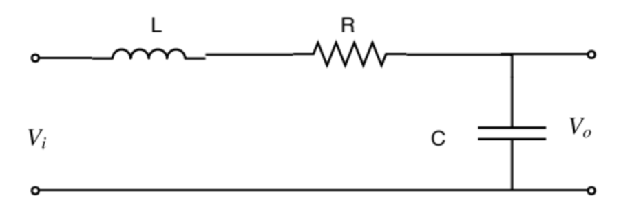
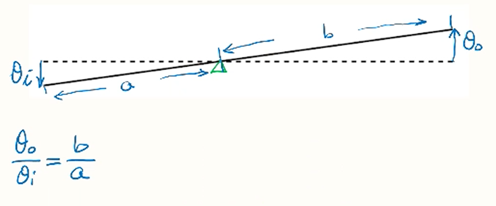

# 数学建模

## 电路建模

$$$
V_L = L\cfrac{di}{dt}, V_R = iR, V_C = V_o, i = C\cfrac{dV_0}{dt}\\
V_i(t) = V_L(t) + V_R(t) + V_o(t)\\
V_i(s) = LC s^2 V_o(s) + CR s V_o(s) + V_o(s)\\
\cfrac{V_o(s)}{V_i(s)} = \cfrac{1}{LC s^2 + CR s + 1}
$$$

## {液压}(Hydraulic Components)

### {杠杆}(Lever)

