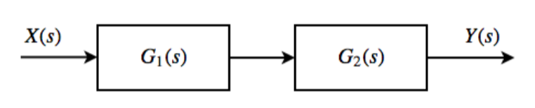
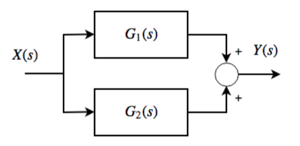
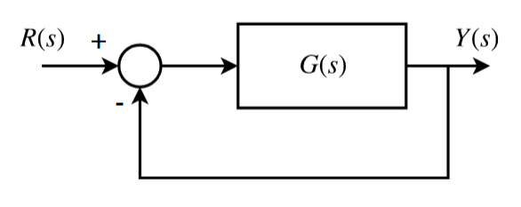
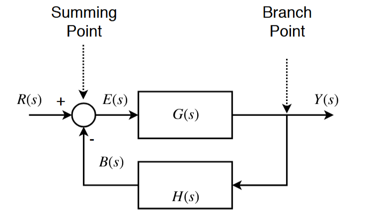
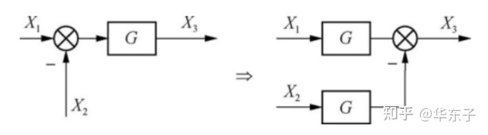
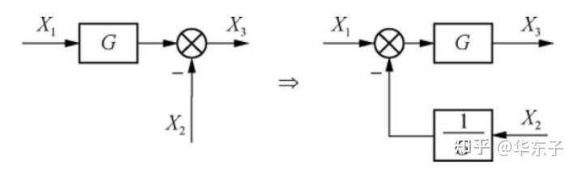
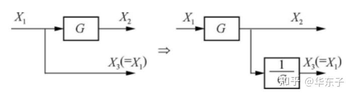
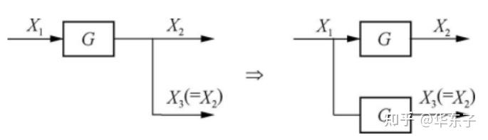

# 方框图

### 串联

$$$
\cfrac{Y(s)}{X(s)} = G_1(s) G_2(s)
$$$

### 并联

$$$
\cfrac{Y(s)}{X(s)} = G_1(s) + G_2(s)
$$$

### 反馈系统

$$$
G_c(S) = \cfrac{G(s)}{1 + G(s)}
$$$

$$$close loop transfer function
G_c(S) = \cfrac{G(s)}{1 + G(s)H(s)}
$$$

## 方框图的节点移动

比较点后移

比较点前移

分支点后移

分支点前移

