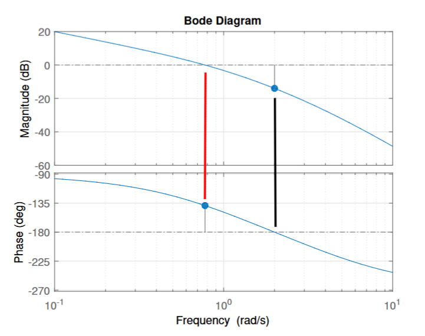

# {相位裕度和增益裕度}(Phase Margin and Gain Margin)

在博德图上找：
- 对于 Phase Margin, PM:
  - 在幅值图上找 0 dB 点，对应相位图的偏移量为 ϕ
  - $$PM = 180\degree + \phi$$
- 对于 Gain Margin, GM: 
  - 在相位图找 -180° 点，对应幅值图中的点取负的值为 GM

PM 和 GM 大于 0 时，系统稳定，小于 0 时，系统不稳定。
