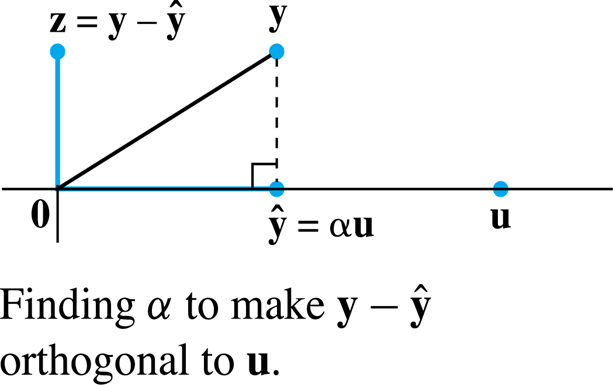

# 正交 | Orthogonality

## 内积 | Inner Product

设向量 $$\vec{u}$$ 与 $$\vec{v}$$ 同为 n 维向量，将其看作 $$n \times 1$$ 的矩阵。

则 $$\vec{u}$$ 与 $$\vec{v}$$ 的{内积}(Inner Product)即为 $$\vec{u}^T\vec{v}$$。

>>> 一个小例子
$$$
\vec{u} = \left[\begin{matrix}
    u_1\\
    u_2\\
    u_3
\end{matrix}\right]\\
\vec{v} = \left[\begin{matrix}
    v_1\\
    v_2\\
    v_3
\end{matrix}\right]\\
\vec{u}^T\vec{v} = \left[\begin{matrix}
    u_1 & u_2 & u_3
\end{matrix}\right] \left[\begin{matrix}
    v_1\\
    v_2\\
    v_3
\end{matrix}\right]
$$$
>>>

## 范数 / 长度 | Norm / Length

对于一个 $$n \times 1$$ 的矩阵 v，其范数

$$$
\Vert \vec{v} \Vert = \sqrt{\vec{v} \cdot \vec{v}} = \sqrt{v_1^2 + \dots + v_n^2}
$$$

- 长度为 1 的向量为{单位向量}(Unit vector)
- 将一个向量{标准化}(Normalizing)后即可转化为同方向上的单位向量

## 向量间距离 | Distance

对于向量 $$\vec{u}$$ 与 $$\vec{v}$$，其相互距离

$$$
dist(\vec{u}, \vec{v}) = \Vert \vec{u} - \vec{v} \Vert
$$$

## 向量正交 | Orthogonal Vectors

对于向量 $$\vec{u}$$ 与 $$\vec{v}$$，若其内积为零，则其互相正交。

### 毕达哥拉斯定理 | The Pythogorean Theorem

对于两个正交向量，有

$$$
\Vert \vec{u} + \vec{v} \Vert ^2 = \Vert \vec{u} \Vert ^2 + \Vert \vec{v} \Vert ^2
$$$

### 正交补 | Orthogonal Complements

对于一个向量 z，有子空间 W，其所有元素均与 z 正交，则 W 为 z 的正交补。

## 投影 | Projection

要求向量 y 在 u 方向上的投影，有公式

$$$
y = \hat y + z\\
\hat y = proj_u y = \cfrac{y \cdot u}{u \cdot u} u
$$$

### 斯密特正交化 | Gram-Schmidt Process

给定一组在子空间 W 下的基 $$\{x_1, \dots, x_p\}$$，有

$$$
v_1 = x_1\\
v_2 = x_2 - \cfrac{x_2 \cdot v_1}{v_1 \cdot v_1} v_1\\
v_3 = x_3 - \cfrac{x_3 \cdot v_1}{v_1 \cdot v_1} v_1 - \cfrac{x_3 \cdot v_2}{v_2 \cdot v_2} v_2\\
\dots
$$$

则计算所得 $$\{v_1, \dots, v_p\}$$ 即为 W 下的一组正交基。

## 最小二乘 | Least-Squares

$$$
Ax = b\\
A^T Ax = A^T b\\
\hat x = (A^T A)^{-1} A^T b
$$$
