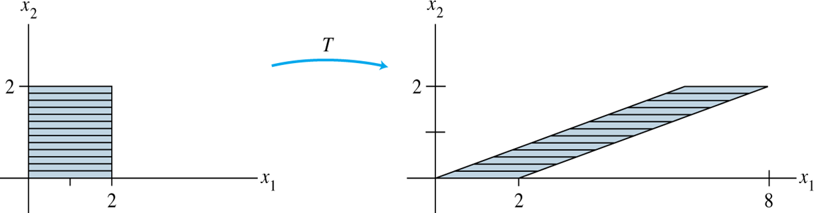

# 线性变换 | Linear Transformation

{变换}(transformation)也可以理解为通常的{函数}(function)或{映射}(mapping)。

- - -

## 定义

定义一个向量 $$\vec{x}$$，有变换 T，使变换后向量 $$T(\vec{x})$$ 为原向量的{像}(image)。

一个变换是线性变换的条件：
1. $$T(\vec{u} + \vec{v}) = T(\vec{u}) + T(\vec{v})$$
2. $$T(c\vec{u}) = cT(\vec{u})$$

>>>一个小例子
有向量 $$\vec{u} = \left[\begin{array}{c} 2 \newline -1 \end{array}\right]$$，变换定义 $$T(x) = \vec{A}x$$，此处 $$\vec{A} = \left[\begin{array}{c} 1 & -3 \newline 3 & 5 \newline -1 & 7 \end{array}\right]$$，
则向量 u 在变换 T 下的像为：
$$$
T(u) = \vec{A}\vec{u} = \left[\begin{array}{c} 1 & -3 \newline 3 & 5 \newline -1 & 7 \end{array}\right] \left[\begin{array}{c} 2 \newline -1 \end{array}\right]
$$$
>>>

- - -

## 剪切变换 | Shear Transformation

对于一个 $$T:\ \mathbb{R}^n \rightarrow \mathbb{R}^n$$，称之为剪切变换。

- - -

对于一个标量 r，定义变换 $$T:\ \mathbb{R}^n \rightarrow \mathbb{R}^n,\ T(\vec{x}) = r\vec{x}$$
- 当 $$0 \le r \le 1$$ 时，T 为{收缩}(contraction)
- 当 $$r > 1$$ 时，T 为{膨胀}(dilation)
