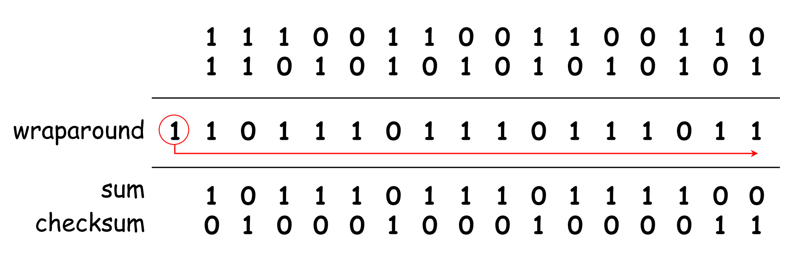

# 传输层介绍

## 传输层协议

TCP:
- reliable
- in-order
- point-to-point
- congestion control
- flow control
- connection setup
UDP:
- unreliable
- unordered
Both:
- no delay guarantees
- no bandwidth guarantees

## Multiplexing/Demultiplexing

MUX: 把同一主机上不同的 socket 要发送的数据合并，交由下一层传输
DEMUX: 将从不同主机收到的数据通过 IP 地址和端口号进行区分，分发到对应的 socket

## Checksum 计算

- 将整个传输段（包括其头部字段和应用层数据）视为一系列的 16 位整数
- 将所有这些 16 位整数相加
- 如果最高位产生了{进位}(carryout)，这个进位必须被加回到结果中（wraparound）
- 将结果的每一位进行反转，即得 checksum

## TCP 拥塞控制（窗口大小控制）

- {线性增加}(additive increase)
- {倍数减少}(multiplicative decrease)

TCP 吞吐量公式：
$$$
avg. TCP\ throughput = \cfrac{3}{4}\cfrac{W}{RTT} bytes/sec
$$$

- W: window size where loss occurs
