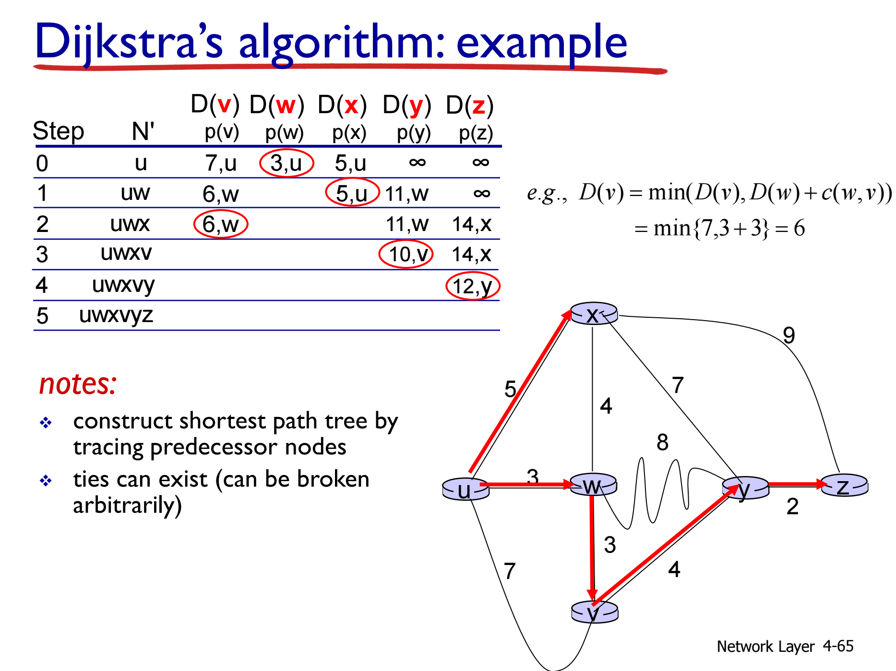
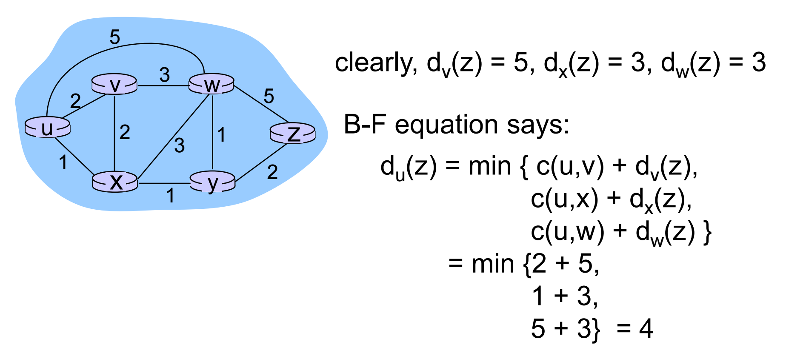

# 网络层介绍

- forwarding: move packets from router’s input to appropriate router output
- routing: determine route taken by packets from source to dest. 

### Traffic Intensity

$$$
traffic intensity = \cfrac{L * a}{R}
$$$

- L 代表 数据包长度，以比特 (bits) 为单位
- a 代表 平均数据包到达率 (average packet arrival rate)，单位为 packets/sec
- R 代表 链路传输速率 (link transmission rate)，也称为链路容量或链路带宽，以比特每秒 (bits/sec) 为单位

- 流量强度 La/R 接近 0 时，平均排队延迟很小
- La/R 接近 1，平均排队延迟会变得很大
- La/R 大于 1，这意味着到达的“工作量”超过了链路能够处理的能力，此时平均延迟会变得无限大

### Router Buffering

$$$
\cfrac{RTT \times C}{\sqrt{N}}
$$$
- N flows

## Internet Protocol

Overhead: 20 bytes of TCP + 20 bytes of IP
MTU: max.transfer size

如果 MTU 大小为 1500 bytes，则实际传输的数据大小为 1480 bytes

## DHCP: Dynamic Host Configuration Protocol

Allow host to dynamically obtain its IP address from network server when it joins network

## {路由算法}(Routing algorithms)

目的：找到最小开销的传输路径

### Link-State Routing Algorithm (Dijkstra’s algorithm)

$$c(x,y)$$: link cost from node $$x$$ to $$y$$; $$=\infty$$ if not direct neighbors
$$D(v)$$: current value of cost of path from source to dest. $$v$$
$$p(v)$$: predecessor node along path from source to $$v$$
$$N'$$: set of nodes whose least cost path definitively known

### Distance vector algorithm (Bellman-Ford)

$$d_x(y)$$: cost of least-cost path from x to y
$$d_x(y) = \min_v \{c(x,v) + d_v(y) \}$$

从 X 到 Y 的最小开销等于：__从 X 到 X 的每个邻近节点的开销加上每个邻近节点到 Y 的开销__的最小值

