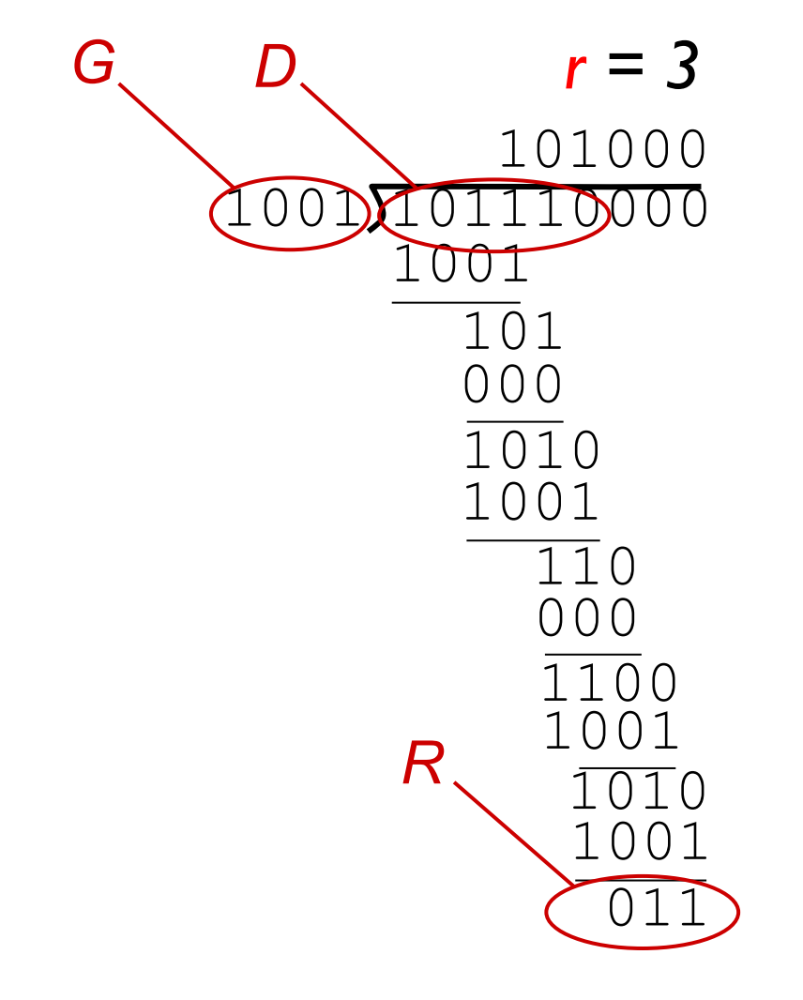
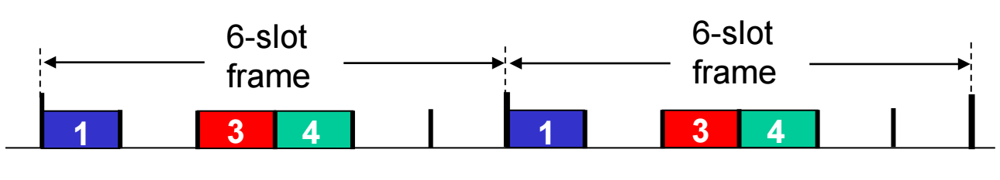
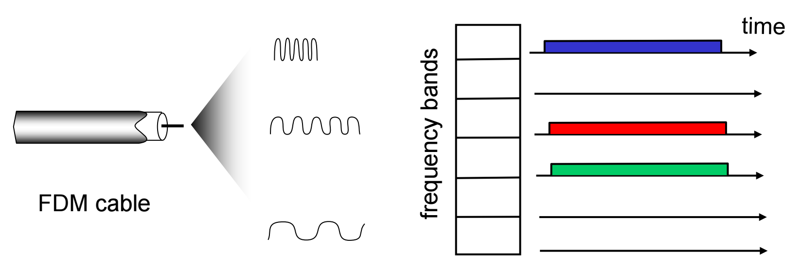

# 链路层介绍

## {CRC}(Cyclic redundancy check) 校验

- D: data bits
- G: r+1 bit pattern (generator)

1. G: 发送方和接收方预先约定好“除数”，也就是生成多项式 G(x)，通常用二进制表示 (r+1 位)
2. D: 被校验的数据
3. R: 计算的余数 (r 位)

发送数据时需要将 D 和 R 一起发送，接收方计算后将计算结果与 R 比较，若不相同则数据有误

## Multiple Access Links

类型：
- point-to-point
- broadcast (shared wire or medium)

### Channel Partitioning

#### TDMA: time division multiple access

#### FDMA: frequency division multiple access 

### Random Access

#### Slotted ALOHA

max efficiency = 1/e = 0.37

#### Pure (unslotted) ALOHA

Efficiency = = 1/(2e) = 0.18

#### CSMA (carrier sense multiple access)

listen before transmit:
- if channel sensed idle: transmit entire frame
- if channel sensed busy, defer transmission

#### CSMA/CD (collision detection)

- collisions detected within short time
- colliding transmissions aborted, reducing channel wastage 
- ##used in wired LANs##

$$$
efficiency = \frac{1}{1 + 5t_{prop}/t_{trans}}
$$$
- T,,prop,, = max prop delay between 2 nodes in LAN
- t,,trans,, = time to transmit max-size frame
efficiency goes to 1
- as t,,prop,, goes to 0
- as t,,trans,, goes to infinity

#### CSMA/CA (avoiding collisions)

##used in IEEE 802.11 (Wi-Fi)##

allow sender to __reserve__ channel rather than random access of data frames: avoid collisions of long data frames

Collision Avoidance (RTS/CTS Exchange): To further avoid collisions, especially for longer data frames, a reservation mechanism can be used
- The sender first transmits a small Request-To-Send (RTS) packet to the base station using CSMA. These RTS packets are short, so even if they collide, less channel time is wasted
- If the base station receives the RTS, it broadcasts a Clear-To-Send (CTS) message in response
- All other nodes that hear the CTS message defer their transmissions, effectively "reserving" the channel for the intended sender to transmit its data frame without collisions. This allows the data frame to be sent entirely without interference.

>>>中文解释 Avoiding collisions
- 发送方发送 RTS (Request-To-Send)：发送方首先会使用 CSMA（载波侦听多路访问）协议发送一个小的请求发送 (RTS) 数据包给基站。这些 RTS 数据包很短，即使它们发生碰撞，浪费的信道时间也较少。
- 基站广播 CTS (Clear-To-Send)：如果基站成功接收到 RTS 数据包，它会广播一个明确发送 (CTS) 消息作为响应。
- 信道保留：所有其他听到 CTS 消息的节点都会推迟它们的传输。这有效地为预期的发送方“保留”了信道，使其可以在没有碰撞的情况下传输数据帧。这种机制能够确保数据帧的完整传输，避免了长数据帧在传输过程中发生碰撞。
>>>

### “taking turns”

nodes take turns, but nodes with more to send can take longer turns
