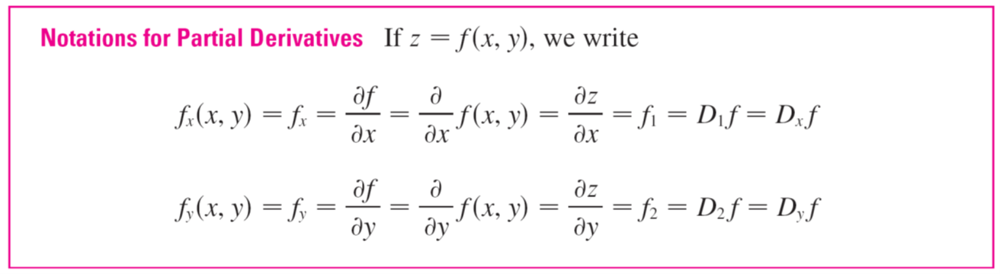
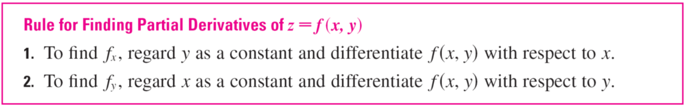
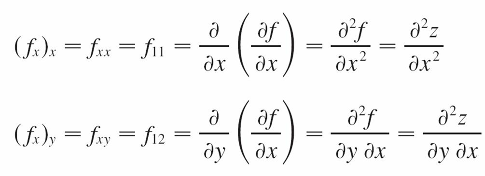
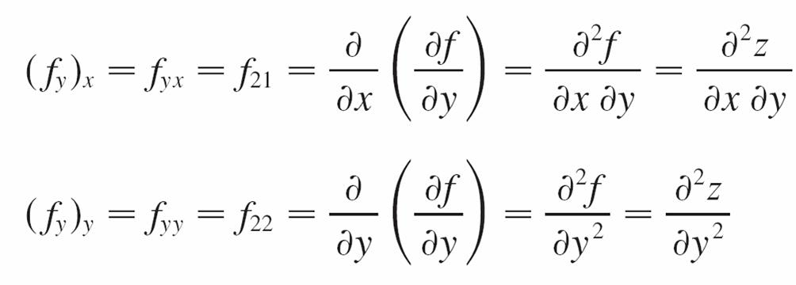
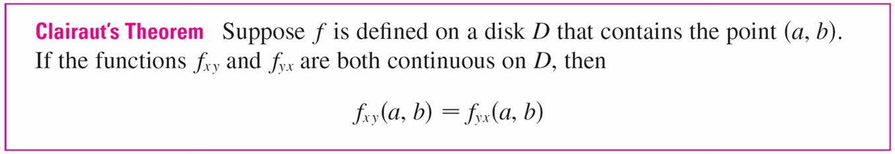

# 偏导数 | Partial derivatives

函数 ``f`` 对 x 的偏导数即为 ``f`` 在 x 轴方向上的变化率，同理，函数 ``f`` 对 y 的偏导数即为 ``f`` 在 y 轴方向上的变化率。

## 高阶偏导数 | Higher derivatives

二阶偏导数写法：

克莱罗定理 - f,,xy,, = f,,yx,, 条件：

在函数 ``f`` 的定义域上，f,,xy,, 与 f,,yx,, 都连续，则 f,,xy,, = f,,yx,,。

