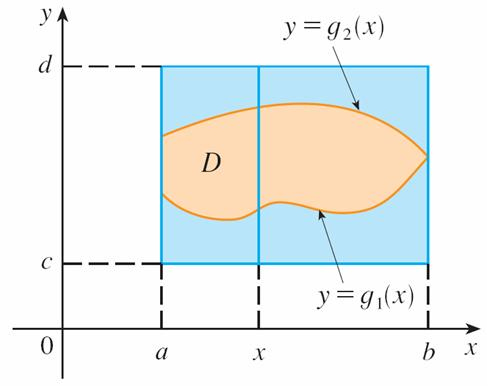

# 二重体积积分

## 长方形区域积分

对于二元函数 $$f(x, y)$$，要求其所构成的体积，有积分
$$$
\iint \limits_R f(x, y)\ dA = \int_a^b \int_c^d f(x, y)\ dy\,dx\\
With\ a \le x \le b, c \le y \le d
$$$

## 一般形状区域积分

对于一般形状的体积积分（如图所示），

则有：
$$$
\iint \limits_R f(x, y)\ dA = \int_a^b \int_{g_1(x)}^{g_2(x)} f(x, y)\ dy\,dx\\
With\ a \le x \le b, g_1(x) \le y \le g_2(x)
$$$

## 二重积分求面积

当二重积分内的函数 $$f(x, y) = 1$$ 时，积分所求即为面积
$$$
\iint \limits_D 1\ dA = A(D)
$$$
