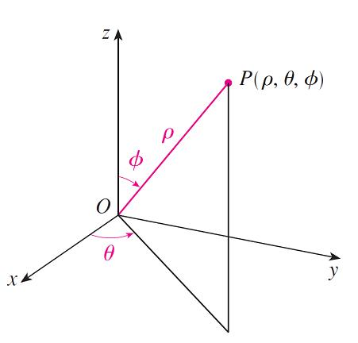

# 柱坐标系和球坐标系

## 柱坐标系 | Cylindrical Coordinates

对于一个三重积分 $$\iiint \limits_E f(x, y, z)\ dV$$，我们可以将其转化为柱坐标系：
$$$
\iiint \limits_E f(x, y, z)\ dV = \iiint f(r\cos\theta, r\sin\theta, z)\ r\,dz\,dr\,d\theta
$$$

## 球坐标系 | Spherical Coodinates

对于球坐标系 $$(\rho, \theta, \phi)$$，$$\rho$$ 为点到原点的距离，$$\theta$$ 与极坐标系相同，$$\phi$$ 为点到原点连线与 z 轴的夹角。

转换关系：
$$$
\begin{cases}
x \rightarrow \rho\sin{\phi}\cos{\theta}\\
y \rightarrow \rho\sin{\phi}\sin{\theta}\\
z \rightarrow \rho\cos{\phi}\\
\end{cases}\\
\rho^2 = x^2 + y^2 + z^2
$$$

$$$
\iiint \limits_E f(x, y, z)\ dV = \int_c^d\int_{\alpha}^{\beta}\int_a^b f(\rho\sin{\phi}\cos{\theta}, \rho\sin{\phi}\sin{\theta}, \rho\cos{\phi})\ \rho^2\sin\phi\ dx\,dy\,dz\\
With\ a \le \rho \le b, \alpha \le \theta \le \beta, c \le \phi \le d
$$$

