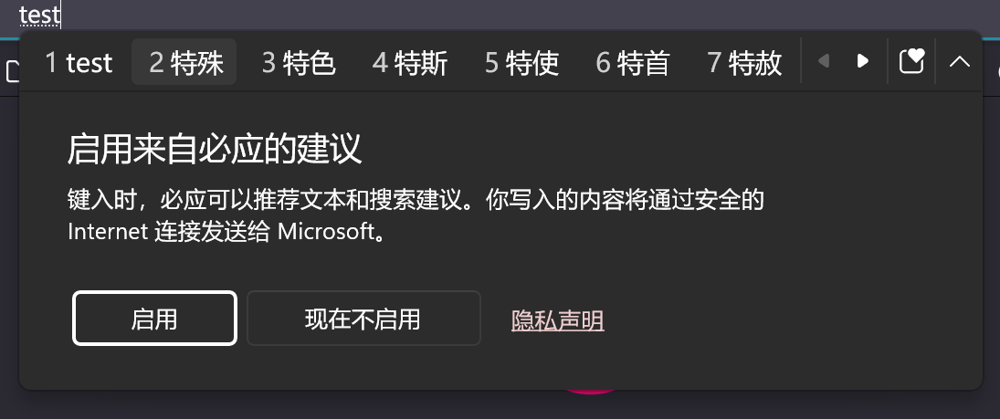
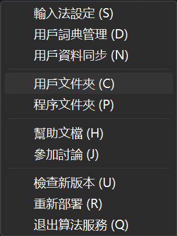
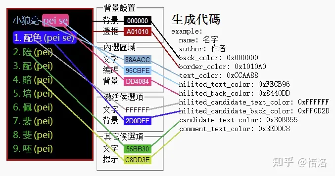

# RIME 输入法折腾记录

``2023/12/18``

- - -

## 缘由

之所以开始折腾 RIME 输入法，是因为 Windows 11 自带的输入法不知从哪次的 Windows 更新开始，在 Windows 拼音输入法下输入时按下 ``Tab`` 键，就会出现如下提示：



开启这一选项意味着你输入的内容都会被发送到微软的服务器，这显然是对个人隐私保护不利的。

我当然可以选择不启用这一功能，但是每每想到这个输入法上存在着这么一个用不着的功能，还被绑定到 ``Tab`` 这个常用的按键，我就浑身难受。

> 小声提一下，你可以在 设置 > 时间&语言>语言 &区域中 找到设置，> Microsoft 拼音 > 词典和自学 > 尝试来自必应的文本建议 启用和关闭这一功能。

## 替代品

于是我开始搜寻自带输入法的替代品。很快，我找到来 RIME（中州韵） 输入法，这一输入法可以高度自定义，有足够的社区支持--（可以抄现成的作业）--，支持 Windows、Linux、MacOs 三大操作系统，最重要的是，它完全开源！

你可以很容易地从[官网](https://rime.im/)下载它，Windows 版本的 RIME 输入法被叫作“小狼毫”。

## 参考

具体的配置过程主要参照这两篇博客：

- [跨平台的开源输入法Rime定制指南，打造强大的个性化输入法](https://www.mintimate.cn/2023/03/18/rimeQuickInit/)
- [Rime 配置：雾凇拼音](https://dvel.me/posts/rime-ice/)

以及其文中附带的 GitHub 上已经配置好的 repo。

- - -

## 主要功能

在本文成文时，我使用的是当前的最新 Windows 版本 ``0.15.0``。

在我的完全配置后，现在已经可以实现如下功能：

- 模糊音识别（en => eng, ian => iang etc.）
- 一定程度的拼音纠错 （dagn => dang, hoa => hao etc.）
- 还看得过去的 UI 界面
- 日本語输入
- 字符映射（emoji 输入, 一月 => January etc.）
- 较为完备的词库
- 通过 lua 脚本实现的快捷的当前时间输入（time => 22:52, week => Mon., date => 2023/12/18）

接下来，我会从入门开始逐一介绍如何配置上述这些功能。

## 折腾配置

### 配置文件解析

在 Windows 上，你可以通过任务栏的托盘（如下图）快速打开配置文件夹。

> 小声提一嘴，如果你和我一样只习惯拼音输入法，在安装中选择输入法的界面可以只选择##朙月拼音##选项，也能勉强算是开箱即用。




主要的配置文件及其功能：

- ``weasel.custom.yaml``：主要用于设置在特定应用中使用英文模式及配置 UI 界面
- ``default.custom.yaml``：用来存放对于所有 RIME 输入法中输入方式的通用配置（按键绑定、单页词数等）
- ``luna_pinyin.custom.yaml``：针对明月拼音输入法的配置文件
- ``build/``：存储输入法编译配置文件后的产物。

其它的也不太用得着，就先不介绍了。

### 外观

俗话说，美是第一生产力。RIME 输入法的默认外观不一定能符合你的需求，自己配置一份外观即能让自己用得更舒服，也能更符合自己的审美。先贴上我配置完后的外观：


我们先打开上文中提到的 ``weasel.custom.yaml``，

可以看到，文件开头的部分：

```yaml
customization:
  distribution_code_name: Weasel
  distribution_version: 0.15.0.0
  generator: "Weasel::UIStyleSettings"
  modified_time: "Sun Dec 17 22:14:58 2023"
  rime_version: 1.8.5
```

这些都不需要管，关键在于后面 ``patch`` 之后的部分。

你可以通过类似下面这样的配置项来告诉输入法，你希望在哪些应用中默认使用英文输入法。##注意⚠️##请使用合适的缩进并且不要使用 Tab 来作为缩进，这可能会导致输入法读取配置文件时出现错误；另外，这里的程序名可以通过任务管理器获取，并且必须全部小写，不得有大写字符。

```yaml
app_options:
  windowsterminal.exe:
    ascii_mode: true
  vscode.exe:
    ascii_mode: true
  vscodium.exe:
    ascii_mode: true
```

在修改配置文件后，你可以通过托盘右键菜单中的“重新部署”来刷新输入法，应用新的配置。

- - -

在添加完对于特定应用的配置后，接下来才是重头戏：样式管理。这是我目前使用的样式并附上完整的注释：

```yaml
style:
  color_scheme: BlueGrey               # 当前使用的颜色配置方案
  display_tray_icon: false             # 是否显示右下角图标
  horizontal: true                     # 横排显示
  font_face: "Microsoft YaHei"         # 候选字体
  font_point: 15                       # 候选字体大小
  label_font_face: "JetBrains Mono"    # 序号字体
  label_font_point: 14                 # 序号字体大小
  comment_font_face: "Microsoft YaHei" # 注释字体
  comment_font_point: 12               # 注释字体大小
  inline_preedit: true                 # 嵌入式候选窗单行显示
  layout:
    border: 6                # 边框宽度
    border_width: 0          # 边框宽度
    margin_x: 18             # 候选项左右边距
    margin_y: 18             # 候选项上下边距
    spacing: 12              # 候选项间距
    candidate_spacing: 24    # 候选项内部间距
    round_corner: 12         # 输入法候选框的圆角幅度，0为直角
    hilite_padding: 8        # 激活候选项背景色高度
    hilite_spacing: 3        # 序号和候选项之间的间隔
    hilited_corner_radius: 8 # 选词的圆角幅度，0为直角
```

然后就是配色方案的编写，不多说，直接上代码：

```yaml
preset_color_schemes:
  BlueGrey:
    name: BlueGrey                         # 配置方案名称
    back_color: 0xF1EFEC                   # 候选框背景色
    border_color: 0xAEA490                 # 候选框边框颜色
    text_color: 0x333333                   # 已选择字文字颜色
    hilited_text_color: 0x000000           # 已选择字右侧拼音文字颜色
    hilited_back_color: 0x000000           # 已选择字右侧拼音背景色
    hilited_candidate_text_color: 0xFFFFFF # 已选择字颜色
    hilited_candidate_back_color: 0x645A45 # 已选择字背景色
    hilited_comment_text_color: 0xE0E0E0   # 已选择字右侧注释文字颜色
    hilited_label_color: 0xE0E0E0          # 已选择字左侧数字序号颜色
    candidate_text_color: 0x333333         # 未候选字颜色
    comment_text_color: 0x666666
```

再附加一张来自其它博主的--包浆--图例：



> 小声说一句🤫：这里的颜色代码不是一般的 RGB 顺序，而是 BGR 顺序，因此你不能直接复制网上配色方案中的颜色代码。这里是一位[大佬做的在线工具](https://bennyyip.github.io/Rime-See-Me/)，你可以以图形化的方式编写配色方案。

再附上完整的 ``weasel.custom.yaml`` 文件：

```yaml
customization:
  distribution_code_name: Weasel
  distribution_version: 0.15.0.0
  generator: "Weasel::UIStyleSettings"
  modified_time: "Sun Dec 17 22:14:58 2023"
  rime_version: 1.8.5
patch:
  app_options:
    windowsterminal.exe:
      ascii_mode: true
    vscode.exe:
      ascii_mode: true
    vscodium.exe:
      ascii_mode: true

  style:
    color_scheme: BlueGrey
    display_tray_icon: false             # 是否显示右下角图标
    horizontal: true                     # 横排显示
    font_face: "Microsoft YaHei"         # 候选字体
    font_point: 15                       # 候选字体大小
    label_font_face: "JetBrains Mono"    # 序号字体
    label_font_point: 14                 # 序号字体大小
    comment_font_face: "Microsoft YaHei" # 注释字体
    comment_font_point: 12               # 注释字体大小
    inline_preedit: true                 # 嵌入式候选窗单行显示
    layout:
      border: 6
      border_width: 0          # 边框宽度
      margin_x: 18             # 候选项左右边距
      margin_y: 18             # 候选项上下边距
      spacing: 12              # 候选项间距
      candidate_spacing: 24    # 候选项内部间距
      round_corner: 12         # 输入法候选框的圆角幅度，0为直角
      hilite_padding: 8        # 激活候选项背景色高度
      hilite_spacing: 3        # 序号和候选项之间的间隔
      hilited_corner_radius: 8 # 选词的圆角幅度，0为直角

  preset_color_schemes:
    BlueGrey:
      name: BlueGrey
      back_color: 0xF1EFEC                   # 候选框背景色
      border_color: 0xAEA490                 # 候选框边框颜色
      text_color: 0x333333                   # 已选择字文字颜色
      hilited_text_color: 0x000000           # 已选择字右侧拼音文字颜色
      hilited_back_color: 0x000000           # 已选择字右侧拼音背景色
      hilited_candidate_text_color: 0xFFFFFF # 已选择字颜色
      hilited_candidate_back_color: 0x645A45 # 已选择字背景色
      hilited_comment_text_color: 0xE0E0E0   # 已选择字右侧注释文字颜色
      hilited_label_color: 0xE0E0E0          # 已选择字左侧数字序号颜色
      candidate_text_color: 0x333333         # 未候选字颜色
      comment_text_color: 0x666666
```

- - -

### 创建自己的输入方案

这一步实际上非常简单。你只需要在配置文件夹下创建 ``[方案名称].schema.yaml`` 的文件，再参考官方的[朙月拼音配置文件的写法](https://github.com/rime/rime-luna-pinyin/blob/master/luna_pinyin.schema.yaml)，加以修改。目前，你只需要 Copy 朙月拼音配置文件，把其中的 ``schema_id``, ``author``, ``description``, ``name`` 和 ``version`` 改成自己的就 OK。

### 模糊音识别及拼音纠错

这一部分非常简单，你只需要在输入方案文件的最后加上如下代码：

```yaml
speller:
  algebra:
    - erase/^xx$/
    - derive/^([zcs])h/$1/ # zh, ch, sh => z, c, s
    - derive/^([zcs])([^h])/$1h$2/ # z, c, s => zh, ch, sh
    - derive/([aei])n$/$1ng/ # en => eng, in => ing
    - derive/([aei])ng$/$1n/ # eng => en, ing => in
    - derive/([iu])an$/$lang/ # ian => iang, uan => uang
    - derive/([iu])ang$/$lan/ # iang => ian, uang => uan
    - derive/([aeiou])ng$/$1gn/        # dagn => dang
    - derive/([dtngkhrzcs])o(u|ng)$/$1o/  # zho => zhong|zhou
    - derive/ong$/on/                  # zhonguo => zhong guo
    - derive/ao$/oa/                   # hoa => hao
    - derive/([iu])a(o|ng?)$/a$1$2/    # tain => tian
    - abbrev/^([a-z]).+$/$1/  # 简拼（首字母）
    - abbrev/^([zcs]h).+$/$1/ # 简拼（zh, ch, sh）
```

其中每一行的用处也都写明，你可以根据自己的需求选择是否使用全部规则。

- - -

### 日本語输入

这是我个人的特殊需求，不需要的话可以跳过。对于其它语言输入法的设置也同理。

打开这个[ GitHub 储存库](https://github.com/gkovacs/rime-japanese)，下载源代码，将其中以 ``yaml`` 为拓展名的文件直接复制到配置文件夹中，再修改 ``default.custom.yaml`` 中的 ``schema_list`` 字段为：

```yaml
patch:
  schema_list:
    - {schema: pinyin}
    - {schema: japanese}
```
另外，你如果觉得配置文件夹中的文件太多太杂乱的话，你可以创建 ``dicts`` 文件夹（这也是我们之后中文词库存放文件夹），然后将 ``japanese.jmdict.dict.yaml``, ``japanese.kana.dict.yaml``, ``japanese.mozc.dict.yaml`` 都移动到其中，在修改 ``japanese.dict.yaml`` 文件为如下所示：

```yaml
# nihong-hybrid.dict.yaml
# encoding: utf-8

---
name: japanese
version: 'v0.2-20180411'

import_tables:
  - dicts/japanese.mozc
  - dicts/japanese.jmdict
  - dicts/japanese.kana
```

重新部署程序，点击 ``F4`` 或者 ``Ctrl + 反引号``，打开输入方案切换框，不出意外的话，框中应该会出现“日本語”的字样。选择它，你就可以使用ローマ字（罗马音）来进行日文输入了。

- - -

### 字符映射

这一步利用来输入法自带的 opencc 功能，得以通过字符映射的方式实现 emoji 等输入。

我们先在我们的语言配置文件（*.schema.yaml）中找到 ``switches`` 字段，在其中加入如下代码：

```yaml
- name: mapping_suggestion
  reset: 1              # 此字段可以让输入法记忆开关状态 
  states: [ 关闭, 映射 ] # 此字段会在输入方案切换框中展示，可以调整需要展示的文字
```

添加完后应该会像这样：

```yaml
switches:
  - name: ascii_mode
    reset: 0
    states: [ 中文, 西文 ]
  - name: mapping_suggestion
    reset: 1
    states: [ 关闭, 映射 ]
  - name: full_shape
    states: [ 半角, 全角 ]
  - name: simplification
    states: [ 漢字, 汉字 ]
  - name: ascii_punct
    states: [ 。，, ．， ]
```

再在其后添加 ``mapping_suggestion`` 的定义：

```yaml
mapping_suggestion:
  opencc_config: mapping.json # 存储映射词库定义的文件
  option_name: mapping_suggestion
  tips: all
  inherit_comment: false
```

再在 ``engine`` - ``filters`` 下加入如下字段：

```yaml
- simplifier@emoji_suggestion
```

添加完后如下所示：

```yaml
engine:
  filters:
    - simplifier@emoji_suggestion
    - simplifier@zh_simp # 简体过滤，此行可能可以省略
    - simplifier # 简体
    - uniquifier # rime基础驱动
```

最后，你可以[到此](https://github.com/iDvel/rime-ice/tree/main/opencc)下载需要的映射表，复制到配置文件目录下的 ``opencc`` 目录（没有可以自己新建），在将其中的 ``emoji.json`` 更名为 ``mapping.json``。

刷新程序，试试效果：


- - -

### lua 脚本配置

> 顺便提一下，我不确定 lua 脚本的使用是否需要安装 lua 解释器，姑且贴一下：[https://github.com/rjpcomputing/luaforwindows](https://github.com/rjpcomputing/luaforwindows)，如果你需要在 Windows 电脑上安装 lua，可能能用得上

先在配置文件目录下新建 ``lua`` 文件夹和 ``rime.lua`` 文件，再在 ``lua`` 文件夹下添加如下脚本：

```lua
-- time.lua
local function translator(input, seg)
    if (input == "time" or input == "when") then
        yield(Candidate("time", seg.start, seg._end, os.date("%H:%M"), " "))
        yield(Candidate("time", seg.start, seg._end, os.date("%H点%M分"), " "))
        yield(Candidate("time", seg.start, seg._end, os.date("%H:%M:%S"), " "))
        yield(Candidate("time", seg.start, seg._end, os.date("%H点%M分%S秒"), " "))
    end
end
return translator
```

```lua
-- week.lua
function translator(input, seg)
    if (input == "week" or input == "xingqiji") then
        local day_w=os.date("%w")
        local day_w1=""
        local day_w2=""
        local day_w3=""

        if day_w == "0" then 
            day_w1="星期日"
            day_w2="Sunday"
            day_w3="Sun."
        end
        if day_w == "1" then
            day_w1="星期一" 
            day_w2="Monday" 
            day_w3="Mon." 
        end
        if day_w == "2" then
            day_w1="星期二"
            day_w2="Tuesday"
            day_w3="Tues."
        end
        if day_w == "3" then
            day_w1="星期三"
            day_w2="Wednesday"
            day_w3="Wed."
        end
        if day_w == "4" then
            day_w1="星期四"
            day_w2="Thursday"
            day_w3="Thur."
        end
        if day_w == "5" then
            day_w1="星期五"
            day_w2="Friday"
            day_w3="Fri."
        end
        if day_w == "6" then
            day_w1="星期六"
            day_w2="Saturday"
            day_w3="Sat."
        end
        yield(Candidate("date", seg.start, seg._end, day_w1, " "))
        yield(Candidate("date", seg.start, seg._end, day_w2, " "))
        yield(Candidate("date", seg.start, seg._end, day_w3, " "))
        yield(Candidate("week", seg.start, seg._end, os.date("%w"),""))
    end
end
return translator
```

```lua
-- date.lua
local function translator(input, seg)
    if (input == "date" or input == "riqi") then
        ------------------------------------------------------------------------------------
        --普通日期1，类似2022年01月02日
        date1=os.date("%Y年%m月%d日")
        date_y=os.date("%Y") --取年
        date_m=os.date("%m") --取月
        date_d=os.date("%d") --取日
        --yield(Candidate("date", seg.start, seg._end, date1, " "))
        ------------------------------------------------------------------------------------
        --普通日期2，类似2022年1月1日
        num_m=os.date("%m")+0
        num_m1=math.modf(num_m)
        num_d=os.date("%d")+0
        num_d1=math.modf(num_d)
        date2=os.date("%Y年")..tostring(num_m1).."月"..tostring(num_d1).."日"
        yield(Candidate("date", seg.start, seg._end, date2, " "))
        ------------------------------------------------------------------------------------
        --普通日期3，类似1月1日
        num_m=os.date("%m")+0
        num_m1=math.modf(num_m)
        num_d=os.date("%d")+0
        num_d1=math.modf(num_d)
        date3=tostring(num_m1).."月"..tostring(num_d1).."日"
        yield(Candidate("date", seg.start, seg._end, date3, " "))
        yield(Candidate("date", seg.start, seg._end, os.date("%Y/%m/%d"), " "))
        yield(Candidate("date", seg.start, seg._end, os.date("%Y-%m-%d"), " "))
        ------------------------------------------------------------------------------------
        --大写日期，类似二〇二〇年十一月二十六日
        date_y=date_y:gsub("%d",{
            ["1"]="一",
            ["2"]="二",
            ["3"]="三",
            ["4"]="四",
            ["5"]="五",
            ["6"]="六",
            ["7"]="七",
            ["8"]="八",
            ["9"]="九",
            ["0"]="〇",
        })
        date_y=date_y.."年"
        date_m=date_m:gsub("%d",{
            ["1"]="一",
            ["2"]="二",
            ["3"]="三",
            ["4"]="四",
            ["5"]="五",
            ["6"]="六",
            ["7"]="七",
            ["8"]="八",
            ["9"]="九",
            ["0"]="",
        })
        date_m=date_m.."月"
        if num_m1==10 then date_m="十月" end
        if num_m1==11 then date_m="十一月" end
        if num_m1==12 then date_m="十二月" end
        date_d=date_d:gsub("%d",{
            ["1"]="一",
            ["2"]="二",
            ["3"]="三",
            ["4"]="四",
            ["5"]="五",
            ["6"]="六",
            ["7"]="七",
            ["8"]="八",
            ["9"]="九",
            ["0"]="",
        })
        date_d=date_d.."日"
        if num_d1>9 then
            if num_d1<19 then
            date_d="十"..string.sub(date_d,4,#date_d)
            end
        end
        if num_d1>19 then
            date_d=string.sub(date_d,1,3).."十"..string.sub(date_d,4,#date_d)
        end
        date4=date_y..date_m..date_d
        yield(Candidate("date", seg.start, seg._end, date4, " "))
        ------------------------------------------------------------------------------------
        --英文日期
            local date_d=os.date("%d")
            local date_m=os.date("%m")
            local date_y=os.date("%Y")
            local date_m1=""
            local date_m2=""
            if date_m=="01" then 
                date_m1="Jan."
                date_m2="January"
            end
            if date_m=="02" then 
                date_m1="Feb."
                date_m2="February"
            end
            if date_m=="03" then 
                date_m1="Mar."
                date_m2="March"
            end
            if date_m=="04" then 
                date_m1="Apr."
                date_m2="April"
            end
            if date_m=="05" then 
                date_m1="May."
                date_m2="May"
            end
            if date_m=="06" then 
                date_m1="Jun."
                date_m2="June"
            end
            if date_m=="07" then 
                date_m1="Jul."
                date_m2="July"
            end
            if date_m=="08" then 
                date_m1="Aug."
                date_m2="August"
            end
            if date_m=="09" then 
                date_m1="Sept."
                date_m2="September"
            end
            if date_m=="10" then 
                date_m1="Oct."
                date_m2="October"
            end
            if date_m=="11" then 
                date_m1="Nov."
                date_m2="November"
            end
            if date_m=="12" then 
                date_m1="Dec."
                date_m2="December"
            end
        
            if date_d=="0" then 
                symbal="st" 
            elseif date_d=="1" then
                symbal="nd" 
            elseif date_d=="2" then 
                symbal="rd" 
            else
                symbal="th"
            end
        date5=date_m1.." "..date_d..symbal..", "..date_y
        date6=date_m2.." "..date_d..symbal..", "..date_y
        
        yield(Candidate("date", seg.start, seg._end, date5, " "))
        yield(Candidate("date", seg.start, seg._end, date6, " "))
    end
end
return translator
```

再在 ``rime.lua`` 文件中添加如下定义：

```lua
time_translator = require("time")
week_translator = require("week")
date_translator = require("date")
```

最后，在输入方案配置文件中的 ``engine`` - ``translators`` 下添加：

```yaml
- lua_translator@time_translator
- lua_translator@week_translator
- lua_translator@date_translator
```

添加完后应该会像这样：

```yaml
engine:
  processors:
    - ascii_composer
    - recognizer
    - key_binder
    - speller
    - punctuator
    - selector
    - navigator
    - express_editor
  segmentors:
    - ascii_segmentor
    - matcher
    - abc_segmentor
    - punct_segmentor
    - fallback_segmentor
  translators:
    - lua_translator@time_translator
    - lua_translator@week_translator
    - lua_translator@date_translator
    - punct_translator
    - "table_translator@custom_phrase"
    - reverse_lookup_translator
    - script_translator
  filters:
    - simplifier@mapping_suggestion
    - simplifier
    - uniquifier
```

刷新程序，在中文模式下输入“date”、“riqi”等设定词，就可以看到 lua 脚本中定义好的输出了：


- - -

### 导入词库

首先，在 ``default.custom.yaml`` 中加入：

```yaml
translator:
  # 允许使用用户词库
  enable_user_dict: true
```

在配置文件目录下创建 ``chinese_simp.dict.yaml``，这个文件夹会用来存放指向所需的词库文件的路径。

修改输入方案配置文件下 ``translator`` - ``dictionary`` 为：``chinese_simp``，即指向我们刚刚创建的文件。

到[这里](https://github.com/iDvel/rime-ice/tree/main/cn_dicts)下载其中的 ``base.dict.yaml``, ``ext.dict.yaml`` 和 ``8105.dict.yaml`` 词库文件，放到前文里创建的 ``dicts`` 目录下。

修改 ``chinese_simp.dict.yaml`` 如下所示：

```yaml
name: chinese_simp # 注意name和文件名一致
version: "0.0.1"
sort: by_weight
use_preset_vocabulary: true
# 此处为输入法所用到的词库，既补充拓展词库的地方
import_tables:
  - dicts/base
  - dicts/ext
  - dicts/8105
```

> 注意⚠️：前文的字符映射要在这里的导入词库配置完之后才能够使用映射表中的所有内容。

- - -

## 最后，放上我的完整的输入方案配置文件 ``pinyin.schema.yaml``

```yaml
schema:
  schema_id: pinyin
  name: 拼音
  version: '0.1'
  dependencies:
    - stroke

switches:
  - name: ascii_mode
    reset: 0
    states: [ 中文, 西文 ]
  - name: mapping_suggestion
    reset: 1
    states: [ 关闭, 映射 ]
  - name: full_shape
    states: [ 半角, 全角 ]
  - name: simplification
    states: [ 漢字, 汉字 ]
  - name: ascii_punct
    states: [ 。，, ．， ]

engine:
  processors:
    - ascii_composer
    - recognizer
    - key_binder
    - speller
    - punctuator
    - selector
    - navigator
    - express_editor
  segmentors:
    - ascii_segmentor
    - matcher
    - abc_segmentor
    - punct_segmentor
    - fallback_segmentor
  translators:
    - lua_translator@time_translator
    - lua_translator@week_translator
    - lua_translator@date_translator
    - punct_translator
    - "table_translator@custom_phrase"
    - reverse_lookup_translator
    - script_translator
  filters:
    - simplifier@mapping_suggestion
    - simplifier
    - uniquifier

mapping_suggestion:
  opencc_config: mapping.json
  option_name: mapping_suggestion
  tips: all
  inherit_comment: false

speller:
  alphabet: zyxwvutsrqponmlkjihgfedcba
  delimiter: " '"
  algebra:
    - erase/^xx$/
    - derive/([aei])n$/$1ng/ # en => eng, in => ing
    - derive/([aei])ng$/$1n/ # eng => en, ing => in
    - derive/([iu])an$/$lang/ # ian => iang, uan => uang
    - derive/([iu])ang$/$lan/ # iang => ian, uang => uan
    - derive/([aeiou])ng$/$1gn/        # dagn => dang
    - derive/ong$/on/                  # zhonguo => zhong guo
    - derive/ao$/oa/                   # hoa => hao
    - derive/([iu])a(o|ng?)$/a$1$2/    # tain => tian
    - abbrev/^([a-z]).+$/$1/  # 简拼（首字母）
    - abbrev/^([zcs]h).+$/$1/ # 简拼（zh, ch, sh）

translator:
  dictionary: chinese_simp
  preedit_format:
    - xform/([nl])v/$1ü/
    - xform/([nl])ue/$1üe/
    - xform/([jqxy])v/$1u/

custom_phrase:
  dictionary: ""
  user_dict: custom_phrase
  db_class: stabledb
  enable_completion: false
  enable_sentence: false
  initial_quality: 1

reverse_lookup:
  dictionary: stroke
  enable_completion: true
  prefix: "`"
  suffix: "'"
  tips: 〔筆畫〕
  preedit_format:
    - xlit/hspnz/一丨丿丶乙/
  comment_format:
    - xform/([nl])v/$1ü/

punctuator:
  import_preset: symbols

key_binder:
  import_preset: default

recognizer:
  import_preset: default
  patterns:
    punct: '^/([0-9]0?|[A-Za-z]+)$'
    reverse_lookup: "`[a-z]*'?$"
```

感谢阅读！
