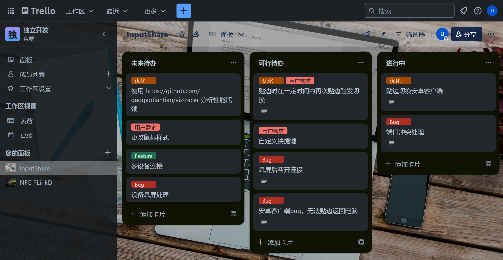
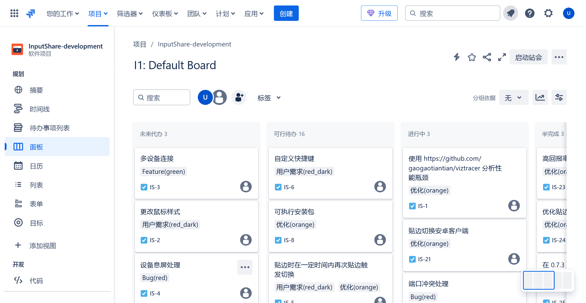
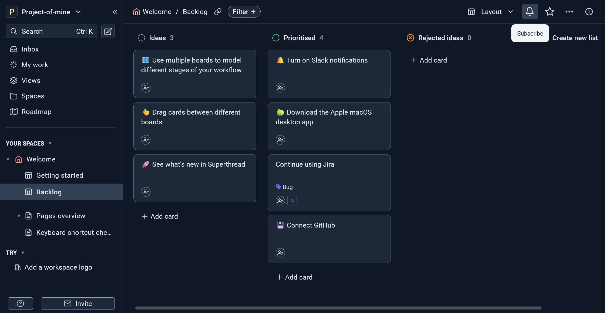
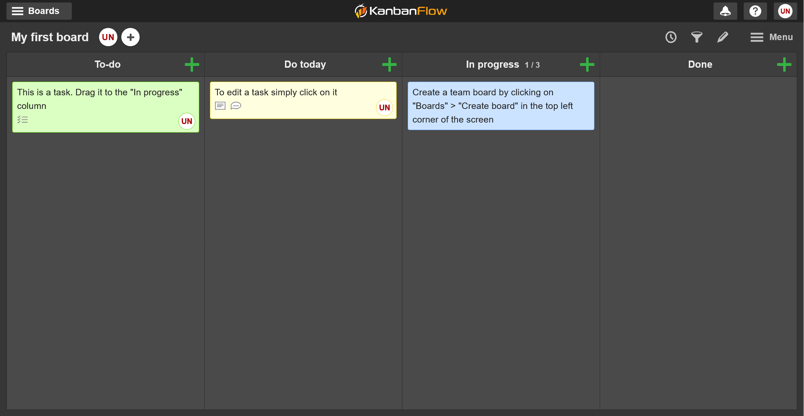
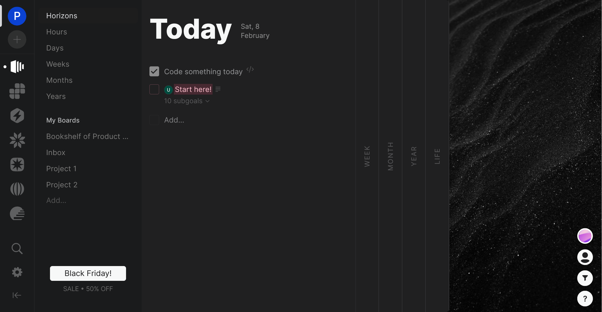
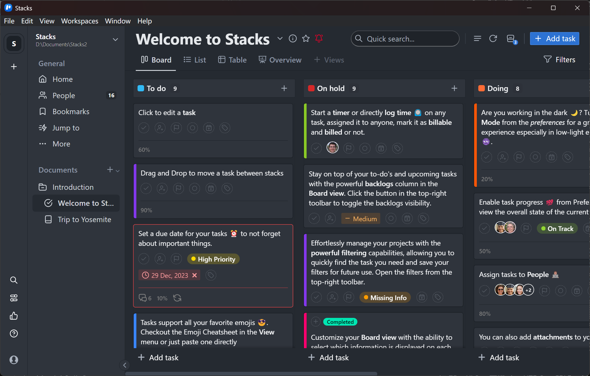

# kanban 类软件调研

## 太长不看

如果你觉得自己需要 kanban 类软件，但有不明确具体需求，可以使用 Trello，原因如下：
1. 很多同类应用支持从 Trello 导入数据
2. 功能全面
3. 所属公司规模较大，不容易跑路

在你明确自己的需求后，可以根据以下条件在对应类别中进行选择：
- 希望开箱即用，有多端同步功能的：
  - 商业软件（SaaS）
- 希望数据能够离线编辑的：
  - 商业软件（一次性付费）、离线客户端、离线独立网页
- 看重数据安全性和隐私的：
  - 开源软件、商业软件（一次性付费）（候补）

- - -

我最开始使用的 kanban 类软件是 [Trello](https://Trello.com/)。

Trello 作为一个商业软件来说非常好用，支持：
- 多端同步
- 离线编辑
- 富文本编辑
- 丰富的模板
- 等...
但是 Trello 同样也有一些限制：
- 无法在多个看板间共享标签
- 对于免费用户有 10 个面板数的限制（貌似可以通过创建多个工作区来规避）
- 数据全部存储于云端（但是支持导出）
- 团队协作相关功能过多，个人用户用不上
- 功能过于复杂繁多，导致使用时心智负担过高，同时在使用一些功能时操作步骤过于繁琐

于是我开始寻找一些替代品。

## 商业软件（SaaS）

### [Jira](https://www.atlassian.com/software/jira)

同为 atlassian 公司的产品，更偏向于软件开发领域。也因此，能够直接导入 Trello 的数据
但是界面过于冗杂，个人觉得并不好用

可以看到，在整个界面中，有过半的空间被与看板本身无关的元素占据，比起 Trello 还是有些鸡肋。

### [Todoist](https://www.todoist.com/)

虽然名字里带有 Todo，但也有提供 kanban 相关功能。
免费用户只能创建 5 个私人项目。

### [SuperThread](https://superthread.com/)

功能上和 Trello 很相近，
免费用户可以创建无限的面板和任务，但是只能创建两个工作区。

- 相比于 Trello，支持在同一工作区内共享标签。
- 支持从 Trello、jira、shortcut 导入数据。

缺点是如果不想使用 Web 端的话，只提供 Mac 版本的客户端。

### [KanbanFlow](https://kanbanflow.com)

偏向于个人使用。
界面非常简洁，免费用户可以创建无限的面板和任务。

### [Plaky](https://plaky.com/)

对于免费用户提供无限的面板数量和面板中的任务数量，但是对每个面板有{字段}(field)数的限制。
个人觉得操作上不如 Trello 那种界面顺手。

### [Zenkit](https://app.zenkit.com/)

同样是团队管理向的 kanban 应用，功能相对于 Trello 更简单一些
免费用户创建<面板数>(25)和<项目数>(500)同样有限制。

### [MeisterTask](https://www.meistertask.com)

在应用内集成了笔记文档协同编辑的功能。
免费用户只能创建 3 个项目。

### [flet](https://flat.app/)

专注于 kanban 这一功能，界面十分简洁。
支持从 Trello、monday、clickup、notion 导入数据
也能和 GitHub、slack 等应用集成。

### [height](https://height.app)

在多用户同时修改看板时能看到其他用户的光标。
自带 AI Chat。

### [EnkiTask](https://enkitask.com/)

按照创建的任务数付费
抛开付费不谈，使用体验可能还行
提供移动端优化的网页（PWA）
> 这一点挺聪明的，小团队资源和人力有限，就把 Web 端适配好全端，省去做 App 的成本

### [nino](https://nino.app)

少见的使用 Material Design 的 kanban 应用
不是专门的 kanban 应用，除看板外也能创建其它一些类型的在线文档，如画布、表格等，也能够创建用于团队交流的类似 discord 的频道。
--比起 kanban，更类似于 notion 或者 office（？）--
免费用户有一万个节点的限制。

### [Timestripe](https://timestripe.com)

使用看板进行从眼前到一辈子的人生管理，UI 设计很棒。

## 商业软件（一次性付费）

### [Stack](https://getstacksapp.com/)

不提供 Web 端，只能下载客户端使用。但有提供 Windows、MacOS、Linux 三端的客户端。
界面设计很棒：

免费版的限制较多，只能创建 3 个面板。
但是并非订阅制，而是一次性买断制，通过 License 激活，售价 49$。

### [Brisqi](https://brisqi.com/)

离线优先的 kanban 应用。
但同样需要购买付费版本以解除面板数量等的限制，##但是限制在一台设备激活使用##。
优点是一次性付费，无订阅，售价 29.99$。

- - -

另外一些没什么特点的：

- [Asana](https://asana.com)
  - 仅提供数天的免费试用，无免费服务。--因为知名度较高，所以列在这里--
- [Clickup](https://clickup.com/)
- [Monday](https://monday.com)
- [Quire](https://quire.io/)
- [Slingshot](https://www.slingshotapp.io/)
  - 编辑体验一般
- [nozbe](https://nozbe.app/)
  - 一个更偏向于个人事务管理的 kanban 应用。免费用户最多只能创建三个面板。
- [essembi](https://essembi.com/)
- [5day](https://5day.io/)

## 开源软件

### 自部署

#### [wekan](https://github.com/wekan/wekan)

知名的开源 kanban 应用，通过用户赞助和提供商业支持盈利。

#### [taiga.io](https://taiga.io/)

完全开源的同时也通过提供云服务（云同步）的方式进行商业化。对自部署有较好的支持。

#### [Planka](https://planka.app/)

界面和功能都和 Trello 相近，如果希望在团队内使用自部署服务替代 Trello，可以考虑。

#### [Kanboard](https://github.com/kanboard/)

一个极简的 kanban 应用。
它自带的界面风格比较原始，但是可以通过安装插件来改变 UI 主题。

#### [Vikunja](https://vikunja.io/)

虽然不以 kanban 为核心功能，但也算 kanban 类应用。
> It's a Todo list, Gantt board, kanban, all in one

支持自部署或使用提供的云服务。
@[在线 demo](https://try.vikunja.io/demo-account-create/)

#### [tillywork](https://github.com/tillywork/tillywork)

少见的使用 Material You 风格的 kanban 应用。
使用官方的在线版本时由于网络原因比较迟钝，不知道自部署的效果怎么样。

#### [Namviek](https://github.com/hudy9x/namviek)

- 提供总览界面
- 能够通过 [Vercel](https://vercel.com/) 和 [Render](https://render.com/) 一键部署。
- 没有官方提供的云服务可供使用。

#### [Huly](https://github.com/hcengineering/platform)

#### [4GA Boards](https://github.com/RARgames/4gaBoards)

[在线 demo](https://demo.4gaboards.com/)
可以将面板连接到 GitHub repo，不过这个功能还未完成。

- - -

后面几个同样为开源可自部署的 kanban 应用，不过没有提供在线 demo，所以不知道具体如何

- [Leantime](https://github.com/Leantime/leantime)
  - --在线版本卡在注册环节死活没法注册成功--
- [tuleap](https://github.com/Enalean/tuleap)
- [Deck](https://apps.nextcloud.com/apps/deck)
- [Harmony](https://github.com/chsakell/Harmony)（不是鸿蒙）

### 离线客户端

对于轻度需求的用户，可能使用离线客户端更合适。
免去了由于网络通信带来的延迟，也不用受 SaaS 类软件免费用户的限制。

#### [Focalboard](https://github.com/mattermost-community/focalboard)

项目不再维护，不过现有的功能应该也够用？

UI 界面设计还算不错

支持从如下软件导入数据：
- Trello
- Jira
- Asana
- Notion
- Todoist

#### [Kanri](https://github.com/kanriapp/kanri)

UI 界面乍一看不错，但细看有些粗糙。
使用 tauri 构建，内存占用和硬盘占用都很小。
支持从 Trello 和 GitHub project 导入数据（但我自己尝试后发现无法正常导入 Trello 的数据）。

#### [Takma](https://github.com/jam53/Takma)

一个还在活跃的项目，虽然只有 23 个 star（截止此文完成）但是却有超过十门语言的支持--我怀疑这个项目之所以现在还活跃就是因为要支持的语言太丰富--
支持将数据存储到指定文件夹，可以指定到网盘自动备份的文件夹实现自动备份数据。
目前基本功能已经算是完备，但是 UI 界面还有较大提升空间。

### 离线独立网页

#### [personal-kanban](https://github.com/nishantpainter/personal-kanban)

@[预览](https://personalkanban.js.org/)

功能过于简单，甚至没有数据导入和导出，感觉只适合临时使用。

#### [nullboard](https://github.com/apankrat/nullboard)

数据完全存在用户浏览器中的 kanban 应用，界面非常简洁，功能也很简单。

[在线预览](https://nullboard.io/preview)

顺带一提，这个项目的代码组织非常奇特，所有代码都在同一个 HTML 文件中。

- - -

## 最后说两句

写完此文之后，发现居然已经记录了超过三十个软件。
开始调研前，我完全没想到会发现这么多同类的软件。（没想到这个赛道有这么卷）
仔细想想，我的主要需求基本如下：
- 面板和任务的创建不受限
- 界面不能过于复杂（功能不能过于冗杂）
  - 比如团队协作、与其它软件联动之类的功能我不太需要
  - 除看板外的功能，有的软件会加入 AI Chat、协作文档之类的功能以区别于其它软件，这种功能对我来说完全冗余
- 编辑要便捷，最好点开马上就能编辑
  - 有些软件（尤其是 SaaS 类软件）的编辑体验很糟糕
- UI 不能太丑，至少要看得过去
- 数据能导出备份，最好要能导入 Trello 的数据

其实还有浏览器插件形态的 kanban 应用，不过不符合我的需求所以没有记录。
