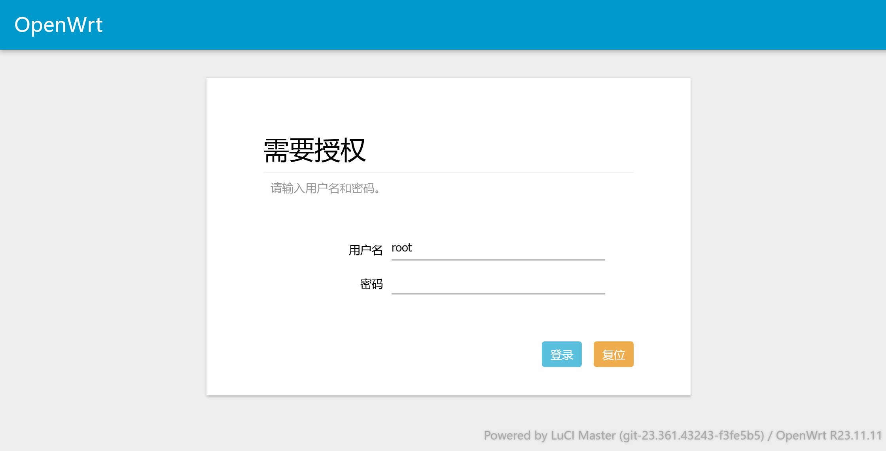
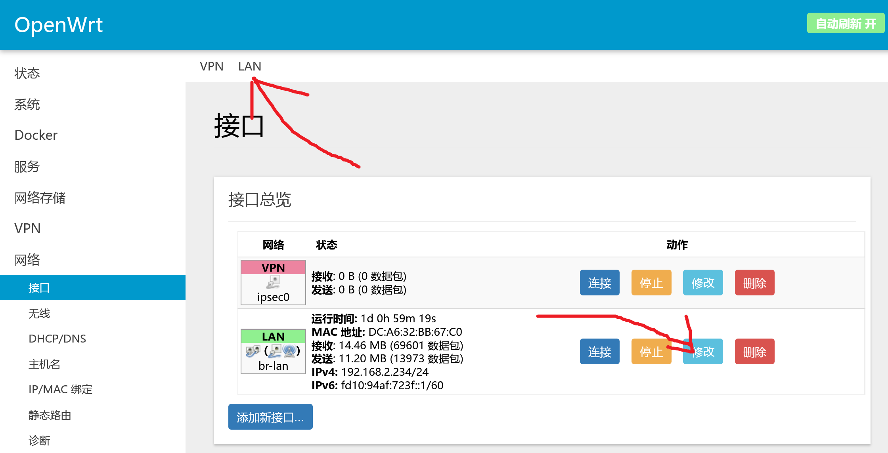
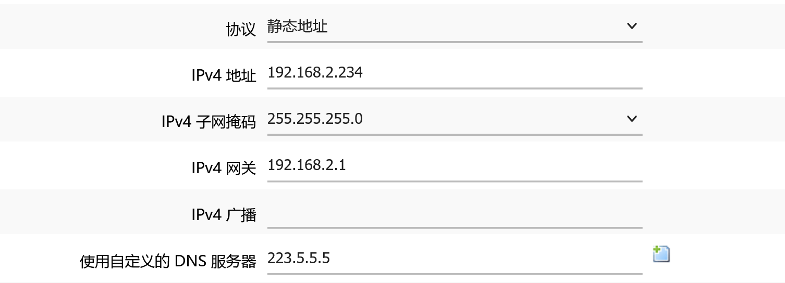
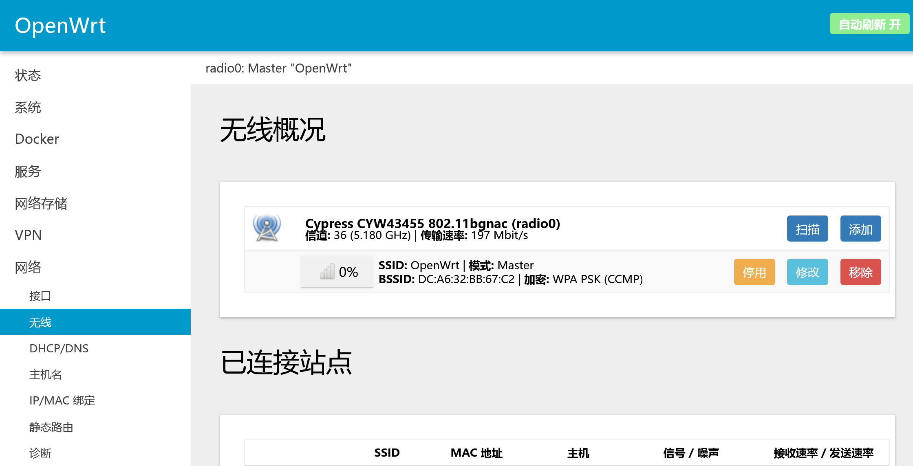

# 树莓派旁路由折腾记录

``2024/01/21``

- - -

其实原本是想直接把树莓派作为主路由使用的，但几经配置没有成功，只得退而求其次将其作为旁路由使用。

所谓“旁路由”，定义如下：
> 旁路网关是指挂靠在主路由网络下的一个旁系网络，他分担了一部分路由器的功能，因此被大众简称为「旁路由」，本质上它是一个通过 LAN 口与主路由连接的一个客户端设备。
> ———— 引自 [少数派文章](https://sspai.com/post/59708)

不过，相比于将其作为主路由，将树莓派作为旁路由对我来说实际的优点更多：
1. 在旁路由故障时可以连接主路由上网，不会明显影响网络使用。
2. 树莓派毕竟不是专门的路由设备，在距离较远时的网络体验可能比不上原来的路由。
3. 可以发挥树莓派相对于原路由的性能优势

- - -

## OpenWrt 安装

最开始是想使用 [RaspAP](https://raspap.com/) 的，这样可以保留派上原本的数据。但是在执行 RaspAP 的安装脚本后，树莓派就无法连网了，原因未知，因此采用 PlanB：OpenWrt。

在很多教程中使用的都是[ SuLingGG 大佬构建的固件](https://github.com/SuLingGG/OpenWrt-Rpi)，但由于该项目已停更，我就选择了[ bigbugcc 的构建版本](https://github.com/bigbugcc/OpenWrts)。

相较于官方固件，这两个版本的固件最大的好处就是自带 luci UI 环境和常用的插件，对新手较为友好。

在[官网](https://www.raspberrypi.com/software/)下载烧录程序后，直接将 TF 卡通过读卡器连接电脑，烧录固件。我这里使用的是：[适用于树莓派 4B 的 ``openwrt-bcm27xx-bcm2711-rpi-4-ext4-factory.img.gz`` 固件](https://github.com/bigbugcc/OpenWrts/releases/download/2024.01.12-022210/openwrt-bcm27xx-bcm2711-rpi-4-ext4-factory.img.gz)

顺便再引用其它博主的话解释一下几种固件的区别：

对于 ``factory`` 和 ``sysupgrade`` 固件的选择，参考[此文](https://www.cnblogs.com/simonid/p/6368111.html)：
> openwrt的固件一般分两种类型：factory原厂固件、sysupgrade固件
> factory多了一些验证的东西，用于在原厂固件的基础上进行升级。
> 普通家用路由一般不是openwrt固件，如果要将家用路由升级为openwrt固件，就可以用factory刷到路由上。sysupgrade是在openwrt路由基础上升级固件，无论你是原厂固件或者本身就是openwrt固件，要升级到openwrt，factory都适用，但是sysupgrade只能用在升级，TTL救砖的时候就不能用sysupgrade。sysupgrade不包含数据分区，factory带，factory预留原厂分区，sysupgrade只包含openwrt分区。

对于 ``ext4`` 和 ``squash`` 文件系统的选择，参考[此文](https://www.bilibili.com/read/cv20086900/)：
> 通常说，老手选择.ext4，新手选择.squash。
> .squash的固件也可以通过屏蔽原始/overlay的方式，给/overlay指定一个新的存储空间，变相增加/overlay空间，我分配了10G，这就可以不担心软件升级问题，避免路由器存储空间耗尽。

简单来说，选择 ``ext4-factory`` 的固件即可。

## OpenWrt 连接与后台系统登录

在烧录固件结束后，将 TF 卡插回树莓派，连接电源。

> 这里有一点需要注意⚠️：在初次启动时不能将派与原路由通过网线相连，可能是由于 OpenWrt 的默认设置，这样操作可能会导致在启动后无法进入 OpenWrt 后台 Web 界面。

在树莓派启动的一小会过后，在电脑的 Wifi 选择界面就可以看到名为 ``OpenWrt`` 的 Wifi，连接它。

在电脑上打开终端，调用 ``ipconfig`` 命令，输出应该类似于下面这样：

```
Windows IP 配置


未知适配器 本地连接:

   媒体状态  . . . . . . . . . . . . : 媒体已断开连接
   连接特定的 DNS 后缀 . . . . . . . :

无线局域网适配器 本地连接* 1:

   媒体状态  . . . . . . . . . . . . : 媒体已断开连接
   连接特定的 DNS 后缀 . . . . . . . :

无线局域网适配器 本地连接* 2:

   媒体状态  . . . . . . . . . . . . : 媒体已断开连接
   连接特定的 DNS 后缀 . . . . . . . :

无线局域网适配器 WLAN:

   连接特定的 DNS 后缀 . . . . . . . :
   IPv4 地址 . . . . . . . . . . . . : 192.168.2.104
   子网掩码  . . . . . . . . . . . . : 255.255.255.0
   默认网关. . . . . . . . . . . . . : 192.168.2.1
```

这里使用的是 Wifi 连接，只需关注 ``无线局域网适配器 WLAN`` 字段即可。

这里可以看到，我的默认网关为 ``192.168.2.1``，这是我配置后的结果。对于一些版本的 OpenWrt，这里初次启动的默认网关会是 ``192.168.10.1``。

在浏览器的地址栏中输入上面的默认网关，回车，你会看到一个登录界面，类似于下图这样：



此版本固件的默认用户名为 ``root``，密码为 ``password``，直接输入，登录即可。

## OpenWrt 配置

点开界面左侧的“网络”-“接口”，选择右侧界面上方的“LAN”或“接口总览”下方“LAN”右方的“修改”按键，如下图所示：



在此界面下，将“IPv4 网关”设为你主路由的网关

> 不知道的话可以连回主路由的 Wifi，使用 ``ipconfig`` 查看默认网关

将“IPv4 地址”设为主路由网关下的地址

> 如果主路由网关地址为 ``192.168.1.1``，设置为 ``192.168.1.X`` 即可，建议这个 X 填个大点的数，比如设置为 ``192.168.1.234``。同时由于 IPv4 的限制，不能填超过 255 的数。

再将“使用自定义的 DNS 服务器”一栏填上任意一个可正常访问的公共 DNS，如阿里公共 DNS ``223.5.5.5``。



拉到页面最下方，点击“保存&应用”。

现在，从你的主路由外连一根网线到你的树莓派上，由于设置的改变，你的设备可能会断开与树莓派的连接，如果断开，请重新连接。

连接上之后，请尝试访问一些网站，测试网络是否联通。

## Wifi 密码设置

现在，再通过前文填的“IPv4 地址”，在浏览器中进入 OpenWrt 的后台界面。

登录之后，点开页面左侧的“网络”-“无线”，点击界面右侧的“修改”按钮，如下图所示：



在下方的”接口配置“中，”基础设置“的”ESSID“选项可以配置 Wifi 名称，在”无线安全“中则可以配置 Wifi 密码。

选择”加密“，不知道选什么就选择”WPA-PSK“，设置好下方的密码，其它选项直接使用默认值，再次点击“保存&应用”。

在重设密码之后，你需要重新连接你的 Wifi，再次连接之后就可以愉快地使用你的新路由器啦。

## 配置项无法保存

在你折腾 OpenWrt 的配置项和各种插件时，可能会遇到保存配置之后，界面右上角始终出现”未保存的配置：...“的提示，怎么保存都无济于事。

在这种状态下，如果树莓派重启，你的配置（插件、Wifi 密码等）都会被重置。

根据[这一篇博客](https://blog.csdn.net/m0_60212601/article/details/127493166)，

你可以在后台界面的”系统“-”TTYD 终端“下（一般来说，需要先使用你登录后台使用的用户名和密码进行登录）使用如下命令：

```bash
mount -o remount rw /
```

注：运行完这条命令，OpenWrt 就可以正常保存配置了，但这也只是临时解决了问题，只要再次重启，问题依旧出现，所以，我们要将这条命令，设置为开机自动运行。

使用 Vim 打开启动脚本文件：``rc.local``：
```bash
vim /etc/rc.local
```

按 ``i`` 进入编辑模式，输入前文中的命令，如果原内容中存在 ``exit 0`` 的字样，则需要将命令插入到该字样之前。

按 ``Esc`` 键退出编辑模式，输入 ``:wq`` 加回车退出编辑器。

最后，为该文件添加执行权限（这一步我没有做，文件也可以正常生效，可能和固件有关）：
```bash
chmod +x /etc/rc.local
```

在这之后，就能愉快地保存各种配置啦。
