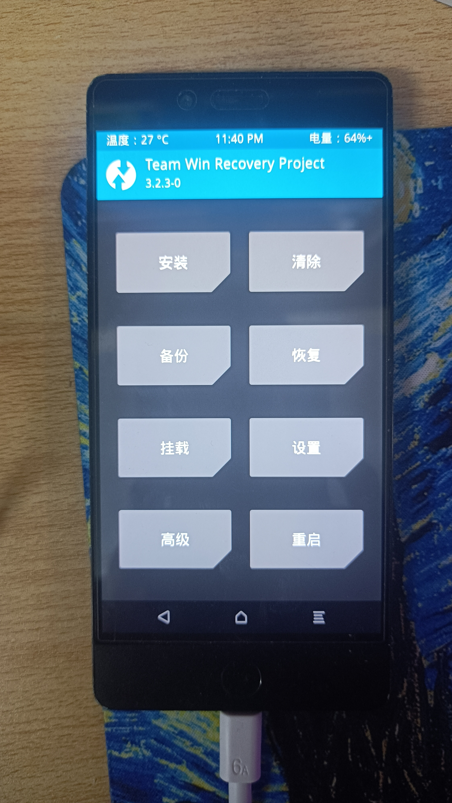
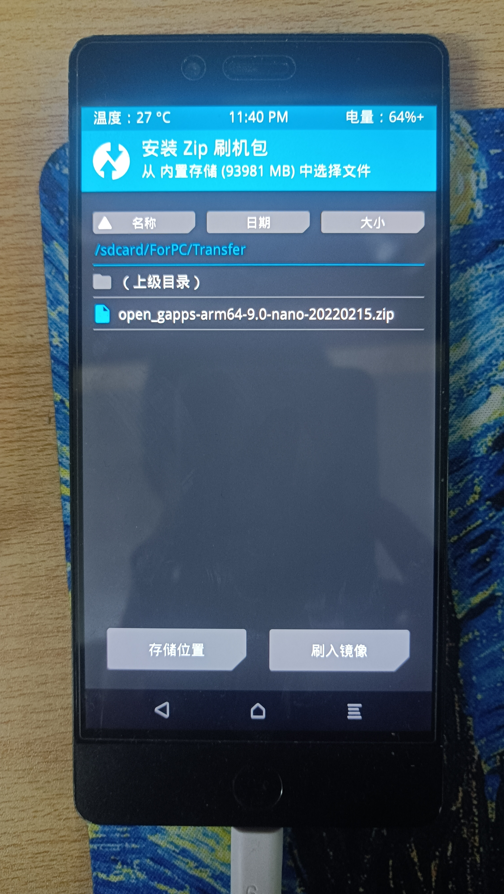

# 给类原生系统刷入谷歌套件的记录

之所以要进行“刷入”，是因为我使用的这台设备的系统没有带任何谷歌服务相关的程序。在自己刷的类原生系统上往往会出现这种问题。在国内厂商的定制系统上往往会带有谷歌服务的基础包，只需要手动安装一些缺失的包（如 Google Play 等）即可使用谷歌服务，无须进行刷入。

- - -

先到 [GAPPs](https://opengapps.org/) 下载谷歌服务卡刷包

> 转自[第三方rec刷入谷歌服务](https://mp.weixin.qq.com/s?__biz=MzU4NzQ3Njk0Mw==&mid=2247485644&idx=1&sn=19272133030a23df20489eeded0322bd&chksm=fdea326cca9dbb7a9f4cb78a8a33a465944d8265444001a111ac8e0ecf97a283e82e8bc52a29&scene=21#wechat_redirect)
> stock：最为贴近 Nexus 机型体验的 GApps 版本，包含了 Nexus 机型所预装的所有 Google 服务和 Google 应用。需要注意的是，这个版本会用 Chrome 、 Google Now Launcher 、 Google Keybord 等 Google 应用替换掉 CM 系 ROM 中那些基于 AOSP 代码的相关应用。
> full：与 stock 版所包含的内容相同，但不会替换 AOSP 应用。
> mini：包含了完整的 Google 服务框架和主流 Google 应用，去掉了 Google Docs 等文档处理应用
> micro：包含了完整的 Google 服务框架和少数 Google 应用，如 Gmail 、 Google Calender 、 Google Now Launcher 。
> nano：包含完整的 Google 服务框架但不包含多余的 Google 应用。
> pico：包含了最基础的 Google 服务框架，体积最小，一些依赖完整 Google 框架的应用（如 Google Camera ）将无法运行。
> aroma：该版本具备图形化安装界面，在刷入过程中可自行选择需要安装的 GApps 组件，十分好用。
> 对于那些想要体验完整 Google 服务的朋友，推荐安装使用 mini 版或是 full 版，这样也可根据具体需求停用系统相关应用或是从 Play Store 中下载其他 Google 应用自行补充；而对于那些依赖 Google 框架玩儿游戏或是运行特定应用的玩家，推荐安装使用 nano 版 GApps 。想自行选择的，可以使用aroma版。

下载到手机存储中后，重启手机进入 recovery 模式（一些手机可以在“开发者选项”中启用“高级重启”，然后在重启时可以直接选择进入恢复模式）

我以 TWRP 的 rec 为例：

选择 gapps 文件后点击刷入，等待完成即可。
