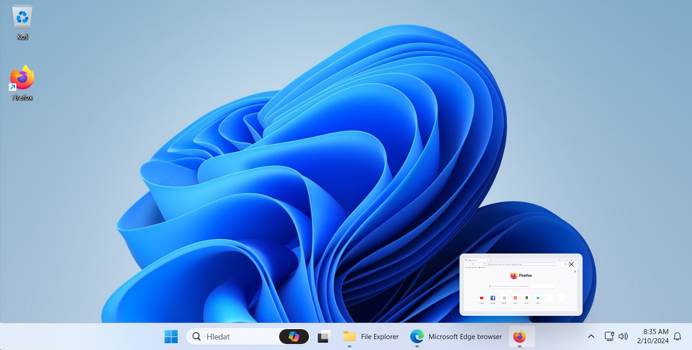
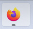

# 记 Firefox 使用中一个小问题的解决

在 Windows 11 的 23H2 更新中，加入了众望所归的任务栏可选合并功能。但是，在设置了任务栏不合并之后使用 Firefox 浏览器，却常常出现如下问题：

可以看到 Firefox 的标题文字并没有展示在任务栏中。

## 解决办法

在 Mozzila Support 的[这个帖子](https://support.mozilla.org/zh-CN/questions/1439337)中，有人反馈了这个 bug。
在这个问题底下，有其它用户回复：

> Try changing ##browser.startup.blankWindow## to ##false## in ``about:config``.
> 在 ``about:config`` 中将 ##browser.startup.blankWindow## 改为 ##false##。
