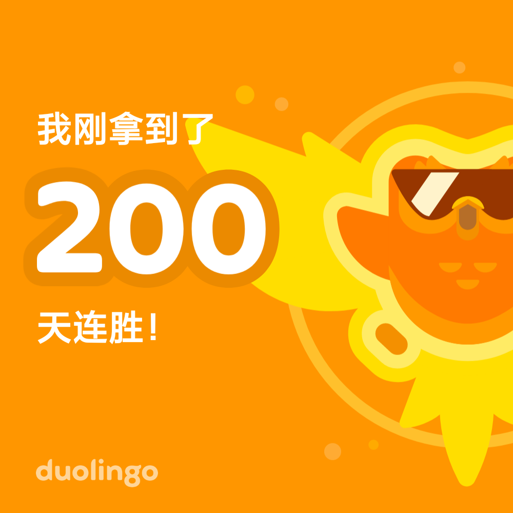

# 2024年2~8月半年小记

从 2024 年的 2 月初到 8 月初，发送了不少我觉得受益匪浅的事，于是便有此文记录。

## 日语学习

从今年的二月中旬，我开始使用多邻国学习日语。随着学习的深入，我也收集了不少日语的学习资源：

- [Weblio](https://www.weblio.jp/)
- [JapanDict](https://www.japandict.com/)
- [JLPT Sensei](https://jlptsensei.com/)

以及一些比较实用的 Youtuber：
- [Daily Japanese with Naoko](https://www.youtube.com/@DailyJapanese)
- [Wasabi Learning Daily Japanese](https://www.youtube.com/@Wasabito.Listening.Japanese)
- [Learn Japanese with Tanaka san](https://www.youtube.com/@japanese_tanakasan)

在经过半年的学习后，我的多邻国连胜如下：

通过油管视频自测，已经基本有 N4 水平。

## 创业 & 商业

在今年的四月份，我与室友一同参加了大学生创新创业大赛。虽然该比赛常被戏谑为 PPT 大赛，但我觉得自己从这次的参赛经历中学到了不少。

在以往，我属于是典型的技术思维，在做自己的软件项目的时候，往往只考虑自己的需求和项目功能的实现，很少想到去做一些真正别人有需求的东西。

我在今年初完成了 [MarkdownBlogTemplate](https://github.com/BHznJNs/markdown-blog-template) 这个项目，于是在便把它作为一个知识库管理项目参赛。

我一开始把这个比赛想得很简单，觉得只要有一个看上去还可以的项目就不用管别的了。但事实把我的脸打得啪啪响。事实是，项目本身根本不重要，重要的是：

1. 项目能给用户带来的价值
2. 项目解决的痛点
3. 项目相比于同类产品的优势

> 同时也可将 2、3 点结合为：项目解决了同类产品的痛点

也就是说，只要你的商业书所描绘的产品能够满足上面三点（是的，你甚至不需要有实际的产品），即：
1. 能给用户带来某方面的价值（如帮用户自动化某些繁琐的事项）
2. 解决用户的某些痛点（和第一点类似）
3. 相比于同类产品具有优势（如和同类产品在具有相同易用性下具有更多部分用户需要而同类产品没有的功能）

你就是一个合格的参赛者。

我想到，实际的创业何尝不是这样？发现需求，调研市场，如果这个需求还没被怎么发掘（没有或只有很少的入局者），就用互联网思维，快速开发好产品原型上线，查看市场反馈决定是否继续优化迭代 OR 退出。

## 实习

### 投递简历

首先在简历的编写上就有一定的门道。

你要先确定自己的目标岗位，比如前端开发、后端开发（下文以前端开发为例）；
你需要着重介绍你在目标岗位方面的能力，比如熟悉 JavaScript、熟悉 Vue React 等开发框架等。有些人会进入个误区，觉得自己会得越多越好，于是把什么 51开发板、arduino 啥的通通写上，但这些对于需要前端工程师的招聘方来说并不在意，你可以写，在前端技术栈写完后提一嘴就好。

对于个人项目也是同样的道理，将与你目标岗位强相关的项目放在前面，着重介绍，把弱相关的放在后面，稍微提两嘴即可。它们可以体现你的涉猎广泛，学习能力强，但这是加分项，你要先说明你能够胜任这个岗位这个加分项才有意义。

对于投递简历同样也有一些技巧，如
- 招聘岗位要求是否清楚明白
- （对于部分招聘平台）是否有公司环境的图片
- 通过企查查、国家企业信用信息公示系统等平台查询企业负面信息等

### 面试

我的这次实习面试相对简单，除了我的个人介绍和项目经历介绍外，只有一道算法题加该司开源项目的一个相关问题（该问题有提前告知，可以提前准备）。
由于当时我已许久没有碰过算法问题，好在给的题简单，最后还是通过了。

### 入职

此部分的感悟在之前的博客[实习一个月后的一点感想](杂谈/实习一个月后的一点感想.md)中基本都写到了，感兴趣的朋友可以看一看。
