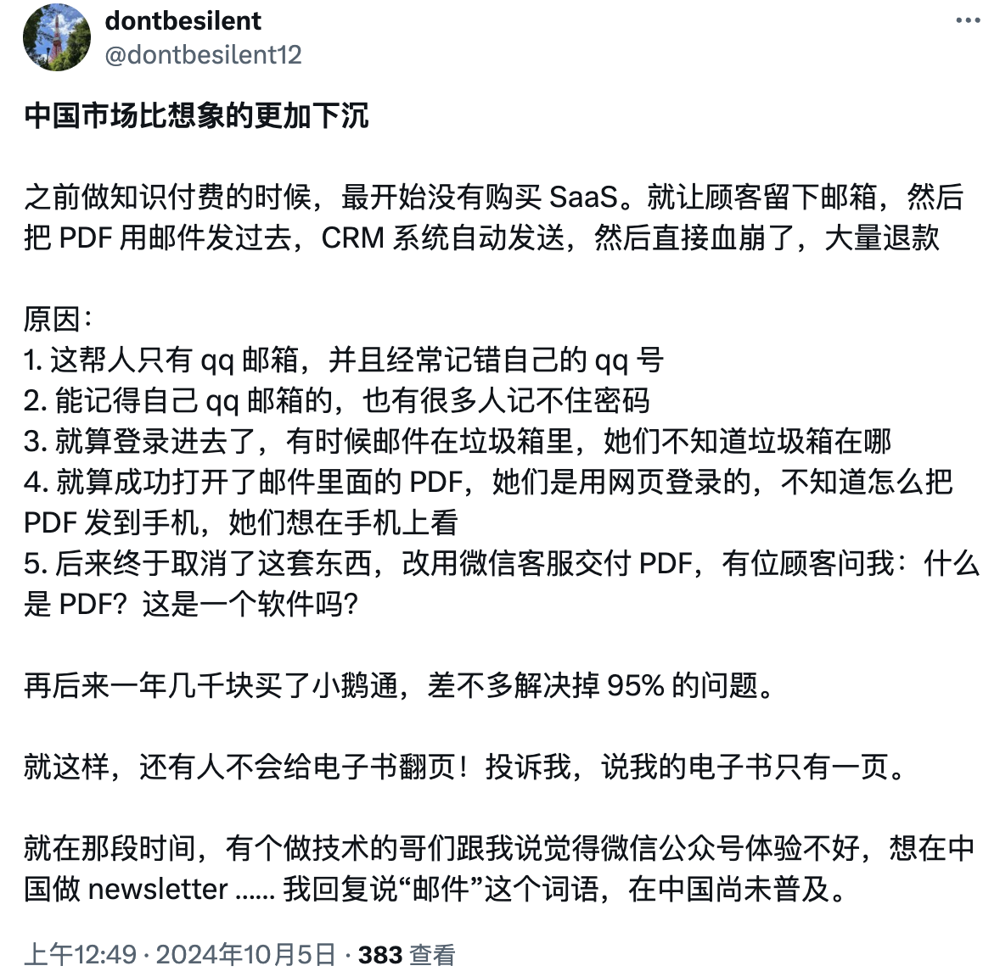
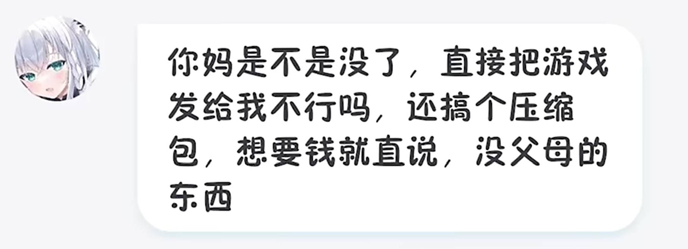

# “赛博扫盲”真的有必要吗？

我在今日刷到一位网友试图仿效国外 Newsletter 的形式，通过知识付费盈利却屡屡碰壁：

这让我想起了前些日子，因在游戏群中上传资源文件压缩包而被骂的 B 站 UP 主庄不纯：[电子扫盲课—网盘下载压缩文件及解压缩教学](https://www.bilibili.com/video/BV11w4m1y7kA)

- - -

虽然在中国，智能手机已经十分普及，但很多人似乎从未接触过邮件、解压等“高级功能”，以至于所谓“电子扫盲”、“赛博扫盲”登上热搜。

##有些人会把这种现象归因于手机的普及##：手机系统简化了文件操作，弱化了文件类型、文件压缩等电脑上常见元素的存在，即时通讯工具使邮箱变为正式场合的专用，手机用户更倾向于安装app而不是使用浏览器网页。
他们认为，手机系统的简单化、傻瓜化使得赛博文盲越来越常见，赛博扫盲刻不容缓；我的观点恰恰相反，手机使用的傻瓜化恰恰是技术进步的体现。乔布斯说，“简单比复杂更难”，对用户隐藏系统的复杂度，只留下一目了然的操作界面，这恰恰是乔布斯和苹果一直在做的事。

几十年来，个人计算机在不断变化。在 DOS 时代，命令行是人们与计算机交互的唯一方式；后来，以键盘和鼠标交互为主的 PC 图形界面得以普及；再后来，以 iPhone 为代表的触屏手机出现，以符合直觉的触控交互方式快速占领市场；再到如今，Vision Pro、Neuro Link 等技术的出现，让我们得以一窥未来的人机交互模式......
在三十年前，计算机还是少数中产家庭的专属，而今天，作为微型计算机的智能手机已经做到人手一机。
要压缩解压文件，有 Bandzip、winrar 等工具；要播放音乐视频，有各色各样的媒体播放器......使用命令行程序来做这些计算机常见操作对于大多数人来说已经难以想象。

近年，无人驾驶技术飞速发展，有人已经提出“未来驾车无需考驾照”的展望。其实电脑的操作和驾车相比，又有多大区别？或许未来的电脑会变成这样：你需要解压文件时，ai会自动帮你调用解压程序；你需要打开pdf文件时，ai会自动安装pdf阅读器并打开；你需要发送信息时，ai会自动通过微信、邮箱等方式发送......你无需关心具体使用什么软件实现，发出指令即可。

或许这才是技术发展的意义：__“让每个人都能享受科技的乐趣”__。
