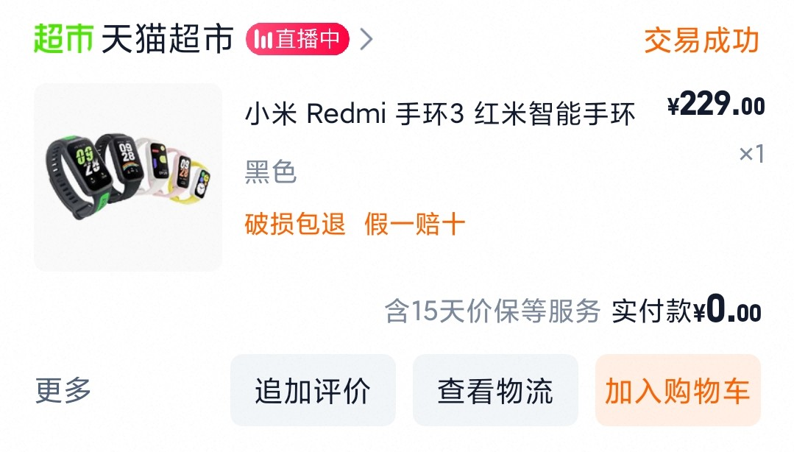
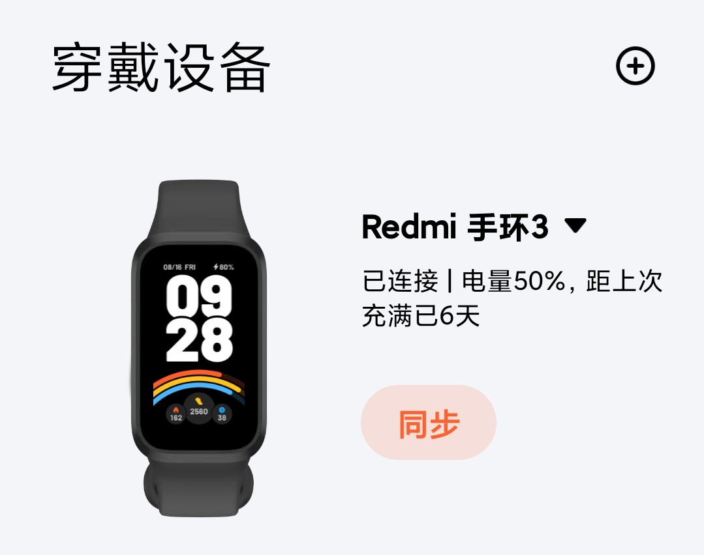

# 红米手环 3 一个月使用体验

``2025/02/15``

在今年年初，我终于攒够了 bing 搜索积分，换了一百元天猫超市卡。加上之前换的一百元，足够白嫖一支智能手环了。

之所以想到买个手环，主要还是为了运动记录。往常我出门跑步，为了记录运动数据，都会把手机带上，跑步时拿着跑，这多少有些不方便。而手环毕竟是可穿戴设备，大小也比手机小太多，在运动记录这方面自然要方便不少。

同价位实际上可选的还有 Keep B4 lite，不过考虑到我一直使用的都是小米自带的运动健康，购买小米自家的产品联动起来更方便，于是买了红米手环。

- - -

## 开箱

手环的包装非常干净，装配好的手环本体和表带外加一根磁吸充电线。小小吐槽一下，怎么连个充电头都不给，好在我连在电脑的 USB 口充电也堪堪能用。

手环给我的第一印象挺好，整个手环没有实体按键，所有操作通过触屏实现。到手时是关机状态，按照说明书，接上充电器开机。开机后需要用手机上的小米运动健康绑定设备，激活后才能开始使用。

## 功能

手环平时是熄屏状态，只有主动点击屏幕或抬起佩戴的那只手后才会亮屏。抬手亮屏的检测还算灵敏，很少需要主动点击屏幕唤起。

手环的功能挺多，我最中意的几个功能如下：
1. 在手机闹铃响铃时振动提醒
   - 可以<不用把手机放在枕头边>(有研究表明，在睡觉时把手机扔得远远的有助于提升睡眠质量)就为了能及时被闹铃闹醒
   - 对于不想让自己的闹铃把身边的人吵醒的人很有用
2. 在手机熄屏时有消息振动提醒
   - 可以限制特定应用的通知，很适合在需要专注时使用，把手机丢在一边，在有重要的事时提醒
   - 我的手机不知道为什么，在微信有消息时经常不会及时提醒，用这一功能也能稍微辅助一下
3. 同步手机天气数据到手环，可以直接通过手环查看接下来几个小时和接下来几天的天气数据
   - 对于出门运动时突然想看一眼天气的场景很有用
   - 有时突然需要查看天气也不必到手机上查看，可以稍微减少手机的使用
4. 同步手机上设置的未来七天的日程数据，方便查看确认
   - 感觉是很有用，不过我个人不怎么使用备忘录和日程功能

由于我并没有开启过多的功能（特别是标注了会明显影响续航的``高精度睡眠检测``和``血氧饱和度检测``），续航很够用。只要在洗澡时插上电即可，不用过多担心电量。

## 运动

手环是可以脱离手机进行运动记录的，对于跑步里程记录的准确度不太确定，不过应该和直接用手机记录差不了多少。
手环自带秒表和计时器功能，对于测速等场景也能用得上。

## 不足

1. 手环的表盘只有四个的上限
   - 我在买前就看到小红书有人提到。不过对我来说无影响，我基本是固定使用一个表盘的。
2. 站立检测过于拉胯
   - 手环有每小时提醒站立活动的功能，不过手环的站立检测过于拉胯，我有时在走动时明明手表中的步数数据已经更新了，居然没有判定站立，在手环上也没有手动标记站立的功能。
3. 心率检测准确度较差
   - 在 B 站看到测评，与其它竞品相比这款手环的心率检测准确度较差，不过我对心率啥的也只是看个乐，没什么影响。
4. 睡眠检测准确度存疑
   - 在起夜之后有可能会漏掉一段睡眠时间
