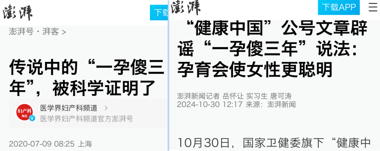

# AI 逐本溯源

## 背景

现在的假新闻越来越多，不仅是因为当今自媒体的泛滥，甚至很多假新闻就来自与一些较为权威的报社媒体。以至于出现假新闻时，评论区总会出现“新闻学魅力时刻”的评论。

Q: 那么，是什么造成这一现象？

对于这一现象的形成，我认为主要有两点原因：
1. 缺乏相关法律法规对发布传播假新闻的媒体进行处罚
2. 普通人缺乏途径和能力寻找新闻出处，获取较为客观的资料。特别地，由于部分新闻来自国外，要读懂原始资料需要具备足够的英文阅读甚至其它语言的阅读理解能力，一些时候还需要科学上网能力，使得要获取这种新闻的第一、二手资料变得很困难。

## 想法

对于第一点，短期内难以改变。对于第二点，即使一个人有能力搜寻原始资料，获取新闻的实际情况，也需要耗费不少精力进行信息检索。

因此我想到，能否通过 AI 来对形形色色的新闻进行逐本溯源，辨别新闻真假。
