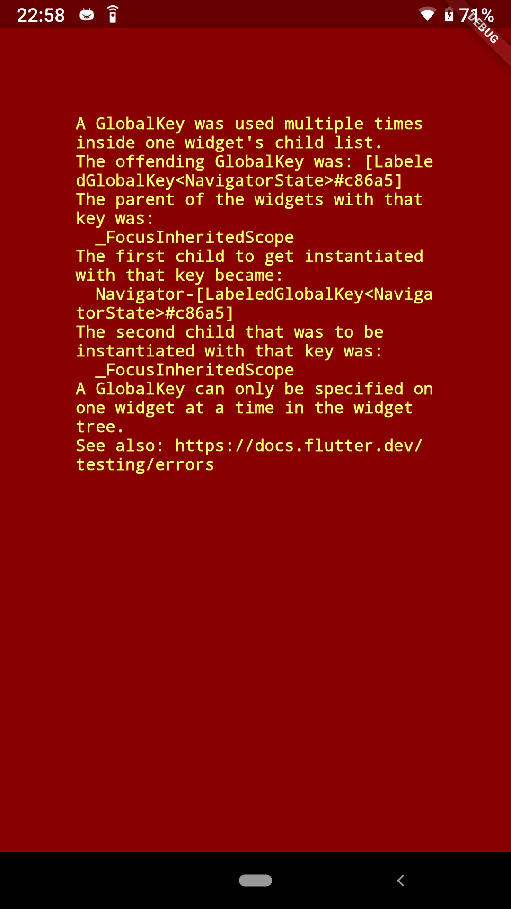

# Flutter NFC 冷启动小坑

最近在[电纸链接](https://github.com/BHznJNs/NFC-PLinkD)这个项目上花了很多时间。这个项目的主要功能和 NFC 相关，自然地，也要有“通过 NFC 启动”这一 Feature。

但是我发现，当通过 NFC 启动后，（在 release 下）应用启动后是没有任何界面元素的。
我后来尝试了在 debug 下通过 NFC 启动，得到了如下报错：

最后还是在 Stackoverflow 上找到的答案：[A global key was used multiple times inside one widgets child list](https://stackoverflow.com/a/61165393/28207463)
> In my case this error happened because I had a initialRoute property set, while instead I should set the home property: 
> 在 ``MaterialApp`` 下不使用 ``initialRoute``，而是使用 ``home`` 定义应用启动后显示的页面。
