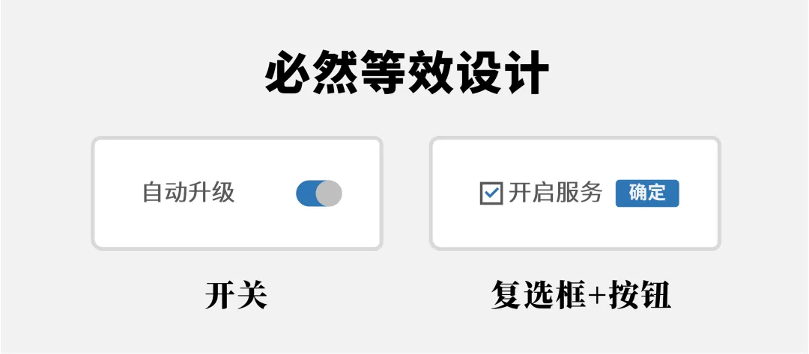
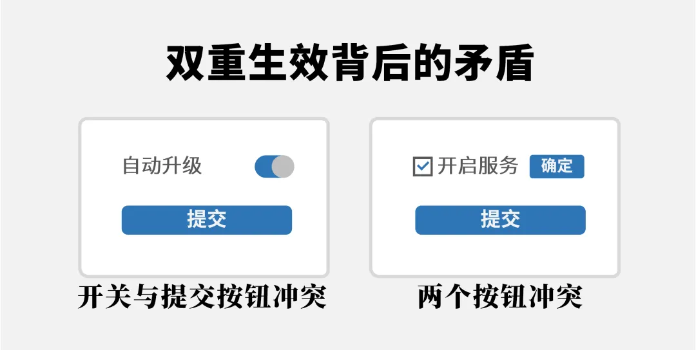
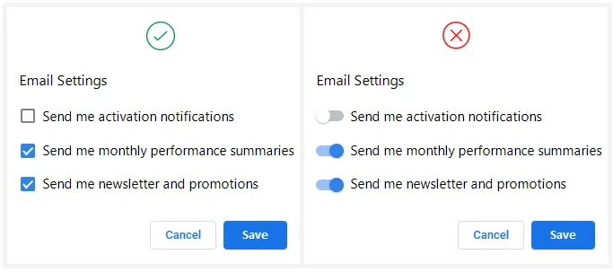

# 开关与提交按钮不能一起使用

原文：[钉钉的体验改进 (2) 开关与提交按钮的博弈](https://mp.weixin.qq.com/s/7g-7IpxEQXlZHrz6JAPZtw)

- - -

开关的特点是“切换马上生效”，这就和行动召唤(CTA)产生潜在矛盾：认知存在两类“生效”，如果一切都要等待CTA按钮生效，那么切换开关生效将是摆设。

简单来说，每个开关自身都潜在地自带了提交按钮：

如果给开关加上了显式的提交按钮，将产生逻辑冲突：

## 如何改进

将表单中的开关换成{复选框}(checkbox)：

