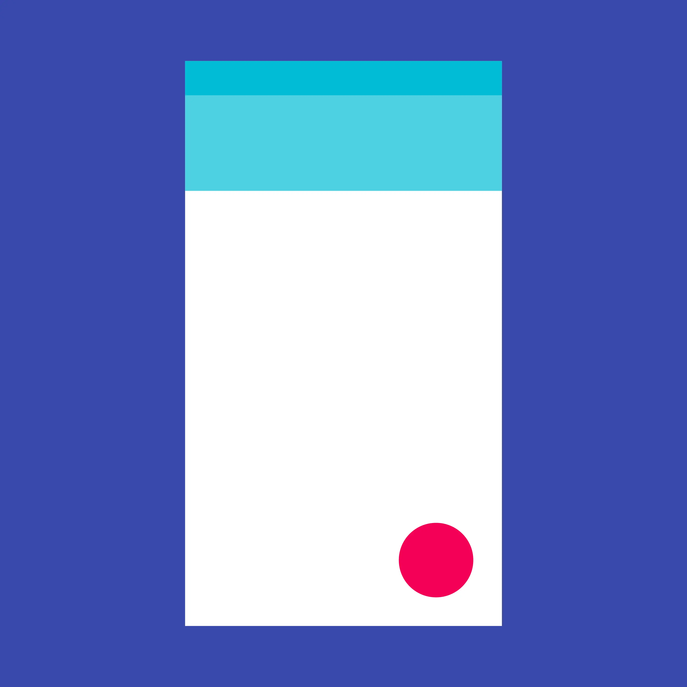
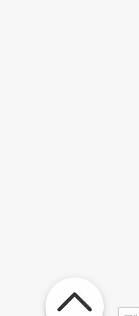

# 漂亮的 FAB 动画实现

``2024/01/18``

- - -

FAB(Floating Action Button) 浮动操作按钮，是 Material Design 中的常见组件。

> 浮动操作按钮代表着应用中最重要的操作。



而本文要实现的 FAB 动画则如下 GIF 图所示：



那么，让我们开始吧！

- - -

## 初步实现

```xml
<div id="fab">
    <div id="switcher" class="fab-item">
        <div class="image"></div>
    </div>
</div>
```

我们先只定义一个 FAB 按钮（即 ``#switcher``），用来切换状态。
再定义其样式：

```css
/* 组件容器样式 */
#fab {
    --fab-size: 64px;
    --shadow-sm: 0 2px 1px -1px rgba(0,0,0,.2),0 1px 1px 0 rgba(0,0,0,.14),0 1px 3px 0 rgba(0,0,0,.12) !important;
    --shadow-md-1: 0 3px 3px -2px rgba(0,0,0,.2),0 3px 4px 0 rgba(0,0,0,.14),0 1px 8px 0 rgba(0,0,0,.12) !important;
    --shadow-md-2: 0 3px 5px -1px rgba(0,0,0,.2),0 5px 8px 0 rgba(0,0,0,.14),0 1px 14px 0 rgba(0,0,0,.12) !important;

    position: fixed;
    right: 1rem;
    bottom: 1rem;
    width: var(--fab-size);
    height: var(--fab-size);
    z-index: 999; /* 位于最上层 */
}

/* 按钮样式 */
.fab-item {
    position: absolute;
    display: flex;
    justify-content: center;
    align-items: center;
    padding: 0;
    background-color: white;
    border: none;
    border-radius: 50%;
    cursor: pointer;
}
.fab-item:hover {
    background-color: #eee;
}
.fab-item .image {
    background-repeat: no-repeat;
    background-size: contain;
}

/* 开关按钮样式 */
#switcher {
    top: 0;
    left: 0;
    width: 100%;
    height: 100%;
    box-shadow: var(--shadow-md-1);
    transition: background .3s,
                box-shadow .3s;
}
#switcher:hover {
    box-shadow: var(--shadow-md-2);
}
#switcher .image {
    width: 75%;
    height: 75%;
    padding-bottom: 0;
    background-image: url(./fab-switch.svg);
    transform: rotate(-180deg);
}
```

@[第一步效果](.漂亮的 FAB 动画实现/1.html)

- - -

## 开关动画

嗯，已经有 FAB 按钮的形状了，让我们给 switcher 按钮添加开关事件吧
```javascript
const container = document.querySelector("#fab")
const switcher  = container.querySelector("#switcher")

switcher.addEventListener("click", () => {
    container.classList.toggle("hidden")
})
```

再加上 ``hidden`` 的样式和 ``transition`` 属性
```css
#fab {
    transition: transform .3s;
}
#fab.hidden {
    transform: translateY(calc(1rem + var(--fab-size) / 3));
}
#switcher {
    transition: background .3s,
                box-shadow .3s,
                transform .3s .25s;
}
#switcher .image {
    transition: padding .3s .25s,
                transform .3s .25s;
}
#fab.hidden #switcher .image {
    padding-bottom: 12px;
    transform: rotate(0);
}
```

@[第二步效果](.漂亮的 FAB 动画实现/2.html)

- - -

## 添加子按钮

在组件的开关按钮内接着添加元素：
```xml
<div id="fab">
    <div id="switcher" class="fab-item">
        <div class="image"></div>
    </div>
    <div id="item1" class="fab-item">
        <div class="image"></div>
    </div>
    <div id="item2" class="fab-item">
        <div class="image"></div>
    </div>
    <div id="item3" class="fab-item">
        <div class="image"></div>
    </div>
</div>
```

通过 javascript 动态向子按钮（``#item1`` ``#item2`` ``#item3``）添加 css 变量：
```javascript
const subFabItems = container.querySelectorAll(".fab-item:not(#switcher)")
for (const [index, item] of Object.entries(subFabItems)) {
    item.style.setProperty("--fab-item-index", Number(index) + 1)
}
```

给新添加的元素设置样式：
```css
#switcher {
    /* 让 `switcher` 位于组件最顶层 */
    z-index: 999;
}
div.fab-item:not(#switcher) {
    top: 10%;
    left: 10%;
    width: 80%;
    height: 80%;
    box-shadow: var(--shadow-sm);
    transform: translateY(calc(-4px - var(--fab-item-index) * var(--fab-size)));
    transition: background .3s,
                box-shadow .3s,
                transform .3s .25s;
}
#fab.hidden div.fab-item:not(#switcher) {
    /* 收回子按钮 */
    transform: translateY(0);
}
div.fab-item:not(#switcher) .image {
    width: 75%;
    height: 75%;
}

/* 设置按钮图片 */
#item1 .image {
    background-image: url(./html5.svg)
}
#item2 .image {
    background-image: url(./css.svg)
}
#item3 .image {
    background-image: url(./javascript.svg)
}
```

@[第三步效果](.漂亮的 FAB 动画实现/3.html)

- - -

## 层叠展开/收回效果实现

到这里其实主要功能已经实现得差不多了，但是前文中 GIF 图里的层叠展开/收回效果还没有实现。

我们先为组件根元素设置组件子按钮数变量
```javascript
container.style.setProperty("--fab-item-count", subFabItems.length + 1)
```

再来设置子按钮的样式：
```css
/* 设置子按钮的层级关系 */
div.fab-item:not(#switcher) {
    --z-index-value: calc(var(--fab-item-count) - var(--fab-item-index));
    z-index: var(--z-index-value);
}
/*
    在隐藏 FAB 时重设 transition 属性
    使其 transform 变化延迟随元素次序而变
*/
#fab.hidden div.fab-item:not(#switcher) {
    transition: background .3s,
                box-shadow .3s,
                transform calc(var(--fab-item-index) * .25s)
                          calc(var(--z-index-value) * .25s + .15s)
                          linear;
}
```

最终效果：
@[最终效果](.漂亮的 FAB 动画实现/final.html)
