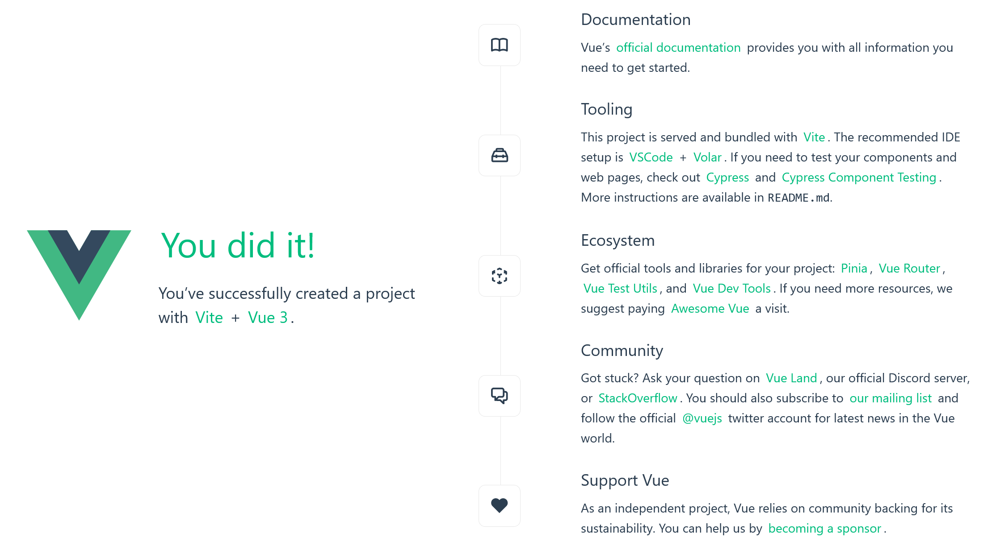
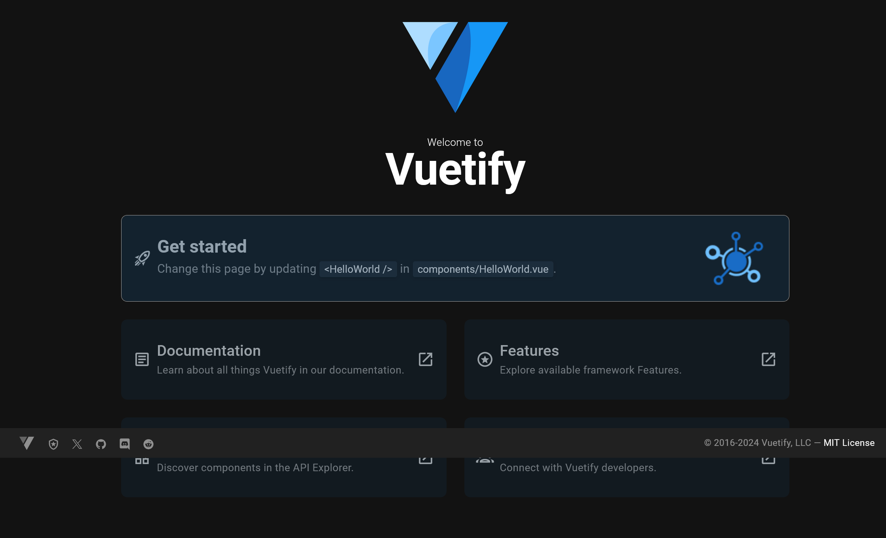
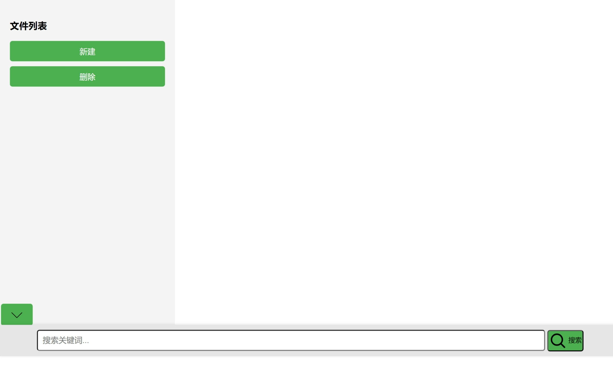
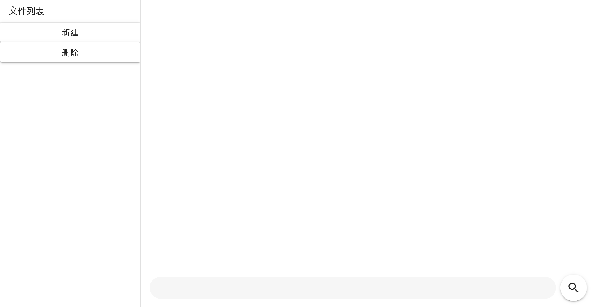

# 前端开发速成，帮你快速实现自己的想法

本文的适用对象：

- --想要成为专业 Web 前端工程师的人--
- 想要通过 Web 技术快速实现自己的应用，有一定编程基础的人

- - -

## 我为什么写这份教程（可跳过）

网络上目前有的教程，对于只是想要快速实现自己应用的人来说，有太多累赘的内容。
我的一位好友深受此害。他是一位 AI 算法开发者，想要给他设计的算法写一个图形界面以便于使用。向 AI 咨询过后，他决定使用 Web 技术。这个选择很正确，目前来说 Web 技术绝对是图形界面开发最好用、开发效率最高同时学习成本最低的技术栈。但是，由于他所看的教程，他的页面一直都使用原生的 HTML、JavaScript、CSS 编写，不仅界面的开发效率低下，而且界面的呈现效果也不令人满意。
我看到后，决定帮他一把。在我的帮助下，他成功在两小时内使用 Vue.js 和 Vuetify 重写了他原来的界面。

- - -

下面是正文。

## 导入

首先，暂时忘记你在其它前端教程中看到的内容，抛开什么 HTML、JavaScript、CSS，统统别管。
你只需要知道以下几个东西，就可以进入下一步了：

### 标签

这是一个标签：

```xml
<div></div>
```

这也是一个标签：

```xml

```

### 标签嵌套

标签中能包含内容：

```xml
<div>标签中包含的内容</div>
```

标签中能嵌套另一个标签：

```xml
<div>
    <div></div>
</div>
```

一个标签代表页面中的一个元素。

那什么是元素？就像你正在看的这个段落，这就是一个元素。类似地，一个按钮、一个文本框、一张图片都是一个元素。网页由一个又一个的元素组成。

## 使用框架

你现在已经掌握了学习前端开发必须的基础知识，对，就是这么简单。接下来，让我们开始学习前端开发框架的使用吧！

### 为什么要使用框架（可跳过）

1. 简化代码，减少样板代码
2. 使项目代码更易于维护
3. 可以更方便地使用开源组件
4. 提高个人和团队的开发效率

### 框架选择（可跳过）

如果你读过菜鸟教程、MDN 等常用的前端开发教程，或者你向 AI 询问关于前端框架的选择，你大概率会获得以下回答：

>>> AI 回答问题：请问常用的 Web 前端开发框架有哪些？
Web 前端开发框架可以帮助开发者更高效地构建用户界面，同时提供了一些预设的功能来处理常见的开发任务。以下是一些常用的 Web 前端开发框架：

1. React - 由 Facebook 维护，React 是一个用于构建用户界面的 JavaScript 库。它主要用于构建 UI 组件，并且因其虚拟 DOM 的概念和高效的性能而受到欢迎。
2. Angular - 由 Google 支持，Angular 是一个完整的前端框架，用于创建动态 Web 应用程序。它使用 TypeScript 作为主要语言，提供了强大的模板系统、依赖注入等特性。
3. Vue.js - Vue（发音类似于“view”）是另一个流行的前端框架，它的设计目标是通过尽可能简单的 API 来实现数据驱动的数据绑定和组合式视图组件。
4. Svelte - Svelte 是一种新的方法来构建 Web 应用程序。它在编译时将你的应用程序转换为优化后的 vanilla JavaScript 代码，这使得最终生成的应用可以更加小巧和快速。

这些框架各有特色，选择哪一个取决于项目需求、团队熟悉度和个人偏好等因素。随着技术的发展，还有可能出现新的前端框架或现有框架的新版本。因此，在开始新项目之前了解最新的趋势和技术是很重要的。
>>>

这里我们选择 Vue.js，原因有三：

1. Vue.js 相比于其它框架对小白更友好、更易于上手使用
2. 开发者为国人，中文资料充足
3. 框架知名度较高，社区支持完善

### Vue.js 框架导入

首先，到 [Node.js 官网](https://nodejs.org/zh-cn)下载并安装最新版本 Node.js。安装完成后，在命令行下运行下面命令

```shell
npm install -g cnpm --registry=https://registry.npmmirror.com
```

> [warning]
> 在下文，如果你无法正常使用 npm（Node.js 的包管理工具），请使用 cnpm 作为替代。

跟随 [Vue.js 官方文档](https://cn.vuejs.org/guide/quick-start.html#creating-a-vue-application)创建新的 Vue 项目，或直接阅读下面内容（复制自官方部分文档，有部分改动）

>>> 创建 Vue 项目
> [important] 前提条件
> - 熟悉命令行
> - 已安装 18.3 或更高版本的 Node.js :::

在本节中，我们将介绍如何在本地搭建 Vue [单页应用](https://cn.vuejs.org/guide/extras/ways-of-using-vue#single-page-application-spa)。创建的项目允许我们使用 Vue 的[单文件组件](https://cn.vuejs.org/guide/scaling-up/sfc) (SFC)。

确保你安装了最新版本的 [Node.js](https://nodejs.org/)，并且你的当前工作目录正是打算创建项目的目录。在命令行中运行以下命令：

```shell
npm create vue@latest
```

这一指令将会安装并执行 ``create-vue``，它是 Vue 官方的项目脚手架工具。你将会看到一些诸如 TypeScript 和测试支持之类的可选功能提示（这些都可以不用管，选 No 即可）：

```
✔ Project name: … <your-project-name>
✔ Add TypeScript? … No / Yes
✔ Add JSX Support? … No / Yes
✔ Add Vue Router for Single Page Application development? … No / Yes
✔ Add Pinia for state management? … No / Yes
✔ Add Vitest for Unit testing? … No / Yes
✔ Add an End-to-End Testing Solution? … No / Cypress / Nightwatch / Playwright
✔ Add ESLint for code quality? … No / Yes
✔ Add Prettier for code formatting? … No / Yes
✔ Add Vue DevTools 7 extension for debugging? (experimental) … No / Yes

Scaffolding project in ./<your-project-name>...
Done.
```

在项目创建完成后，在之前的命令行下运行以下命令：

```shell
cd <your-project-name>
npm install
npm run dev
```

在你的命令行中出现如下字样之后：

```
VITE v5.4.8  ready in 1624 ms

➜  Local:   http://localhost:5173/
➜  Network: use --host to expose
➜  press h + enter to show help
```

在浏览器中打开终端中单词“Local”后的[链接](http://localhost:5173/)，不出意外，你能看到如下页面：


>>>

Congratulations! 你已经完成了基础的项目搭建，接下来你需要安装合适的代码编辑器及配套的插件。

>>> 代码编辑器及配套的插件
官方推荐使用 [VSCode](https://code.visualstudio.com/) 和 VSCode 上的[官方插件](https://marketplace.visualstudio.com/items?itemName=Vue.volar)配合使用。
如果你偏好使用其它开发环境，请根据官方的 [IDE 支持](https://cn.vuejs.org/guide/scaling-up/tooling#ide-support)进行配置。
>>>

下面会以使用 VSCode 进行说明。

### Vue.js 框架基础使用

在完成了 Vue 项目的创建后，请先在 VSCode 中打开项目文件夹。
在项目的 ``src`` 文件夹中，删除其中的 ``assets`` 和 ``components`` 文件夹下所有文件。
将 ``main.js`` 的内容改为如下：
```javascript
import { createApp } from 'vue'
import App from './App.vue'

createApp(App).mount('#app')
```

将 ``App.vue`` 的内容改为如下：
```xml
<template>
  <!--  -->
</template>

<script>
export default {
  // 
}
</script>
```

打开 Vue 官方文档的[模版语法](https://cn.vuejs.org/guide/essentials/template-syntax.html)章节，##将界面左上角的“API 风格偏好”设为“选项式”##。

让我们直奔[文本插值](https://cn.vuejs.org/guide/essentials/template-syntax.html#text-interpolation)部分。

让我们打开 ``App.vue`` 文件，先把 ``script`` 标签中的注释改成以下代码：
```javascript
data() {
    return {
        message: "Hello World!"
    }
}
```

这段代码定义了名为 ``message`` 的字符串数据，其值为 ``"Hello World!"``。

类似地，你可以像这样定义更多数据：
```javascript
data() {
    return {
        counter: 0,
        message: "Hello World!",
        anotherMessage: "Foo bar",
    }
}
```

我们定义了数据，要如何展示在页面上？我们前面看到[模版语法](https://cn.vuejs.org/guide/essentials/template-syntax.html)就能在这里发挥作用了。
让我们更改 ``template`` 中的内容：

```xml
<div>{{ message }}</div>
```

现在再打开浏览器界面，你能看到：

@@@
<div>Hello World!</div>
@@@

你现在已经学会了 Vue.js 的基础使用，让我们进入下一步。

## 使用组件库

### 什么是组件库？

上面有提到，你的网页由各种元素组成。对于一个复杂的页面，其中会有成千上万个元素。直接管理这些元素的复杂度非常高。于是我们将组成同一功能的所有元素进行封装，称其为“组件”。通常来说，一个组件提供一个特定功能，如处理用户输入、进行视频播放等。

而组件库，则是聚合了前端界面开发时常用功能所对应组件的库。

> [warning]
> 组件库往往依赖与所使用的框架。
> 换句话说，如果一个组件库基于框架 A，而你的项目使用框架 B，你大概率没法在你的项目中使用这个组件库。

### 组件库的选择

>>> AI 的回答（可跳过）：请问使用 Vue.js 框架开发前端页面时，有哪些常用的组件库可供选择？
使用 Vue.js 框架进行前端开发时，有许多流行的组件库可供选择。这些组件库提供了丰富的UI组件，帮助开发者快速构建出美观且功能齐全的用户界面。以下是一些常用的 Vue.js 组件库：

1. ##Vuetify##
   - Vuetify 是基于 Google 的 Material Design 规范的 Vue.js UI 库。它提供了一整套 Material Design 风格的组件，并且支持自定义主题。
2. ##Element##
   - Element 是由饿了么团队推出的一套桌面端组件库，基于 Vue 2.x。它为开发者提供了丰富而全面的组件集，设计上追求简洁、一致性和易用性。
3. ##Quasar Framework##
   - Quasar 是一个完整的框架，不仅包含了大量的UI组件，还提供了构建工具和CLI来帮助开发者创建SPA、PWA、SSR、移动端应用等。
4. ##BootstrapVue##
   - BootstrapVue 将 Bootstrap 4 和 Vue.js 结合起来，使得开发者可以使用熟悉的Bootstrap样式和布局来构建Vue应用。
5. ##Ant Design of Vue (antd-vue)##
   - Ant Design 是蚂蚁金服出品的企业级产品设计体系，antd-vue 是其官方提供的 Vue 实现版本，提供了高质量的企业级UI设计。
6. ##Buefy##
   - Buefy 是轻量级的 Vue.js UI 组件库，基于 Bulma CSS 框架。它易于集成，具有响应式特性，并且不需要额外的JavaScript依赖。
7. ##Vue Material##
   - Vue Material 是遵循 Material Design 规范的另一个 Vue.js 组件库，它提供了一系列的Material风格组件。
8. ##Vant##
   - Vant 是有赞前端团队开发的一套轻量、可靠的移动端 Vue 组件库，非常适合用于移动Web应用。
9. ##Mint UI##
   - Mint UI 是由饿了么前端团队开发的一个基于 Vue.js 的移动端组件库，特点是按需加载组件，减少不必要的加载时间。

每个组件库都有自己的特点和优势，选择哪一个取决于项目需求、设计风格偏好以及团队成员对特定库的熟悉程度。在选择组件库之前，建议查看各个库的文档和示例，以确保它们能够满足你的具体要求。
>>>

组件库的选择主要基于个人喜好，我们选择 AI 回答中第一位的 Vuetify 作为示例。

### Vuetify 组件库导入

让我们先关闭前面的 Vue 项目，跟着 [Vuetify 的官方文档](https://vuetifyjs.com/en/getting-started/installation/)（或者你也可以直接看下面的内容，我摘抄了文档中关键的部分，有少量改动）安装并新建一个使用 Vuetify 组件库的项目。

>>> Vuetify 项目创建
确保你安装了最新版本的 Node.js，并且你的当前工作目录正是打算创建项目的目录。在命令行中运行以下命令：

```shell
npm create vuetify@latest
```

接下来，安装程序会给出一些提示选项：

```
? Project name: ❯ vuetify-project
? Which preset would you like to install? » Barebones (Only Vue & Vuetify)
? Use TypeScript?: ❯ No / Yes
? Would you like to install dependencies with yarn, npm, or pnpm?:
  ❯ yarn
    npm
    pnpm
    bun
    none
? Install Dependencies? ... No / Yes
```

- Project name: 请输入你自己喜欢的名称，这里以 “vuetify-project” 为例
- Which preset would you like to install?: ``Barebones (Only Vue & Vuetify)``
- Use TypeScript: ``No``
- Would you like to install dependencies with yarn, npm, or pnpm?: ``npm``
- Install Dependencies?: ``Yes``

待其安装完成后，在命令行下输入下面两行命令：

```shell
cd vuetify-project # 这里是你自己设置的项目名称
npm run dev
```

待命令行中出现如下字样后：

```
VITE v5.4.8  ready in 3183 ms

➜  Local:   http://localhost:3000/
➜  Network: use --host to expose
➜  press h + enter to show help
```

在浏览器中打开终端中单词“Local”后的[链接](http://localhost:3000/)，不出意外，你能看到如下页面：


>>>

You did it! 你已经完成了使用 Vuetify 组件库的项目搭建，接下来请在 VSCode 中打开该项目，并进入下一步。

### Vuetify 组件库使用

请打开项目的 ``src`` 目录，删除 ``assets`` 和 ``components`` 文件夹下的所有文件。

将 ``App.vue`` 文件改为如下所示：

```xml
<template>
  <v-app>
    <v-main>
      <!--  -->
    </v-main>

  </v-app>
</template>

<script>
export default {
  // 
}
</script>
```

把 ``plugins`` 目录下的 ``vuetify.js`` 文件改成如下所示：

```javascript
/**
 * plugins/vuetify.js
 *
 * Framework documentation: https://vuetifyjs.com`
 */

// Styles
import '@mdi/font/css/materialdesignicons.css'
import 'vuetify/styles'

// Composables
import { createVuetify } from 'vuetify'

// https://vuetifyjs.com/en/introduction/why-vuetify/#feature-guides
export default createVuetify()
```

现在，我们要##正式开始写页面了##。

我们先看看上文提到的我的好友使用原生开发（即不使用框架开发）完成的界面



让我们现在开始尝试使用框架和组件库重写一个相同布局的界面吧！

- - -

我们先在 ``components`` 目录下新建一个名为 ``SideDrawer.vue`` 的文件，这是页面中的侧边栏组件。
让我们根据 Vuetify 文档中的[这一篇](https://vuetifyjs.com/en/components/navigation-drawers/)来完成这个组件

```xml
<!-- SideDrawer.vue -->
<template>
<v-navigation-drawer permanent>
  <v-list-item title="文件列表"></v-list-item>
  <v-divider></v-divider>
  <!-- ``btn`` 即 button，按钮组件 -->
  <v-btn block>新建</v-btn>
  <v-btn block>删除</v-btn>
</v-navigation-drawer>
</template>

<script>
export default {
    // 
}
</script>
```

>>> 补充：标签属性
你可能注意到了上面这段代码中的陌生之处：
```xml
<v-navigation-drawer permanent>
...
</v-navigation-drawer>
```

这里的 ``permanent`` 即是 ``v-navigation-drawer`` 标签的属性。

一般来说，标签的属性使用键值对的格式，上面的代码等效于：
```xml
<v-navigation-drawer :permanent="true">
...
</v-navigation-drawer>
```

后面的这段代码
```xml
<v-list-item title="文件列表"></v-list-item>
```

等效于：
```xml
<v-list-item :title="'文件列表'"></v-list-item>
```

一个组件标签支持的属性可以在组件库的文档中查看。如上面的 ``v-navigation-drawer`` 标签支持的属性可以[在此](https://vuetifyjs.com/en/api/v-navigation-drawer/)查看。
>>>

在 ``App.vue`` 中引入这个组件以在页面中展示它

```xml
<!-- App.vue -->
<template>
  <v-app>
    <v-main>
      <!--  -->
    </v-main>
    
    <SideDrawer />
  </v-app>
</template>

<script>
// 使用 ``import`` 语句导入组件以使用该组件
import SideDrawer from './components/SideDrawer.vue';

export default {
  // 
}
</script>
```

现在整个界面的样子：


很好！让我们再创建一个界面底栏的组件。类似地，在 ``components`` 目录下新建一个名为 ``BottomBar.vue`` 的文件，这是页面中的底栏组件。
我们依然使用 Vuetify 的[对应的组件](https://vuetifyjs.com/en/components/bottom-navigation/)来开发

```xml
<!-- BottomBar.vue -->
<template>
<v-footer app>
    <v-text-field
        density="compact"
        rounded="pill"
        variant="solo-filled"
        flat hide-details
    ></v-text-field>
    <v-btn class="ml-2" icon="mdi-magnify"></v-btn>
</v-footer>
</template>

<script>
export default {
    // 
}
</script>
```

现在，我们的界面是这样：


