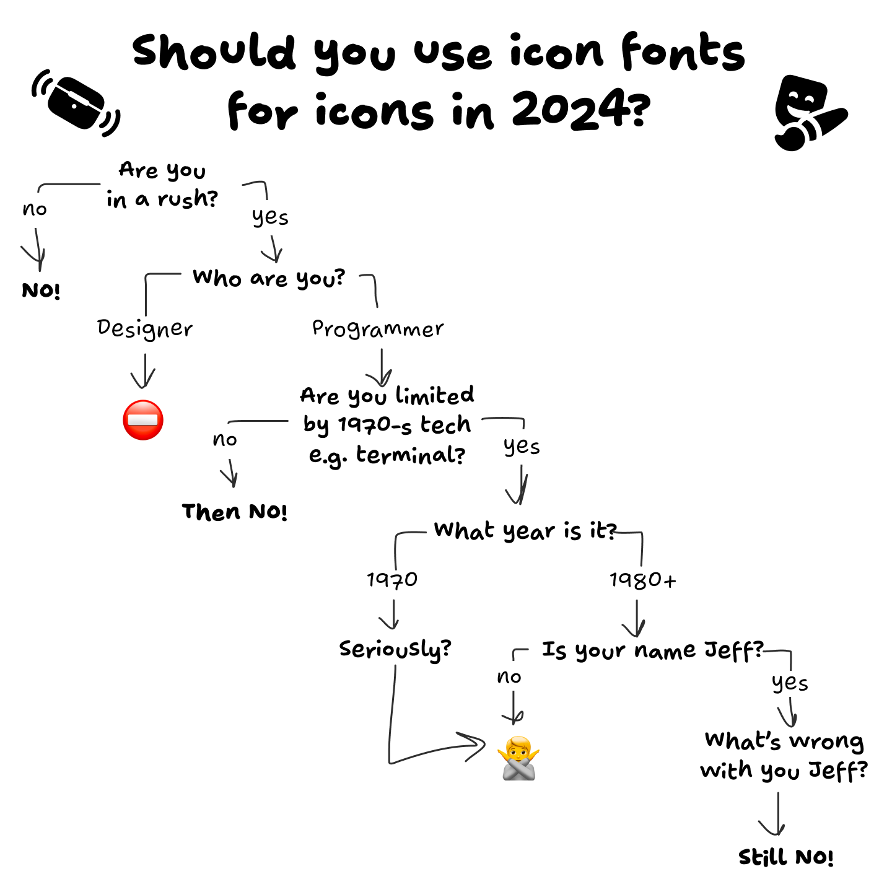
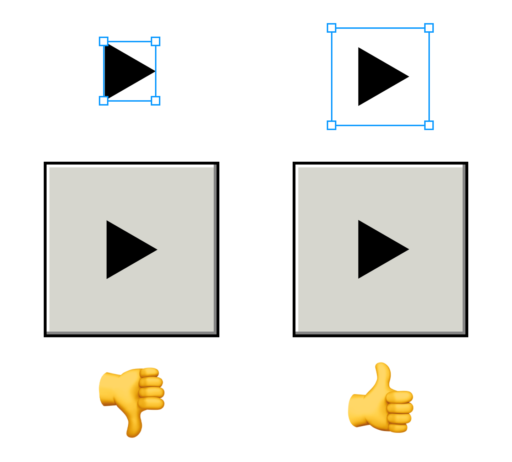

# 在计算机图形界面中的居中难题

原文：[Hardest Problem in Computer Science: Centering Things](https://tonsky.me/blog/centering/)

让文字，尤其是和图标组合的文字竖直居中一直是计算机图形界面设计实现中的难题，甚至连谷歌、微软这样的大公司都有做不到位的情况。

## 解决办法

### 不要使用 icon font

作者给了一张自测图，告诉你在哪些情况下不要使用 icon font（然而实际上，你在所有情况下都不应该使用）

### 让图标在视觉上更对称

你可以通过将图标嵌套在一个稍大一些的矩形中，尝试将这个矩形进行居中处理来使这个图标在视觉上更对称。

