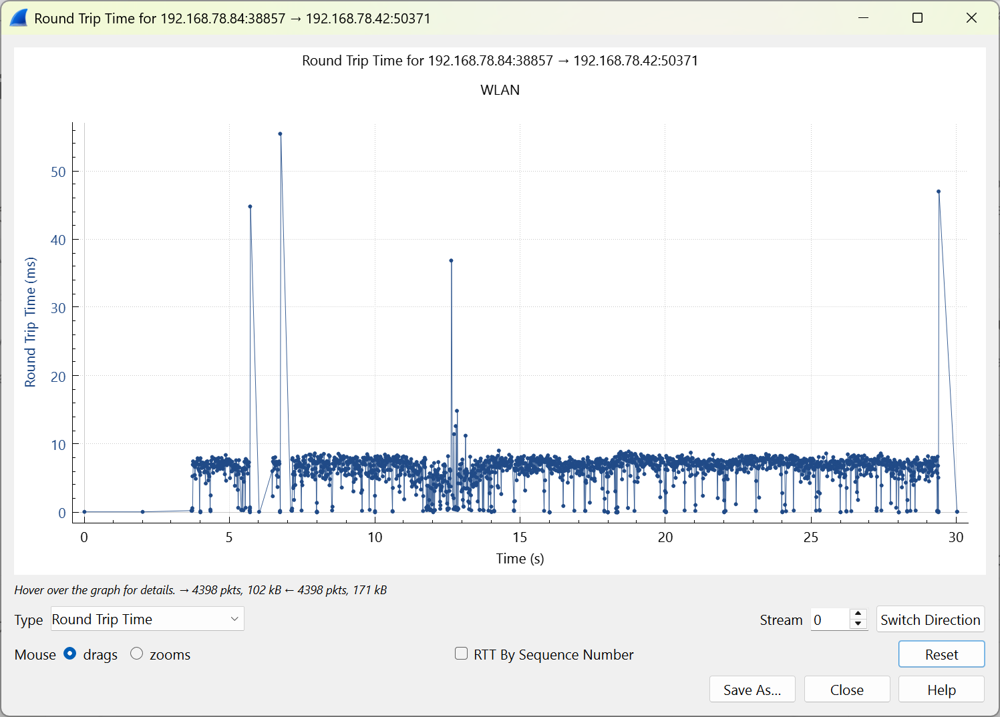
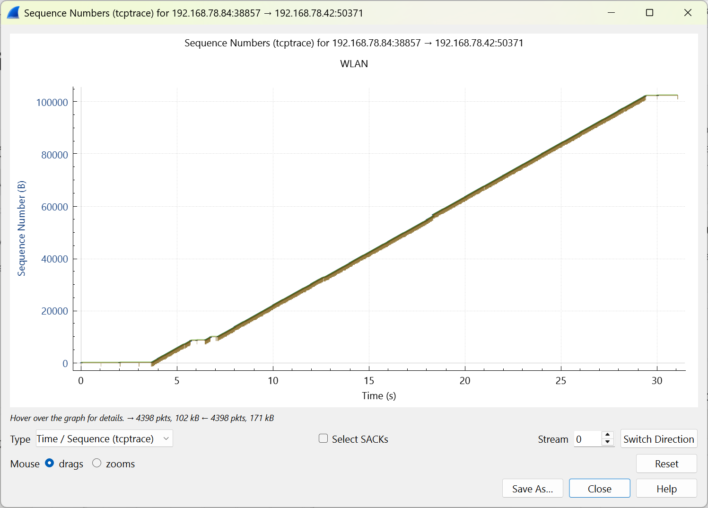

# 记一次 TCP 与 UDP 间的技术决策

## 背景

我最近在开发 InputShare 的付费版本，在开发过程中，一直收到内测用户反馈的鼠标定位不准的问题，具体表现为鼠标在安卓设备端时不时会大幅度移动一下。我尝试用 AI 改了好几版的通信逻辑都不行。

## 最开始如何优化？

最开始的逻辑很简单，鼠标事件监听，收到一个移动事件就发送一个。这个实现起来简单，但是问题也很明显：如果用户使用的鼠标的回报率（或者叫轮询率）较高，事件发送的频率会非常高，按鼠标的不同，最高能达到数千赫兹。

于是我后来修改了逻辑，核心思想就是在监听移动事件之外另起一个线程，在这个线程中尽可能地以固定间隔向发送线程中推事件，这样可以统一程序在不同鼠标回报率下的行为，使用同样的发送速率。这个版本已经会好一些了，但用户反馈还是不太行。

## 后来如何决策改为使用 UDP？

我先调研了一些相似的开源项目，如 [Deskflow](https://github.com/deskflow/deskflow)、[Barrier](https://github.com/debauchee/barrier) 等，又使用 Grok 进行了调研，结果如下：

>>> Grok 调研结果
主流开源项目在涉及无线控制（例如远程桌面、键盘鼠标分享等场景）并需要发送和接收鼠标移动事件时，主要使用 TCP 协议。这是因为鼠标事件（如相对移动、点击）需要可靠传输，以避免包丢失导致的控制不准或延迟问题，尤其在无线网络环境下。UDP 虽然能提供更低的延迟，但通常仅在特定低延迟场景（如游戏或实验项目）中使用，且往往结合重传机制或作为辅助。以下基于调研的总结和示例（扩展到无线鼠标/键盘分享和远程控制项目，不限于 Android）：

### 主要开源项目示例
- **Barrier/Deskflow/Input Leap**（流行键盘鼠标分享工具，Synergy 的 fork，用于多电脑无线分享输入）：使用 TCP 协议（端口 24800）。鼠标事件作为有序数据流传输，确保可靠性。UDP 被讨论作为未来选项，但当前主流实现依赖 TCP。
- **Synergy**（经典开源键盘鼠标分享软件）：主要使用 TCP（端口 24800），鼠标移动事件通过自定义 TCP 流协议发送和接收。少数讨论提到 UDP 作为备选，但不为主流。
- **VNC (Virtual Network Computing)**（开源实现如 TightVNC 或 RealVNC）：使用 TCP 协议进行无线远程控制，包括鼠标事件传输。鼠标相对/绝对移动编码后通过 TCP 套接字发送，确保无丢失。
- **FreeRDP**（RDP 协议的开源实现，用于远程桌面）：默认使用 TCP（端口 3389）传输鼠标事件；UDP 仅作为多媒体（如视频）的低延迟辅助，但输入控制（如鼠标移动）优先 TCP 以保证精确性。
- **SPICE (Simple Protocol for Independent Computing Environments)**（开源远程桌面协议，用于虚拟化）：主要使用 TCP 传输鼠标和键盘事件；UDP 可用于视频流，但不用于输入事件。
- **lan-mouse**（新兴开源 LAN 鼠标/键盘分享项目）：使用 UDP（端口 4242）结合 DTLS（UDP 上的安全层）传输鼠标事件，强调低延迟，但这不是主流（更多是实验性选择）。
- **KDE Connect**（开源设备整合工具，支持无线输入分享）：数据传输包括鼠标事件使用 TCP；UDP 仅用于设备发现。

### UDP 的使用情况
UDP 在主流项目中较少见，主要出现在小众或特定优化场景：
- **某些自定义实现**（如 Raspberry Pi 项目或 ESP8266 远程控制）：使用 UDP 发送鼠标数据以追求实时性，但往往需额外处理包丢失（如重传逻辑）。
- **OSC (Open Sound Control)**（用于无线控制，但非专为鼠标）：部分实现使用 UDP，但 TCP 变体更适合可靠事件传输。
- **实验项目**（如 GitHub 上 RC 车或 IoT 控制）：UDP 简单，但不推荐用于精确鼠标控制。

总体上，TCP 是主流选择，因为无线网络易受干扰，鼠标事件的可靠性（如连续移动不丢帧）优先于极致低延迟。如果项目针对游戏或高帧率场景，UDP 可能更合适，但需自定义错误处理。在开源社区讨论中（如 GitHub 和 Reddit），TCP 被视为默认标准，以简化开发和确保跨平台兼容。
>>>

总结就是主流开源项目都使用 TCP 实现。

然后再总结了针对项目中鼠标移动事件通信的特点：
- 通信频率高
- 带宽需求小
- 延迟要求高
- 丢失个别包几乎无影响（对于迟到的包可以直接丢弃）

这样看似乎使用 UDP 会更优？于是我尝试使用 Wireshark 进行抓包，结果如下：

从图中可以看出，大部分时候下的 RTT 其实是符合我的应用需求的（我的应用需要每秒发送 150 次左右包，也就是 6.67 毫秒发送一次，图中的 RTT 平均下来是 8 毫秒左右，单程通信就是 4 毫秒，还不是性能瓶颈）。关键在于个别延迟到达的包（也就是 RTT 图中的突出点），由于 TCP 的有序性，在一个包延迟到达或者丢包时，接收端会等待这个包到达后再接收之后的包，而这恰恰是我的应用所不需要的。

### 为什么一开始使用 TCP？

主要是因为我的项目基于 [scrcpy](https://github.com/Genymobile/scrcpy) 这个项目的服务端部分进行实现，而这个项目本身是完全不使用 UDP 来通信的。

### 动手实践

在得出结论之后，我觉得动手实践，fork 了 scrcpy，在创建服务端 socket 时额外创建了一个 UDP socket，专门用于监听 UHID 鼠标事件。
由于 UDP 不保证包到达的有序性，我在发送端额外给包带上了一个序号，并在接收端解析和检查序号，当收到的包的序号小于当前收到的最大序号时，直接无视。

在实现 demo 版本后，我马上打包发给用户测试，得到的反馈很好，之前提到的鼠标定位不准的问题也没有再出现。

于是我继续完善这个 demo，主要集中在 UDP 服务的创建和发送上。
demo 版本的 UDP 服务使用固定端口，虽然安卓设备上基本不会有创建 UDP 服务的需求，但是毕竟是做付费软件，还是得保证一下程序的鲁棒性。我后来在实现时依然使用固定端口，但是在绑定端口时会继续检查，如果端口被占用，则进行顺延，同时实现了一个响应 ping 信号的功能。在客户端侧，在需要连接到 UDP 服务时，使用 ping 信号来检查指定端口是否存在服务，如果不存在则同样进行顺延，如果完全扫不到端口则回退到使用 TCP 通信。
