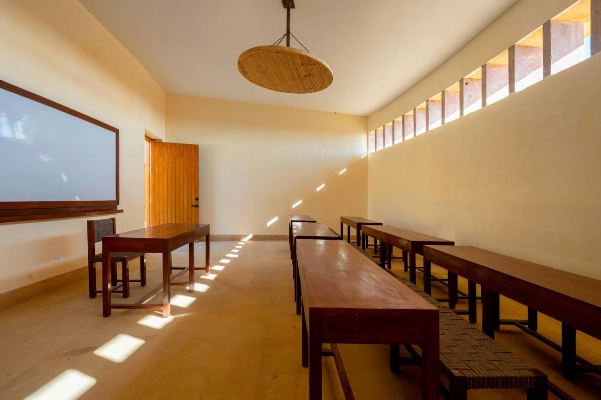
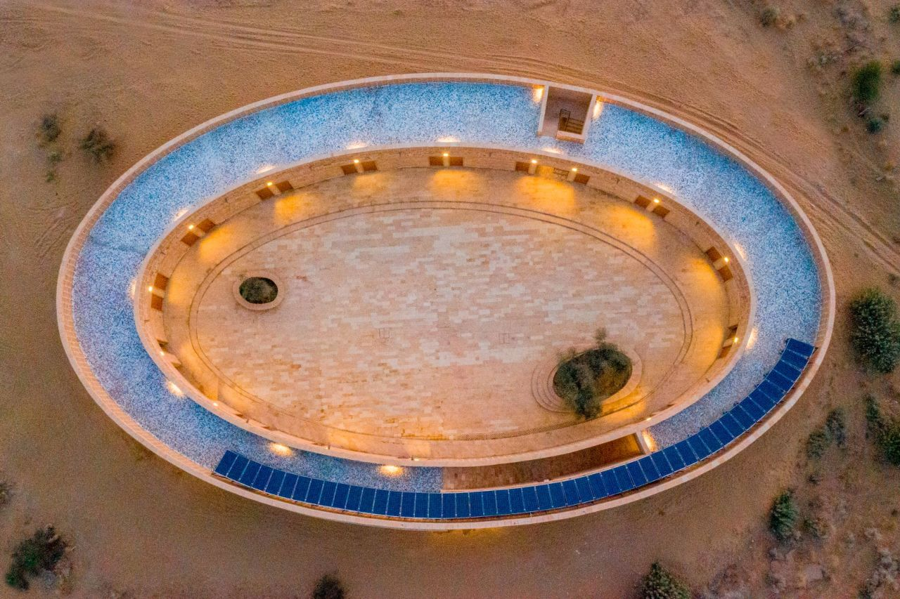

# 印度沙漠中的学校如何在极端炎热中保持凉爽

``2023/8/9``

原文：[How this school in the Indian desert stays cool even in extreme heat](https://edition.cnn.com/style/article/india-rajkumari-ratnavti-kellogg-school-spc-intl/index.html)

- - -

在印度北部沙漠中的城镇杰伊瑟尔梅尔（Jaisalmer），也因其地大量的沙石建筑被称为“黄金之城”。当地的温度在盛夏时可达大约 120 华氏度（49 摄氏度）。

在这里，建筑都被设计以适应高温。纽约建筑师戴安娜·凯洛格（Diana Kellogg）在设计当地的女子学校 Rajkumari Ratnavati 时遵循了这一传统。

这一地区的女性识字率是印度最低的。这一工程为该地区的女性提供了教育机会，同时，这一工程是由 CITTA 组织委托进行的，这是一个位于美国的非盈利性组织，致力于为偏远地区的女性提供经济和教育援助。这是该组织三步工程计划中的第一步，此计划同样包含了一个女性协作中心和一个展示区。

据凯洛格所说，2020 年被印度建筑文摘（Architectural Digest India）称为 “建筑之年”，该环保沙石学校于 2021 年的 11 月启用，同时 120 位女孩已入学接受教育。

## 自然冷却

在这个塔尔沙漠（Thar desert）的中心区域设计一个舒适的学习环境是一个巨大的挑战。在这里，气候变化使得旱情更加严重。凯洛格通常设计的是一些高端住宅，她于 2014 年旅行来到杰伊瑟尔梅尔，被当地的酷热环境所激发，想要在这沙漠中通过联合传统的当地工艺与现代设计建造一座象征希望与坚韧的建筑。

凯洛格说：“几个世纪以来，有许多方法可以用来降温避暑。我所做的只是将那些方法整合，使其更好的工作。” 她补充说明，学校的室内温度大概比室外低了 20 到 30 华氏度。

对于这些建筑，她选择使用本地的沙石 —— 一种能够适应气候变化的材料，该材料在这一地区有悠久的使用历史，包括杰伊瑟尔梅尔城堡（Jaisalmer Fort），这个城市中具有四分之一人口的一部分，同时也是联合国教科文组织世界遗产保护区。

“这个区域非常富裕，在出价这方面十分合理，并且当地的石匠在处理石料时如同魔术师一般。”凯洛格说，“这些石料能够在白天时阻隔外界的炎热，也能在夜晚时阻挡外部的凉意。”

在传统的技术中，凯洛格选择了其中的一种融入到她的建筑设计当中：用一种具有冷却性质的多孔的石灰粉粉刷内墙，这有助于释放空气中的水分。受该地区其它建筑的启发，她在建筑中安装了贾利墙（jali wall），一种用来通过文丘里效应（venturi effect）加速空气流通的沙石网格，用来降温的同时也提供了树荫。较高的天花板和窗户有助于释放教室内的热量，同时装配着太阳能板的顶棚也能提供阴影和电能。

该结构与风向成一定角度，呈椭圆形。选用这样的结构不仅是因其利用冷空气的能力，也是因为其富有女子气质的特点，与此项目所提倡的精神相匹配。凯洛格称其为“一个大而紧的拥抱”。

## 舒适校园中的可持续性

凯洛格坦承，被使用在这所学校的许多冷却技术原则上也能被使用在其它地方，它们的有效性和可持续性因地而异。比如说，其它地方特殊的风向和不同的沙石材料会使得对温度的控制效果不同于在杰伊瑟尔梅尔。

这幢建筑中没有使用空调，不止是因为空调的环境影响，空调在这一地区并不常见。通过当地学生熟悉的传统的和自然的降温技术来取代空调，她相信学生们会通过感受周围环境变得更加有信心。

“在过去的三、四个月里，我独自看着，”她说，“在这些女孩身上的变化，从害羞少语到现在的阳光开朗，她们饥渴地吸收着你授予她们的所有知识。”

- - -

In the north Indian desert town of Jaisalmer, also known as “The Golden City” for its array of yellow sandstone architecture, temperatures can reach approximately 120 degrees Fahrenheit (49 degrees Celsius) at the height of summer.

Here, buildings have long been designed to adapt to the heat, a tradition that New York architect Diana Kellogg has followed with her work on the Rajkumari Ratnavati Girls’ School.

The project, which is meant to empower women and girls through education in a region where the female literacy rate is the lowest in India, was commissioned by CITTA, a US non-profit organization that provides economic and education support to women in remote and marginalized communities. It’s the first step in a three-part architectural project that will also include a women’s cooperative center and an exhibition space.

Named the 2020 “Building of the Year” by Architectural Digest India, the eco-friendly sandstone school opened in November 2021 and 120 girls are currently enrolled in its curriculum, according to Kellogg.

## Natural cooling

Designing a comfortable learning space can be challenging in the heart of the Thar desert, where climate change is making drought spells longer and more intense. Kellogg, who usually designs high-end residential projects, was motivated by a 2014 trip to Jaisalmer, and wanted the building to symbolize the hope and resilience of the desert by merging aspects of traditional Jaisalmer architecture with a modern design.

“There are methods to cool spaces that have been used for centuries. What I did is I put them together in a combination that worked,” Kellogg said, adding that indoor temperatures at the school are approximately 20-30 degrees Fahrenheit lower than the outdoors.

For the structure, she opted to use locally sourced sandstone – a climate-resilient material that’s been long used for buildings in the area, including the Jaisalmer Fort, a part of the city that hosts one fourth of its population and is a UNESCO World Heritage site.

“It’s so abundant in this area. It’s very reasonable (in price) and the extremely talented stonemasons are just magicians with the stone,” Kellogg said. “It actually keeps the heat out and also keeps the coolness out at night.”

Among the traditional techniques Kellogg incorporated into the design is lining the inner walls with lime plaster, a porous and natural cooling material that helps release any trapped moisture resulting from humidity. Inspired by other buildings in the region, she also installed a jali wall — a sandstone grid that enables wind to accelerate in a phenomenon called the venturi effect, cooling the courtyard space while also providing shade from the sun. High ceilings and windows release rising heat in classrooms, while a solar panel canopy provides shade and energy.

The structure, which is angled in relation to the prevailing winds, has an elliptical shape, chosen for its ability to capture and circulate cool air, but also for its symbolic connotations of femininity, matching the ethos of the project. Kellogg calls it “a big, tight hug.”

## Comfort in sustainability

While many of the cooling techniques used at the school could be applied elsewhere in principle, their effectiveness and sustainability would vary from site to site, Kellogg admits. Particular wind directions and different sandstones would regulate temperatures differently to the materials found and used in Jaisalmer, for example.

Air conditioning isn’t used anywhere in the building, not just because of its environmental impact but because it isn’t common in the area. By adopting traditional and natural cooling mechanisms that the students are familiar with instead, she believes they can get sense of comfort from their surroundings, leading to greater confidence.

“I’ve seen it myself over the last three, four months,” she said.

“The change in the girls, from being quite shy to being these bright lights that are devouring whatever kind of information you put in front of them.” 
