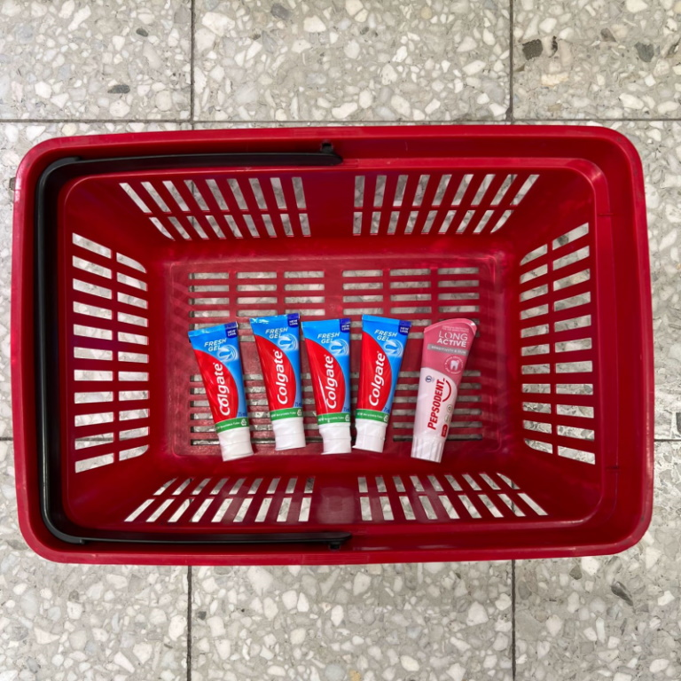

# {哨兵值和牙膏}(The sentinel toothpaste: a useful programming technique for everyday life)

原文链接：[The sentinel toothpaste: a useful programming technique for everyday life](https://dunkels.com/adam/sentinel-toothpaste/)

- - -

这是我在日常生活中发现的一个非常有用的编程技巧：[哨兵值](https://en.wikipedia.org/wiki/Sentinel_value)。我每天使用这个技巧来管理我的牙膏。

在编程中，哨兵值可以用来判断一个列表的末尾。当你有一个列表，你可以将列表的最后一项元素设为一个特殊值，这样你可以很容易地知道你是否遍历到了列表的末尾：当你遍历到的值是那个特殊值，你就遍历到列表的末尾。

这是一个使用 Emoji 的可视化表示：

| 😀 | 🥰 | 😎 | 🤗 | 🙄 | 😜 | 😮‍💨 | 🐈 |

上面表格中的猫猫不是个笑脸（和其它表情不同），所以我们可以用猫猫表情来表示这个列表的末尾。

## 一个典型用例

这个编程技巧的一个典型用例就是（C 语言中）使用字符 ``\0`` 结尾的字符串。要计算这种字符串的长度，我们可以遍历字符串直到找到 null 字符，这里的 null 字符就是哨兵值。

下面是一个值为 ``String`` 的字符串，其最后的 ``\0`` 字符就是字符串的哨兵值：

| S | t | r | i | n | g | \0 |

## 另一个典型用例

另一个典型用例就是链表数据结构中的 ``null`` 值指针。如果所有链表节点的数据都不为 ``null``，我们可以使用 ``null`` 值指针来表示链表的结束。

## 哨兵值和牙膏

我发现这个编程技巧对于日常生活极其有用，比如，用来管理牙膏管。

当你刷牙的时候发现牙膏用完通常不是件好事。所以当我买牙膏时，我总是买许多，并且总是确保其中一管和其它的（外观）不同，这就是哨兵牙膏。

这样，当我发现只剩下这管特殊的哨兵牙膏时，我就知道我需要买牙膏了，并且我还有充足的时间。

## 我如何学到这个技巧

我第一次知道这个哨兵值技巧是在知名的计算机科学家兼教授 [Lennart Andersson](https://cs.lth.se/lennart-andersson/) 的编程课上，这也是我的第一门计算机科学课和编程课。我从他那学到了很多极其有用的编程技巧，这些技巧在我的职业生涯中也发挥了很大的用处。但哨兵值是唯一的一个我发现在计算机编程之外，在生活中也十分有用的技巧。

- - -

> 译者注：后面还有一些作者从 Lennart 教授学到的东西，个人觉得用处不大，就不翻译了，直接贴原文。

Here are a few of the useful things I learned from Lennart:

- How to efficiently write parsers for formal languages, such as mathematical expressions and programming languages.
- How satisfyingly compact functional programming techniques can be, particularly with map, reduce, and filter operations, even in imperative languages.
- That (some) printers weren’t just dumb devices that would print bitmaps, but that they were running a fully-fledged language called PostScript. So you could manually write a piece of code that you could send to the printer, which would run it and generate output – on the paper. What a realization!
- How to avoid comparing floating point values directly with each other – instead, subtract them from each other and check that the difference is small. That is, instead of checking a == b, check abs(a - b) < 0.0001 (or some other small quantity). This is a nifty way to protect against small numerical errors in floating point repressentation.
- The importance of external vs internal repressentation of data structures: we were given a lab assignment to write a small Excel/VisiCalc clone. We were free to do it in any way we wanted, with one exception – we were not allowed to use a two-dimensional array to repressent the contents of the sheet. The purpose was to teach us that the externally visible repressentation (a two-dimensional sheet of cells) was in no way related to the best way to repressent the same data internally, inside our program. This has stuck with me ever since.
