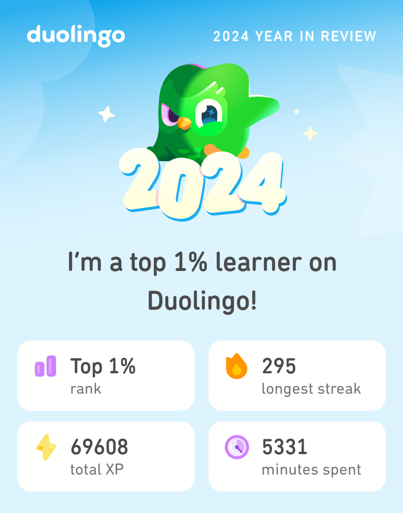

# 2024年 年度总结

## 工作流

在 2024 年中，我的工作流发生了很大的变化。

现在，我的工作流可以概括如下：

!!!flow-chart
st=>start: 获得灵感
cond1=>condition: 闪念(yes) or 项目(no)
op1=>operation: 记录到小米笔记:>https://i.mi.com/note/h5#/
op2=>operation: 记录到 Trello:>https://trello.com/w/user28557763
cond2=>condition: 是否需要总结
filter=>inputoutput: 整理有价值的信息
op3=>operation: 整理总结到此博客
e=>end: 结束

st->cond1
cond1(yes)->op1->filter->op3
cond1(no)->op2->cond2
cond2(yes)->op3
cond2(no)->e
op3->e
!!!

还有一个很大的变化：我把手机上的 Bilibili 客户端卸载掉了。
原因很简单，我刷 B 站时经常容易忘了时间，一刷半个晚上就过去了😢😢
于是我为了减少刷 B 站的时间，果断将其卸载，又把去年折腾过的 RSS 客户端重新拾起。

## 运动健康

在今年上半年开始，我基本保持着每周跑两次，每次两公里的跑量。
在坚持半年多之后，我已经逐渐地能做到每次跑到三公里以上了。甚至在一次跑步中，取得了[一千米三分三十](一千米跑进三分四十记录.md)的好成绩。
根据手机自带的数据记录，我今年共跑步 ``125.2`` 公里。

在往年，由于鼻炎、个人的懒惰等因素，我是不太喜欢在冬季跑步的。
但是今年由于运动的增加，我也逐渐能够在十度左右的气温下出门运动了。

## 学习提升

这一年都在持续地通过多邻国学习日语，

在这个过程中，也持续地在油管观看一些日语播客等内容。我自己还写了一个[汉字转和制汉字](https://hanzi2kanji.zeabur.app/)的应用来辅助学习。

## 技术和开发

今年的上半年和室友一同参加了大学生创新创业大赛，暑假时尝试了我的第一次实习。详情见此：[2024年2~8月 半年小记](2024年2~8月 半年小记.md)。

十月份时开始了 [InputShare](https://github.com/BHznJNs/InputShare) 这个项目，在实现了基础功能后尝试了一些宣发的渠道，收获良多。见：[2024年11月 月度小结](2024年11月 月度小结.md)。

在十二月时开始尝试 VSCode 插件开发，虽然之前尝试给 Calculator.rs 写过插件 [Calculator.rs-VSCode-extension](https://github.com/BHznJNs/Calculator.rs-VSCode-extension)，不过只是浅尝辄止。这次在 AI 的辅助下开发效率得到了很大的提升，花了两三天就给[本站的模版项目](https://github.com/BHznJNs/markdown-blog-template)写了一个[辅助编辑博客文章的插件](https://github.com/BHznJNs/markdown-blog-ext)。

在开发的过程中感觉 VSCode 的右键菜单过于繁杂，又写了一个用来[简化 VSCode 右键菜单的插件](https://github.com/BHznJNs/vscode-custom-contextmenu)。

今年算是对我而言比较重要的一年了。我摆脱了单纯的技术人员思维、参与了实习、做的软件也能够让非技术人员用上了。
