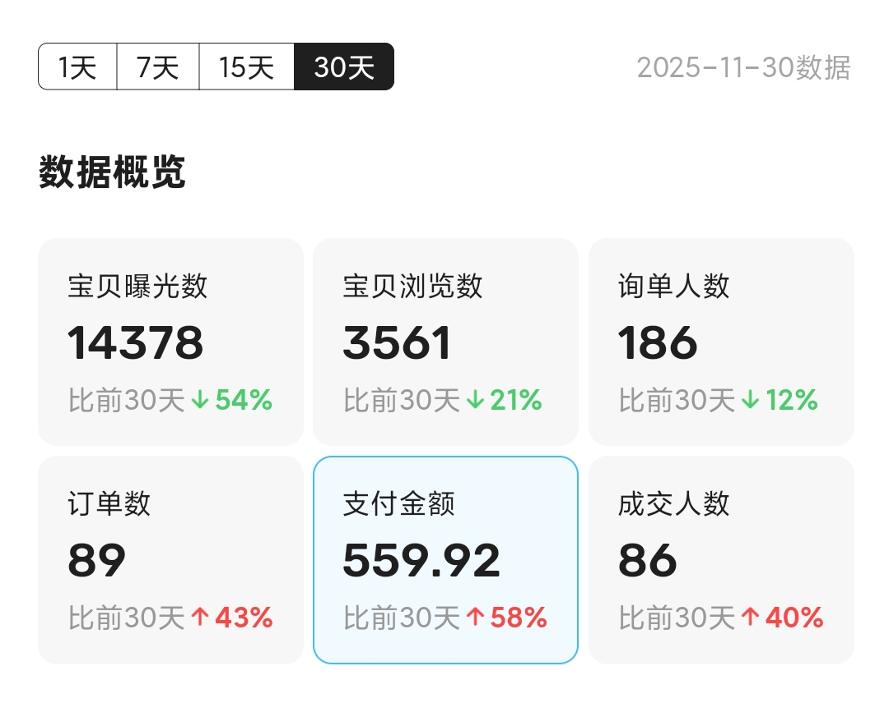

# 2025 年 11 月 月度小结

::这个小结拖了好久，从十一月底拖到了双十二...::

## 独立开发

这个月我基本把 InputShare2 的 Debug 工作给基本结束了，同时将 InputShare2 上架后也小范围的宣传了一下，一个月差不多销售额 50 刀左右，扣除手续费和税，收入 39.31 刀。

### GEO

我也稍微尝试了去做 InputShare2 的 GEO，即生成式引擎优化。看起来挺高大上，但实际上就是自己去摸索一下各 Chat Bot 的内容来源偏好，然后到对应的那些平台去发布相关内容。

## 开源

### Daigent

在月中时，由于多数时间在等测试用户的反馈，于是继续开发 Daigent 项目。
主体部分都已经完成，就差最关键的 Agent 对话部分的实现了。

### [LiteAI-SDK](https://github.com/BHznJNs/liteai)

由于 Daigent 这个项目需要一个类似于 Vercel AI SDK 的依赖来处理通用的 LLM API 调用，在 Python 生态内调研了一圈后，发现主要能用的有二，并且效果都不理想：
- Mozilla 的 [any-llm](https://github.com/mozilla-ai/any-llm)
  - 目前看来还不够完善，甚至在我尝试用它运行一个最基本的 Agent Loop 示例时还遇到了[问题](https://github.com/mozilla-ai/any-llm/issues/632)
- [LiteLLM](https://github.com/BerriAI/litellm)
  - 它的 Python SDK 过于难用，且没有提供工具参数的封装

于是我自己基于 LiteLLM 实现了 LiteAI-SDK，提供了 AI SDK 风格的 API 的同时，支持直接传入 Python 函数并在内部自动解析为工具定义。

## 娱乐

看完了《反叛的鲁路修》以及其后续的剧场版《复活的鲁路修》。
番剧本身非常精彩，又是让我难得的追得停不下来的番剧。但是剧场版就有些一言难尽了。

## 运动

这个月为了体测稍微去跑了几次，体测时拼尽全力，没想到一千米跑到了四分十三，比去年的成绩还好一点。

## 闲鱼

这个月多亏了 Kimi 的砍价活动，闲鱼收入明显增长。

