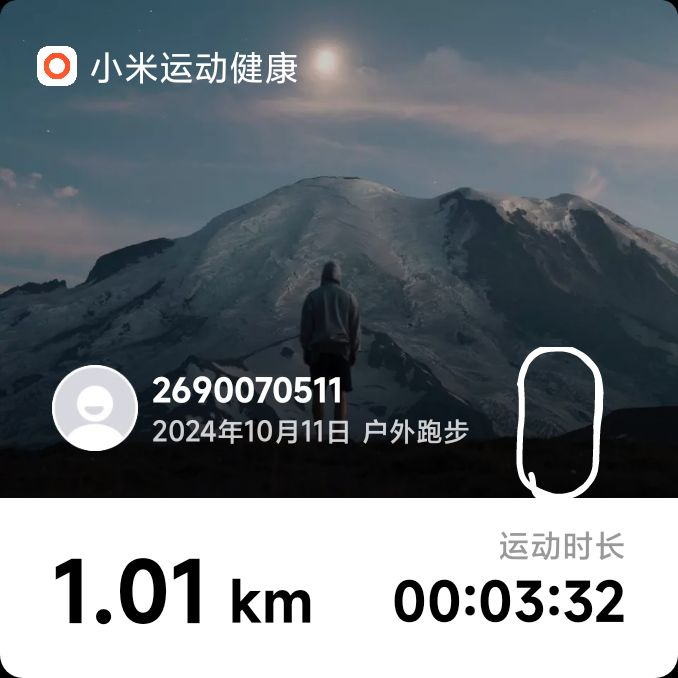

# 一千米跑进三分四十记录

``2024/10/11``

今年上半年，遇到了个不错的体育课老师。为了让我们的十二分钟跑成绩达标 Ta 在每次课的最后会让我们跑个两千米的量，并布置在课后自己完成一次两千米长跑。
似乎是得益于 Ta 的这些半强制任务，我养成了每周跑步两次的习惯。
跑步最需要长期坚持。在坚持七个月后，临近体侧的今天，我尝试自测了一次，下图为结果

我们学校体侧一千米满分为三分十五，我离这个满分成绩还差十七秒。再坚持半年，不知道在那过之后我能不能达到满分水平。
