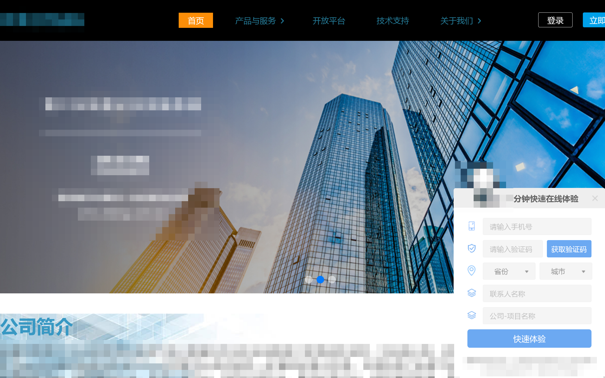
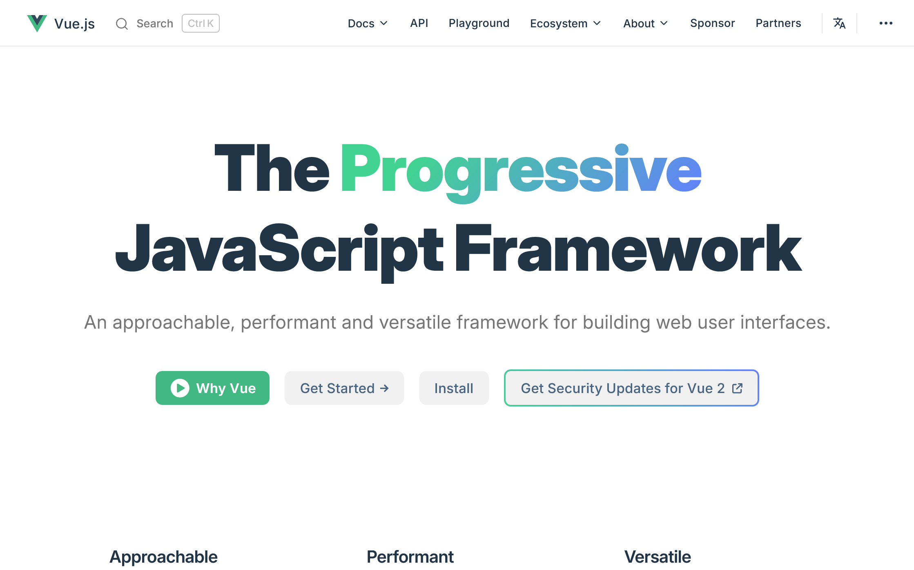

# 关于我实习一个月跑路后的一点感想以及为什么我认为现阶段前端已死

## 找实习的过程

于今年五月份，我开始找前端实习。大抵是因为劳动节放假，投了几家公司没有收到回复。这时，我刷到了本文的主角，为了我的个人隐私和该公司的名誉，我们就叫他 A 司罢。

首先，该司和其它公司一样没有给我回复，但 A 司的官网风格较其它公司完全不同，类比一下就是：

其它企业的官网：

- 糟糕的配色
- 界面元素拥挤
- 在线咨询弹窗

A 司的官网：

- 配色舒适
- 大量留白，极简布局
- 多语言支持
- Get Started

- - -

随后，我在该企业官网上找到了其 GitHub 的地址，我一下对 A 司起了--性欲--兴趣。

经过一番了解，我大致明白了 A 司的经营范围。该司的主力产品是一款 AI Powered 的开源数据分析工具，该工具本身可以完全离线使用，主要依靠 AI 相关功能来收费盈利。同时，该工具在海外具有一定的知名度。

我很快通过该司的 GitHub 主页找到其老板的邮箱（在这里插一句，由于该司规模较小，没有专门的人力资源管理人员），投递了简历。

中间的一些事儿就不进行赘述了，总之，我通过了面试并在暑期成功作为实习生入职。

## 实习过程的一些体会

就我实际接触到的来说，该司员工不到十人，其中 70% 左右为开发，一位前端，两位全栈，同时部分前端页面由后端老哥在 AI 辅助下完成。

该司的前端技术栈为 React + Tailwind CSS / Shadcn UI，这个没啥好说的，常见的敏捷开发组合。

至于为啥我要在实习一个月后跑路，当然不是因为什么资本压榨，相反，该司的待遇还是挺好的（我属于是一分钟班没加过），单纯就是我觉得学不到东西。也不能说啥都没学到吧，不过在技术方面确实没啥提升（倒是在摸鱼的时候把 Redis 1.0 版本的源码看懂了）。

我跑路后思考了一下原因，为什么我会觉得没学到东西，原因有三：

1. 我在职时的任务主要为各类展示型页面，不涉及该司产品的核心代码
2. 从个人技术发展角度，学习各类前端框架（如该司使用的 React 和 Tailwind）耗时且无用
3. 我同样自己学习过该司产品的开源代码，但未感觉到有明显收获

## 为什么我认为现阶段前端已死

首先是对于前端技术发展，从远古的 IE 时代到如今，我认为前端技术重要的发展如下：

1. AJAX：使页面可以无刷新动态更新，//提升用户体验//
2. 现代 CSS：让开发者能做出更好看的页面，//提升用户体验//
3. JQuery：辅助开发者解决浏览器兼容性问题，提供更方便的 API，//提升开发效率//
4. Vue, React, Angular 等 MVVM 框架：使 UI 和数据分离，让开发者专注于业务处理，//提升开发效率//

可以看出，前端技术发展的着重点有二：//提升用户体验//与//提升开发效率//。

在提升用户体验方面，近年来也不是完全没有进步：

- 有了 PWA 以改善离线体验（谁会在断网的情况下用浏览器啊）
- 有了 WASM 以提升页面性能（在多数场景无必要）
- 等等

但这些技术一方面推出许久仍很少被使用；另一方面，这些技术本身都由浏览器开发者开发，前端开发者更多地还是在调用 API，我认为学习与使用这些与使用各类前端框架无异。

在开发效率方面，近年来虽然也有如 Tailwind CSS 这样的工具致力于提升开发效率，但这种提升我认为是明显不如 MVVM 框架带来的提升的。

从另一角度来说，前端开发者其实很多时候都是在写重复代码。像是登录表单、服务定价页面、商品展示页面等，无非是 UI 风格的不同，其实界面所用的组件、用户行为处理逻辑甚至界面布局等都是相同的。这就导致，虽然开发者在写着不同的代码，但他所做的事实际上是一样的，基本就是换个框架、组件库的区别。

而对于这种重复的工作，就有 AI 加入的余地了。对于前端 AI Coding，我认为目前做得最像样的应该是 Vercel 的 [v0.dev](https://v0.dev/)。它目前能够通过用户输入的 Prompt 来生成使用 React JSX + Shadcn UI 编写的前端页面，并且生成的界面还能具备一定程度的交互性。这就很可怕了，哪怕目前它只能完成项目开发中很少量的工作，但长期来看，在未来五年时间内 AI 的发展很可能会使这样的 AI 技术替代大量的前端开发工作。

### 那为什么本段的小标题里提到“现阶段”？

因为 Apple Vision Pro 的出现，我认为在 MR/VR 设备逐渐普及的未来，对于这类设备的前端开发会成为新的风口。毕竟 Web 最早是在 PC 端的交互，而手机则有些像是缩小的 PC。也就是说，目前的前端交互方式其实已经有近二十年没有发生大的变化了。而 MR/VR 设备则代表着全新的交互方式，这就意味着需要大量的开发者进行探索和创新。

但毕竟，这类设备的普及不是几年内能够做到的，因此我估计，在五年之后，由于技术的发展，MR/VR 设备会逐渐普及，而到那时，半死不活的前端开发将会成为新的风口。

## “前端已死”之后

由于上述原因，在现阶段，我不推荐任何有//其它选择//的人##为了就业##而学习前端开发。

注意上面的粗体字“为了就业”，难道不为就业就能学了吗？一定程度上是的！因为前端易学习、开发效率高、生态丰富、跨平台性强的特点，如果你想要成为一个独立开发者，或是想要创业，前端会是一个性价比较高的技术栈。

同时，在对于个人应用的开发上，由于定制化的 UI 需求占比较多，使用 AI 实现难度反而更高，因此也不用过于担心“学完的知识马上报废”。
