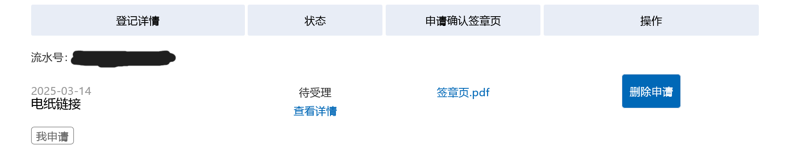

# 2025 年 2 月末及 3 月上半总结

由于寒假结束后 2 月就只剩十天不到，于是把这几天的总结与下一篇要写的总结（也就是本文）合并了。

## 新学期我的改变

我更社牛了点。以往我不敢主动与陌生人交谈，但是这段时间里，我借由一些契机认识了几位原本绝不可能认识的同龄人。--当然这也能归因于大学生比较好套近乎。--

## 软著申请

我在[电纸链接](https://github.com/BHznJNs/NFC-PLinkD)这个项目写得差不多之后，开始着手于将应用上架到国内的安卓应用商店。在一番调查之后，我发现要上架到国内手机厂商的应用商店少不了两个条件：企业资质和软著。
我琢磨着，申请个软著一来可以用来之后上架应用，二来还能加学分，挺划算的，花了半天多的时间把软著的材料整理好，进行了申请。

顺便吐槽一下，我在申请前有看了一些申请软著的文章作为参考，但是这些文章无一例外都提到要将申请文件邮寄到版权中心，导致我一直都觉得申请软著很麻烦，拖了很久。结果我自己实践了之后发现##根本不需要邮寄东西##。

## 开发

在一些渠道尝试推广了电纸链接之后，和之前的一些用户也聊了聊，在讨论之后，决定加入“链接到笔记软件”的功能。
最近花了四五天的时间把我的博客系统给重构了一下。--本来寒假前就计划要做的但是我太拖了😭😭--
把所有功能封装到一个 [npm 包](https://www.npmjs.com/package/basb-cli)中，方便更新资源文件。另外还给统计界面添加了每月统计的图表。

## 运动

说来也惭愧，开学到现在二十多天，只出门运动了两次。虽然这段时间的天气确实不太好，但这也不能为我的惰性作开脱。希望下半月我能多出门跑一跑。

## 写作

三月上半月由于基本处于上课-写代码的循环中，在博客输出上较前几个月少了很多，在添加了每月统计的图表后就更明显了。
